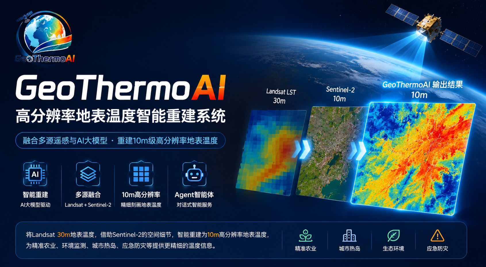
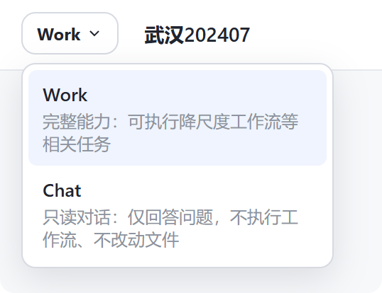
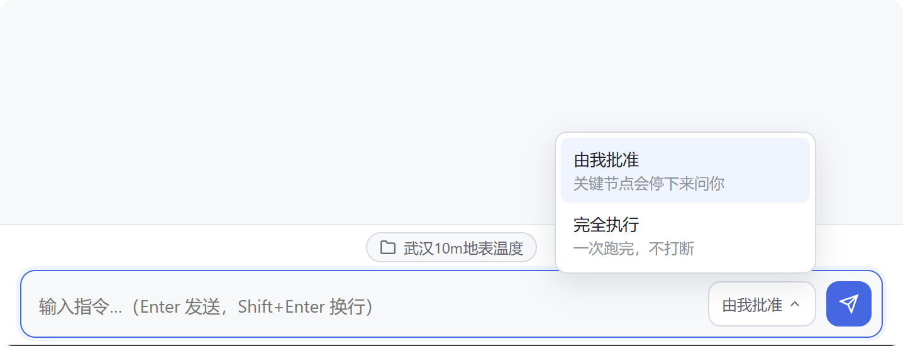
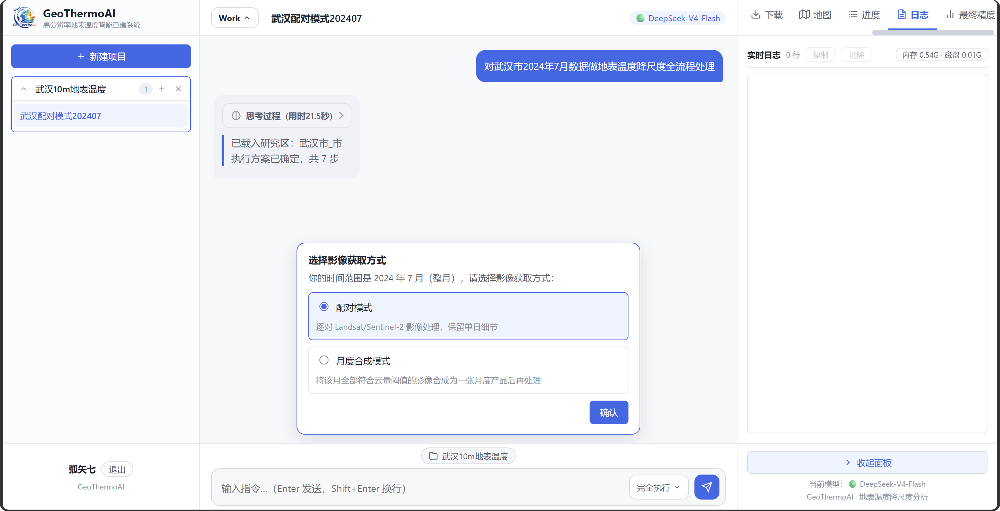
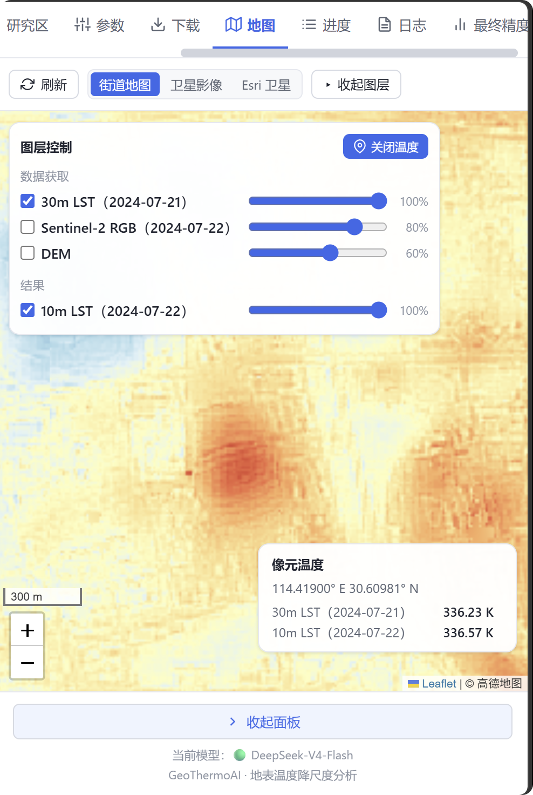
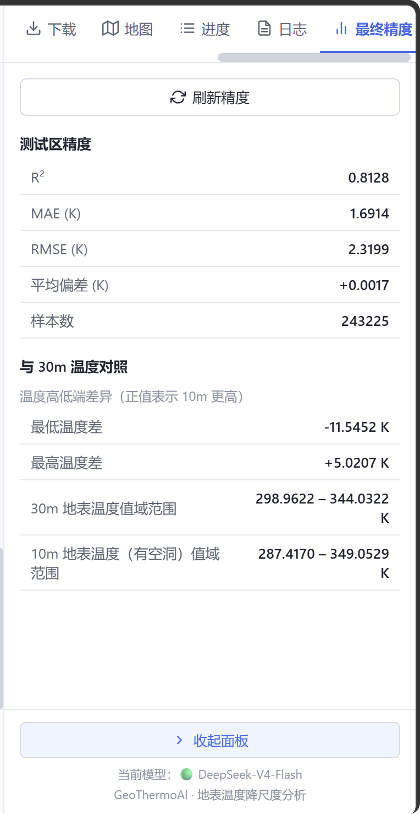
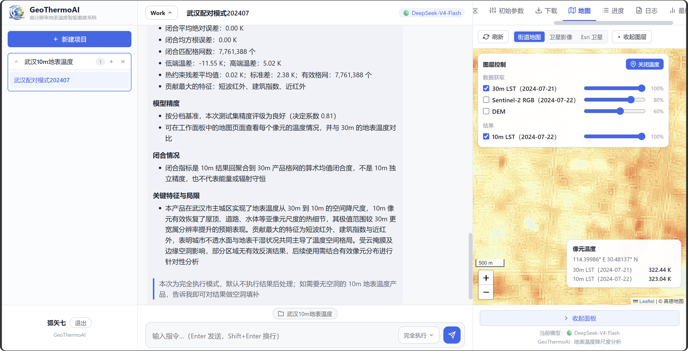

**[English](README.md)** | **[简体中文](README.zh-CN.md)**

<div align="center">
  
  <h1>GeoThermoAI</h1>
  <p><b>One sentence in, a 10 m land surface temperature product out</b> — a multi-agent system for land surface temperature (LST) spatial downscaling</p>
  <p>
    <a href="LICENSE"></a>
    <a href="https://www.python.org/"></a>
    <a href="https://www.docker.com/"></a>
    <a href="https://modelscope.cn/studios/Adhara/GeoThermoAI"></a>
  </p>
</div>

Describe your goal in natural language (e.g. *"Downscale land surface temperature for Wuhan, July 2024"*), and GeoThermoAI automatically performs **data search and download, preprocessing, terrain thermal response computation, Random Forest modeling, thermal constraint correction, accuracy assessment, and product export** — delivering a **10 m high-resolution LST GeoTIFF** ready for GIS analysis, with no remote-sensing expertise required.

**What you get**: a 10 m LST layer with crisp streets, water bodies, and building patterns; pixel-level Kelvin temperature query on an interactive map; downloadable GeoTIFF and all intermediate data; and follow-up questions about existing results (e.g. *"What is the temperature at this point?"*, *"Where is this?"*).

**Our principle**: calibration, masking, spatial splitting, model training, thermal constraint correction, and accuracy computation are all performed by deterministic remote-sensing algorithms (GDAL / rasterio / scikit-learn). The agents understand goals, orchestrate tasks, check data, and explain results — **numbers are trustworthy, and the process is auditable**.

## ✨ Highlights

| Capability | Description |
|---|---|
| **Natural-language driven** | Chat to ask, Work to execute — one sentence starts the full pipeline |
| **Multi-agent collaboration** | Planner / Data / Train / Evaluation roles work together, while all key computations remain deterministic |
| **Chat / Work dual mode** | Clean boundary between read-only Q&A and full execution |
| **"Approve myself" / "Full auto"** | Optionally approve key steps (image pairing, hyperparameter tuning, etc.), or run fully automatically |
| **Pair / monthly-composite strategies** | For precise analysis of a real acquisition pair, or for long-term monthly thermal monitoring |
| **Gap-free results, automatic** | Say "gap-free" when creating a task; gap filling runs automatically after the main pipeline, delivered as one report |
| **Interactive map thermometry** | Pixel-level Kelvin query on 30 m / 10 m layers, cursor locking, opacity control |
| **Project-level memory** | Structured + RAG dual-track memory; tasks continue across conversations, past experience is reused |
| **Result Q&A** | Ask questions about existing results: place identification (*"Where is this?"*), region / picked-point temperature statistics |

## 🚀 Quick Start

```bash
docker build -t geothermoai-image .
docker volume create geothermoai_data
docker run -d --name geothermoai -p 7860:7860 \
  --memory=16g --cpus=16 \
  -v geothermoai_data:/app/data \
  geothermoai-image
```

Open **http://localhost:7860** and then:

1. In the right-hand panel, complete the four setup steps: **[API Settings → Data Sources (optional) → Test → Study Area]** (we recommend DeepSeek V4 Flash as the LLM; data sources are optional — the system falls back to Microsoft Planetary Computer automatically);
2. Create a project and a conversation, and choose **Work mode**;
3. Send one sentence: `Downscale land surface temperature for Wuhan, July 2024, pair mode`;
4. Track progress in the task panel; when finished, view results on the map and download the GeoTIFF.

More entry points:

- Online demo (ModelScope Studio): <https://modelscope.cn/studios/Adhara/GeoThermoAI>
- Video walkthrough (Bilibili, full pipeline for Wuhan July 2024, pair mode): <https://www.bilibili.com/video/BV1L8gP6vEBC/>
- Example dataset and product (Wuhan 2024-07-22): <https://modelscope.cn/datasets/Adhara/Wuhan_10m_LST_20240722>

> Note: `/app/data` inside the container is the persistent root for accounts, conversations, study areas, the task ledger, and memory — it must be mounted. See the [deployment configuration guide](docs/Deployment.md) for the full variable table.

## 📸 Feature Gallery

<div align="center"></div>
<div align="center"><b>Chat / Work dual mode: clean boundary between Q&A and execution</b></div>

<div align="center"></div>
<div align="center"><b>Approve myself / Full auto: whether key steps wait for your confirmation</b></div>

<div align="center"></div>
<div align="center"><b>When key information is missing (e.g. processing mode), the system asks proactively</b></div>

<div align="center"></div>
<div align="center"><b>Pixel-level temperature query: both 10 m results and 30 m reference are readable pixel by pixel</b></div>

<div align="center"></div>
<div align="center"><b>Accuracy panel: test-area metrics, sample counts, and temperature ranges at a glance</b></div>

## 🧠 How It Works

A task-control layer sits in front of the algorithms: your goal is decomposed into four responsibilities — **planning, data, training, evaluation** — and orchestrated by agents, while all key computations are delegated to deterministic remote-sensing algorithms. The full pipeline is:

```
Data acquisition → Preprocessing → Terrain thermal response (TTRI) → Random Forest → Thermal constraint correction (TCR) → Export → Accuracy assessment
                                                                                                            └ Optional: gap filling (gap-free product)
```

- **Data sources**: Microsoft Planetary Computer (Landsat 8/9 L2) and Copernicus Data Space (Sentinel-2 L2A, GLO-30 DEM), with automatic search, download, caching, and fallback;
- **Temperature source**: Landsat 30 m LST provides the coarse-scale thermal reference; Sentinel-2 provides 10 m spatial detail; Random Forest plus thermal-constraint residual correction yields the 10 m estimate (preserving the 30 m parent-cell mean constraint);
- **Result Q&A**: numerical statistics are computed in code; the LLM only phrases them — **numbers by program, words by model**.

Technical details: [Algorithm Principles](docs/Algorithm.md); for setup and usage, see the [User Guide](docs/User-Guide.md).

## 📖 Documentation

| Document | Content |
|---|---|
| [docs/User-Guide.md](docs/User-Guide.md) | Setup steps, mode descriptions, map & accuracy panels, Wuhan case study |
| [docs/Algorithm.md](docs/Algorithm.md) | Calibration/masking, spectral & terrain features, TTRI, Random Forest, thermal constraint correction, accuracy metrics |
| [docs/Motivation.md](docs/Motivation.md) | Four gaps between raw imagery and usable temperature products |
| [docs/Deployment.md](docs/Deployment.md) | Deployment variable table and migration notes |

## 🛰️ Example Result

<div align="center"></div>
<div align="center"><b>Wuhan, 2024-07-22: 10 m LST product (left) vs. 30 m Landsat reference (right)</b></div>

Compared with the 30 m reference, the 10 m product clearly resolves temperature detail along streets, road networks, and building blocks. The dataset and product for this case are available on [ModelScope](https://modelscope.cn/datasets/Adhara/Wuhan_10m_LST_20240722).

> Important: the downscaled result is not an independently acquired 10 m thermal observation. Test-area accuracy evaluates the model's predictive ability on held-out 30 m temperature samples, and coarse-scale closure evaluates how well the result re-aggregates to the reference mean. Neither substitutes for independent 10 m accuracy validation.

## 📄 Algorithm Inspiration

The algorithm originates from the thermal remote sensing course project of the two developers. Main inspirations:

1. Kolláth, J., Kolláth, M., & Šveda, P. (2022). Combining Landsat 8 and Sentinel-2 data in Google Earth Engine to derive higher resolution land surface temperature maps in urban environment. *Remote Sensing*, 14(16), 4076. doi: 10.3390/rs14164076
2. Yuan, W., Hu, S., Zhan, C., Wang, G., & Luo, Y. (2025). Machine learning land surface temperature downscaling method based on Landsat 9 and Sentinel-2 satellite feature interaction. *Geo-spatial Information Science*, In Press. doi: 10.1080/10095020.2025.2598526
3. Bahi, H., Bounoua, L., Sabri, A., Bannari, A., Malah, A., & Rhinane, H. (2025). A new thermal fusion method to downscale land surface temperature to finer spatial resolution using Sentinel-MSI and Landsat-OLI/TIRS imagery. *Remote Sensing Applications: Society and Environment*, 37, 101519. doi: 10.1016/j.rsase.2025.101519
4. Andriambololonaharisoamalala, R. R., Helmholz, P., Bulatov, D., Ivanova, I., Song, Y., Soon, S., & Jones, E. (2025). Downscaling of urban land surface temperatures using geospatial machine learning with Landsat 8/9 and Sentinel-2 imagery. *Remote Sensing*, 17(14), 2392. doi: 10.3390/rs17142392
5. <https://mp.weixin.qq.com/s/OXwHyvUK3zEe0AoqTw6_rA>

## 💬 Contact

GeoThermoAI is developed by two undergraduate students (Class of 2023, Remote Sensing Science and Technology, China University of Geosciences, Wuhan). We warmly welcome collaboration and discussion with researchers in thermal remote sensing.

For bugs or suggestions, please open an Issue or contact us:

- jiyinuo@cug.edu.cn
- 3509851915@qq.com

## ⚖️ License

GeoThermoAI follows a "community edition + commercial license" dual-licensing model: all source code is licensed under **GNU Affero General Public License v3.0 (AGPL-3.0)**. Commercial use requires a separate commercial license — see [NOTICE](NOTICE) for details.
