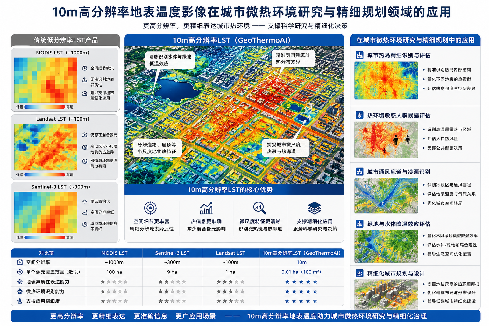
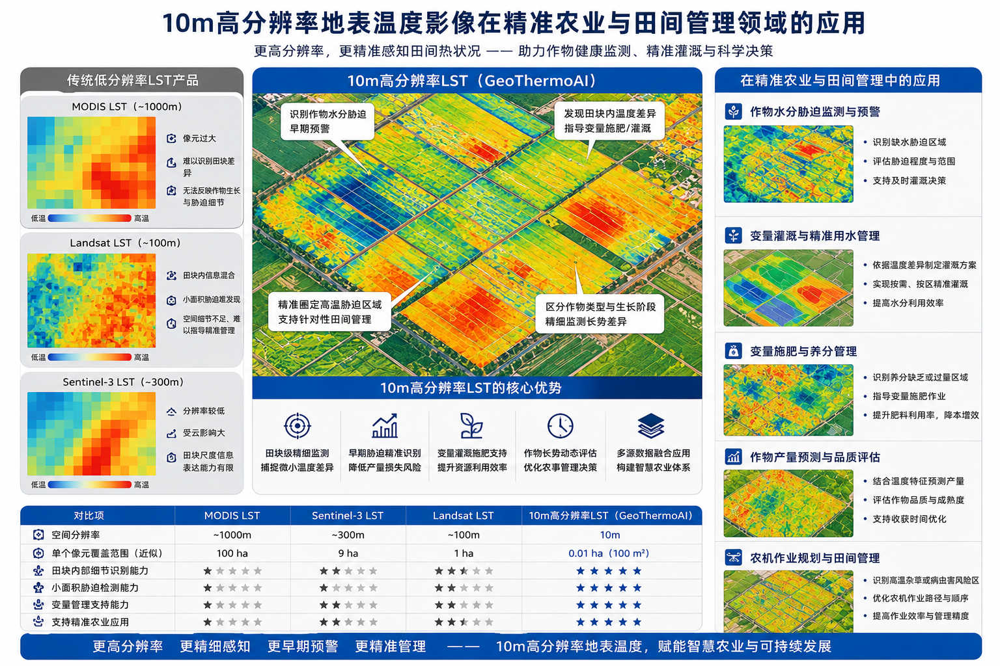
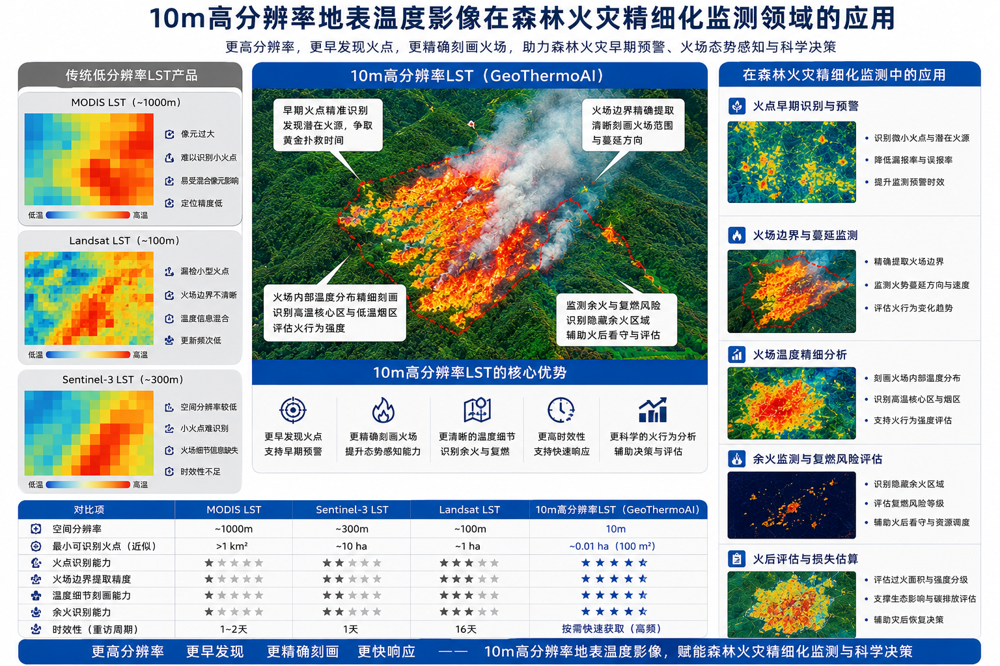

**[English](Motivation.md)** | [简体中文](背景与动机.md)

# Motivation

## 1.1 Four gaps between satellite imagery and a usable temperature product

### 1.1.1 Insufficient spatial resolution

　　Landsat thermal infrared products provide a stable land surface temperature reference, but their spatial scale (100 m native resolution; the official USGS LST product is resampled to 30 m to match the multispectral bands) cannot adequately express the subtle differences among roads, water bodies, dense built-up areas, and vegetation patches. Simple resampling only increases the number of pixels while roughly preserving the temperature range — it cannot restore trustworthy spatial detail. Figures 1–3 illustrate several application scenarios and advantages of 10 m high-resolution LST imagery.

<b>Figure 1. 10 m high-resolution LST imagery for urban micro-thermal environment research and fine-scale planning</b>

<b>Figure 2. 10 m high-resolution LST imagery for precision agriculture and field management</b>

<b>Figure 3. 10 m high-resolution LST imagery for fine-grained forest fire monitoring</b>

### 1.1.2 Multi-source data are hard to reconcile directly

　　Thermal infrared, multispectral, and terrain data differ in acquisition dates, coordinate systems, resolutions, quality flags, and no-data conventions. Any mishandled step can leak clouds, shadows, boundary gaps, or calibration errors into the model.

### 1.1.3 Detail enhancement and thermal constraints are hard to balance

　　High-resolution optical imagery provides fine-scale texture, but texture is not temperature. A downscaled result must express land-cover and terrain differences while staying anchored to the coarse-scale thermal constraint provided by the original thermal infrared observation.

### 1.1.4 Professional pipelines are unfriendly to non-specialists

　　Traditional remote-sensing workflows require users to master data retrieval, projection transformation, quality control, model training, and raster output. Yet many users of LST products — such as agricultural practitioners planning farmland development, or urban planners designing ventilation corridors based on surface heat patterns — are not remote-sensing specialists and are unfamiliar with LST production pipelines and technical details. Meanwhile, publicly released 10 m high-resolution LST products remain rare, so an easy-to-use tool for non-specialist production scenarios is needed. GeoThermoAI organizes these steps into explainable staged tasks, letting users describe requirements in natural language and review or approve plans at key nodes.

## 1.2 Scientific value and application boundaries

　　The scientific value of GeoThermoAI lies in handling multi-source remote-sensing features, terrain thermal response, and coarse-scale thermal constraints within a single pipeline. It outputs a 10 m temperature estimate constrained by the 30 m thermal reference, suitable for examining spatial heterogeneity and identifying areas worthy of further investigation.

　　It must be emphasized that the downscaled result is not an independently acquired 10 m thermal observation. In the absence of contemporaneous high-resolution temperature ground truth, the model evaluation answers how well the model predicts held-out 30 m temperature samples, and the coarse-scale closure answers whether the result re-aggregates to the constraint mean. Neither can substitute for independent 10 m accuracy validation.
