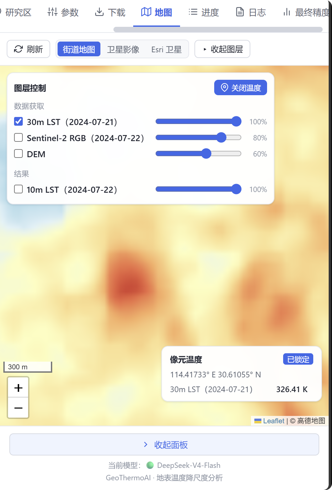
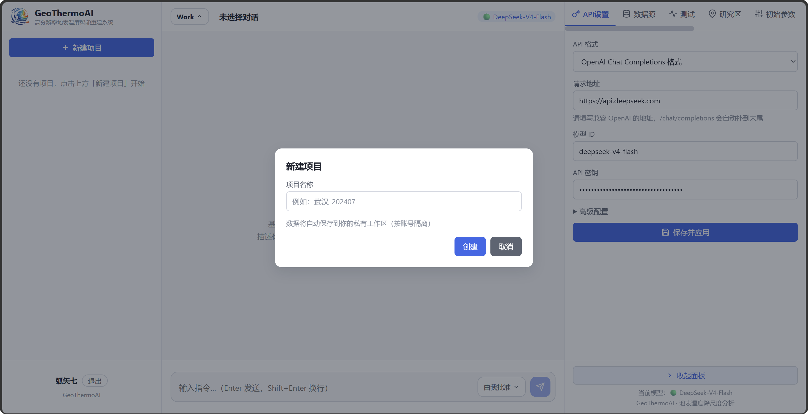
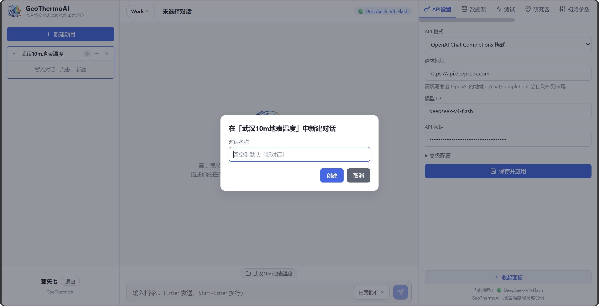
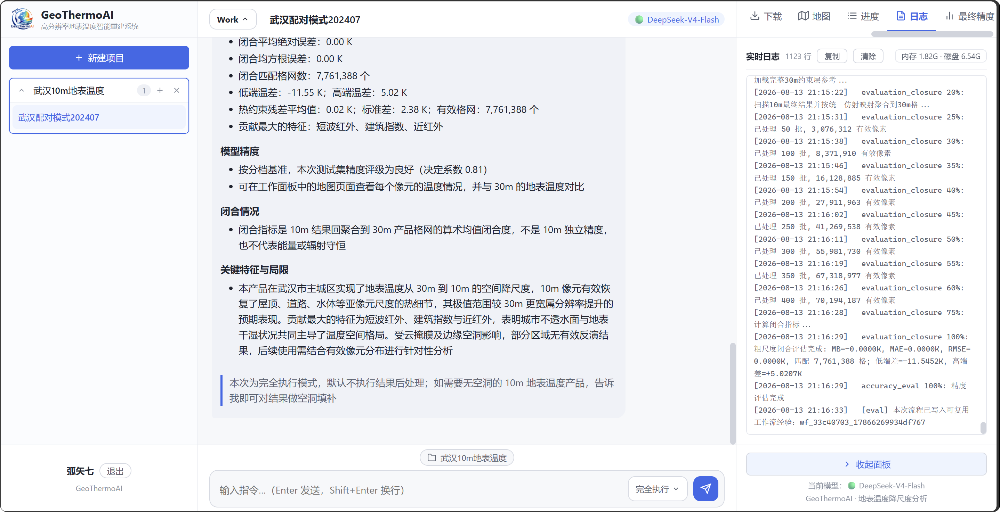
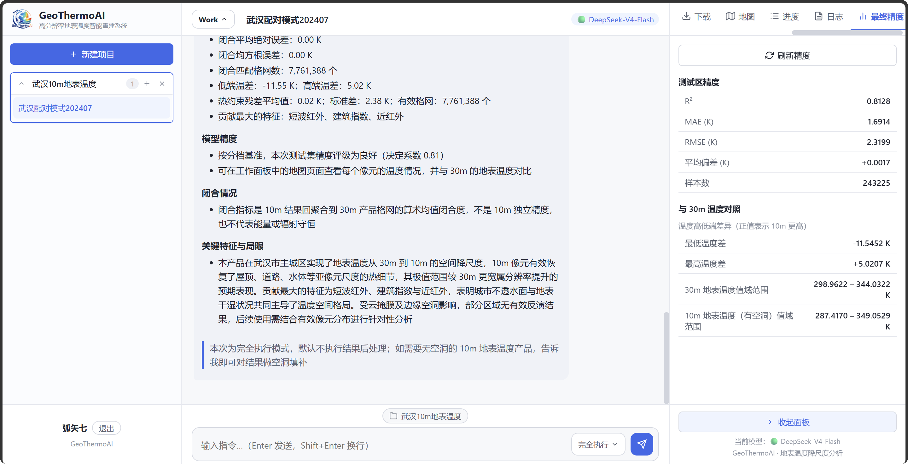

**[English](User-Guide.md)** | [简体中文](功能与使用指南.md)

# User Guide

## 1. Features

### 3.1 Memory for continuous tasks

　　GeoThermoAI does not treat each conversation as an isolated request. The system keeps confirmed study areas, temporal conditions, user preferences, execution plans, and experiment results, scoped by project and conversation, so that returning to the same project lets you continue existing tasks without restating all the background.

　　Memory is organized into three layers. Conversation memory stores the current task intent, confirmed conditions, missing information, and user approval state. Project memory accumulates historical experiments, result metrics, data combinations, and reusable workflows. Domain memory provides knowledge about land surface temperature, remote-sensing data quality, model training, and result evaluation. Each role retrieves different content: the Data role prioritizes data and quality control, the Train role consults model experience, and the Evaluation role retrieves evaluation knowledge. Only workflows that pass evaluation enter the reusable experience store, so later tasks can build on historical results while you keep the freedom to choose parameters and data again.

　　GeoThermoAI uses a **dual-track design of exact queries plus RAG semantic retrieval**: writes are dual (structured JSON records + ChromaDB vector passages), and reads overlay four sections into the prompt — domain knowledge RAG, project experience RAG, the best historical experiments (exactly sorted by R²), and structured exact matches extracted from the user query (region / time / image-pair dates). RAG with bge-small-zh-v1.5 ONNX embeddings and cosine similarity handles "semantic relevance", while exact JSON queries keep "metrics traceable". Both are tuned per role (planner / data / train / eval) in scope and result count, and RAG failures fall back through multiple levels (unfiltered query → curated seed entries). The core idea is **semantic retrieval for relevance, exact queries for metrics** — avoiding the failure of pure RAG in scenarios that need exact field matching.

### 3.2 Multi-role collaboration with dynamic switching

　　Ordinary remote-sensing tools take users straight to parameter panels or processing scripts. GeoThermoAI adds a task-control layer in front of the algorithms, decomposing a natural-language goal into four responsibilities: planning, data, training, and evaluation. A central scheduler switches roles dynamically as stages progress; roles share the task context but never cross responsibility boundaries to modify each other's conclusions. Table 1 summarizes the division of labor across a full pipeline.

<div align="center"><b>Table 1. Responsibilities of the multi-role agents</b></div>

<table align="center">
  <thead>
    <tr>
      <th align="center">Role</th>
      <th align="center">Main responsibilities</th>
      <th align="center">Value to the user</th>
    </tr>
  </thead>
  <tbody>
    <tr><td align="center">Planner</td><td align="center">Understands study area, time, and product goal; forms a staged plan</td><td align="center">Turns natural-language requirements into a reviewable task</td></tr>
    <tr><td align="center">Data</td><td align="center">Searches multi-source data; checks dates, cloud cover, and completeness</td><td align="center">Lowers the barrier of data preparation and quality control</td></tr>
    <tr><td align="center">Train</td><td align="center">Organizes terrain thermal response and Random Forest training</td><td align="center">Builds the model within explicit parameter bounds</td></tr>
    <tr><td align="center">Evaluation</td><td align="center">Summarizes held-out testing, value ranges, and coarse-scale closure</td><td align="center">Explains whether the result is usable, with one consistent standard</td></tr>
  </tbody>
</table>

### 3.3 Chat and Work dual mode

　　Inspired by the "Chat / Work" dual mode of the ChatGPT desktop app and the "Ask / Agent" dual mode of the Qoder desktop editor, this design draws a clear execution boundary for different conversational tasks, keeping them targeted and controllable.

#### 3.3.1 Chat mode

　　Chat explains algorithms, parameters, metrics, and result boundaries. It never starts downloads or modifies results — suitable for understanding the method before a run and asking about temperature values and accuracy meanings afterwards.

#### 3.3.2 Work mode

　　Work executes full tasks. The system first forms a plan, then proceeds through data acquisition, preprocessing, terrain thermal response computation, model training, thermal constraint correction, product export, and accuracy assessment. The interface shows the current stage, run status, and result entries in sync.

### 3.4 "Approve myself" and "Full auto" modes

　　Inspired by the "Ask for approval / Approve for me / Full access" modes of the ChatGPT desktop app, the two modes here are designed for workflows and are therefore available only in Work mode.

#### 3.4.1 Approve myself

　　"Approve myself" suits users who want to control the process. The system pauses at plan confirmation and key choices (such as image pairing selection and hyperparameter tuning), where you can accept the recommendation or adjust the study area, time, data combination, or model parameters.

#### 3.4.2 Full auto

　　"Full auto" suits tasks with well-defined parameters. The system completes all stages continuously according to established rules (including automatically selecting and downloading the most suitable imagery and LLM + rule-constrained intelligent tuning). If data are incomplete or quality is insufficient, it stops automatically instead of substituting placeholder imagery. Full auto shares the same remote-sensing processing and evaluation standards as "Approve myself" — the only difference is the degree of human involvement — and since it needs no intervention once the execution plan is fixed, it also suits beginners who are unfamiliar with the underlying principles.

### 3.6 Pair mode and monthly-composite mode

　　The downscaling strategy of GeoThermoAI relies on Sentinel-2 imagery to provide spatial detail for Landsat land surface temperature, so the two satellites' images must form a pair. Either a true pair — overpass time difference of at most 2 days with similar weather — or a pseudo-pair formed by monthly-composite imagery is acceptable. GeoThermoAI therefore offers pair mode for precise real-moment thermal scenes and monthly mode for long time-series monthly thermal monitoring. You can include the requirement directly in your instruction (prompt); GeoThermoAI parses it intelligently, and if it is not clearly specified, GeoThermoAI asks you proactively.

　　The monthly composition algorithm used by GeoThermoAI is the median compositing method common in remote sensing.

### 3.7 Automated data acquisition

　　GeoThermoAI packages the tedious data search, download, and preprocessing into an automated workflow. The system automatically searches Landsat, Sentinel-2, and Copernicus DEM, and selects usable data by time difference, cloud cover, and coverage. Table 2 shows the role of the three data sources in the workflow.

<div align="center"><b>Table 2. Multi-source data and their roles</b></div>

<table align="center">
  <thead>
    <tr>
      <th align="center">Data source</th>
      <th align="center">Main information</th>
      <th align="center">Role in the pipeline</th>
    </tr>
  </thead>
  <tbody>
    <tr><td align="center">Landsat 8/9 Level 2</td><td align="center">Land surface temperature and quality flags</td><td align="center">Provides the 30 m thermal reference and excludes clouds and cloud shadows</td></tr>
    <tr><td align="center">Sentinel-2 Level 2A</td><td align="center">Visible, near-infrared, shortwave-infrared bands and scene classification</td><td align="center">Provides 10 m spatial texture, spectral indices, and the valid-pixel domain</td></tr>
    <tr><td align="center">Copernicus GLO-30 DEM</td><td align="center">Elevation (this dataset is essentially a DSM)</td><td align="center">Computes slope, aspect, and terrain thermal response</td></tr>
  </tbody>
</table>

　　Data acquisition supports failure retry, result reuse, and local caching. Date-pair mode prefers thermal and multispectral images close in time. Monthly mode statistically composites cloud-free pixels from multiple scenes. Before modeling, the system checks required bands, coordinate information, and valid-pixel counts again, preventing incomplete data from entering subsequent computation.

　　To make data search and download convenient — and considering the difficulty of directly connecting to GEE from within China and the cumbersome GEE download process — GeoThermoAI uses two data sources: Microsoft Planetary Computer and Copernicus Data Space, acquiring the COG imagery of the three datasets above for processing. By default, GeoThermoAI uses Microsoft Planetary Computer to search and download Landsat data, and preferentially uses Copernicus Data Space for Sentinel data and DEM data, falling back to Microsoft Planetary Computer.

### 3.8 Map interaction and temperature usability assessment

　　GeoThermoAI provides an interactive map interface to visualize downloaded data and generated 10 m LST products, and to help you judge whether a generated temperature product is reasonable. The map panel supports basemap switching, layer visibility, opacity adjustment, and temperature display. Clicking a valid temperature area reads the Kelvin temperature of the corresponding pixel (both 30 m LST and generated 10 m LST), and the pixel temperature can be locked so it is not disturbed by cursor movement. Figures 1 and 2 show the map page displaying pixel temperatures around the Wuhan Railway Station area.

<div align="center"></div>
<div align="center"><b>Figure 1. 30 m land surface temperature around Wuhan Railway Station (cursor lock on)</b></div>
<div align="center"></div>
<div align="center"><b>Figure 2. 10 m land surface temperature around Wuhan Railway Station (cursor lock off)</b></div>

　　The final accuracy panel simultaneously shows the image dates, valid-pixel count, test-area accuracy, 30 m reference range, and 10 m result range, helping you judge the usability of the temperatures.

## 2. Getting Started and Online Experience

　　We deployed an interactive online application on ModelScope Studio for exploring GeoThermoAI. Two notes:

1. The ModelScope Studio instance is not isolated per user, so we designed a login system — you register with an account name, nickname, and password. We collect no personal privacy data; the login system exists only to isolate data produced by different users on ModelScope Studio;
2. Cloud resources on ModelScope Studio are limited (we use the free CPU plan with on-demand 2 vCPU and 16 GB memory); simultaneous use by multiple users may exceed the cloud memory or disk limits and crash the app. For serious work (such as generating a 10 m LST product for Wuhan), we recommend deploying locally in Docker from this repository — and even if you are unfamiliar with Docker, that is fine: in the AI era you can hand such tedious deployment tasks to an AI.

### 4.0 Local Docker deployment

　　`/app/data` inside the container is the persistent root for accounts, conversations, study areas, the task ledger, memory, and default project data. Production runs must mount this directory, otherwise deleting the container also deletes the run state. The commands below use a Docker named volume, so tasks and memory survive container re-creation:

```bash
docker build -t geothermoai-image .
docker volume create geothermoai_data
docker run -d --name geothermoai -p 7860:7860 \
  --memory=16g --cpus=16 \
  -v geothermoai_data:/app/data \
  geothermoai-image
```

　　If project imagery needs to live on a separate large-capacity disk, set `WORKSPACE_ROOT` and mount the corresponding directory; SQLite must still remain on a local persistent disk of the same machine. Concurrency, download connections, CPU, memory, disk cache, timeouts, memory write-back retries, and cache caps are all configurable via `config/deployment.json` or environment variables. Invalid values, unwritable directories, and SQLite on network drives make the service refuse to start. The full variable table and migration notes are in the [Deployment Configuration](Deployment.md) document.

### 4.1 Basic configuration

　　This section describes the configuration needed before formally generating a 10 m LST product with GeoThermoAI, including LLM configuration, data source configuration, connection tests, study area configuration, and initial model parameters. All of it is done in the workbench panel after entering a conversation. The workbench consists of the tabs "API Settings", "Data Sources", "Test", "Study Area", "Model Params", "Download", "Map", "Progress", "Log", and "Accuracy" — the first five are configuration items to confirm before use; the last five are for tracking task progress and results.

#### 4.1.1 LLM API configuration

　　Open the workbench panel and switch to the "API Settings" tab. First select the API format — the system supports the OpenAI Chat Completions format and the Anthropic Messages format; choose the compatible format for your model vendor. Then fill in the Base URL of the model (e.g. [https://api.deepseek.com](https://api.deepseek.com)); the system appends the corresponding endpoint path automatically. Next fill in the "Model ID" and "API key". Under "Advanced configuration" you can also set the "model display name" and the context window (context-input, context-output); set the window according to your model's supported range. Consult each vendor's developer platform for details. Click "Save and apply" when done — the model takes effect as a hot update. For security, a saved key is not echoed in plain text but shown as black dots; enter a new value to overwrite it.

　　We recommend DeepSeek V4 Flash: its latest official release is available via API, with low cost and strong capability.

#### 4.1.2 Data source configuration

　　The data acquisition stage needs no manual upload of raw imagery; the system automatically searches and downloads from Microsoft Planetary Computer and Copernicus Data Space. The division of labor: Sentinel-2 L2A (multispectral and scene classification) preferentially uses Copernicus Data Space, falling back to Microsoft Planetary Computer on failure; Landsat 8/9 L2 (LST and quality flags) uses Microsoft Planetary Computer; DEM (Copernicus GLO-30) preferentially uses Copernicus Data Space and requires S3 keys, otherwise uses Microsoft Planetary Computer.

　　Considering the inconvenience of connecting to foreign data services from within China, we suggest filling in your Copernicus Data Space account and password (register at dataspace.copernicus.eu) on the "Data Sources" tab, to prefer the faster Copernicus Data Space. Under "Advanced configuration" you can also fill in the OAuth2 Client ID and Client Secret (for image search) and the S3 Access Key and S3 Secret Key (required when DEM downloads go through Copernicus Data Space). If unconfigured or a download fails, the system automatically falls back to Microsoft Planetary Computer, so basic use is unaffected.

　　If you find Copernicus Data Space configuration too complex, it is fine to configure nothing: the system falls back to Microsoft Planetary Computer for search and download, at the cost of slower downloads (though still directly reachable from within China).

　　In addition, regardless of data source, we suggest enabling a proxy when deploying GeoThermoAI locally in Docker for faster downloads.

#### 4.1.3 Connection tests

　　After the configuration above, verify each item on the "Test" tab. It provides three tests: Planetary Computer connection, Copernicus Data Space connection, and the geospatial processing environment. Results are shown as status rows, with pass, warning, and failure in different colors. If a data source connection fails, you can tell whether it is a network problem or a credential problem and fix it on the "Data Sources" tab before retesting.

#### 4.1.4 Study area configuration

　　The study area is a required input for data acquisition and the full pipeline. On the "Study Area" tab, click upload and choose a GeoJSON or Shapefile (.geojson/.json/.shp/.dbf/.shx/.prj). Multiple study areas can be stored at once; click an entry to switch the active one, and use the delete button to remove unused ones. The agent uses the active study area for data acquisition and full-pipeline tasks.

#### 4.1.5 Initial model parameters

　　Model training uses Random Forest regression; the machine-learning method is currently fixed. On the "Model Params" tab you can adjust four hyperparameters with sliders: n\_estimators (number of trees), max\_depth (maximum depth), min\_samples\_split (minimum samples required to split an internal node), and min\_samples\_leaf (minimum samples per leaf). Recommended ranges are provided. For most tasks the defaults give reliable results; you can also adjust them at the plan-confirmation node of "Approve myself" mode.

### 4.2 Creating projects and conversations

　　GeoThermoAI is project-based: you can create multiple projects, and each project can contain multiple conversations. Memory is isolated between projects and shared within a project. A good practice is one project per region whose LST product you generate.

#### 4.2.1 Creating a project

　　Click "New project" on the left, enter a name summarizing your research goal, and confirm. Projects centralize study areas, conversations, data, results, and reusable experience. Figure 3 shows the project creation dialog. After you enter a name, an independent workspace is created; subsequent conversations and artifacts belong to that project.

<div align="center"></div>
<div align="center"><b>Figure 3. Creating a new research project</b></div>

#### 4.2.2 Creating a conversation

　　After creating a project, click the add button on the project card to create a conversation for this task. The name should include time and goal, e.g. "LST downscaling August 2024", but the name does not affect results. One project can hold multiple conversations to distinguish different periods or experiment plans. See Figure 4 for the entry and form. A conversation carries one specific consultation or processing task and stays in the project sidebar for later continuation.

<div align="center"></div>
<div align="center"><b>Figure 4. Creating a task conversation in a project</b></div>

### 4.3 Choosing interaction and execution modes

#### 4.3.1 Chat and Work

　　After creating a conversation, choose the interaction mode according to the task. Chat suits asking about methods, parameters, and result meanings; it starts no processing and changes no files. Work suits executing data acquisition, modeling, export, and evaluation. Figure 5 shows both modes and their interface notes. Work is for LST downscaling tasks; Chat is for algorithm Q&A.

<div align="center"></div>
<div align="center"><b>Figure 5. Choosing the Chat or Work interaction mode</b></div>

#### 4.3.2 "Approve myself" and "Full auto"

　　In Work mode you also choose the degree of human involvement. "Approve myself" pauses at key nodes, suitable for users who want to check the data. "Full auto" completes all stages continuously once conditions are clear, including hyperparameter tuning — suitable for beginners unfamiliar with the whole pipeline. See Figure 6 for the two options. Both use the same remote-sensing algorithms and quality rules; the only difference is whether key nodes wait for your confirmation.

<div align="center"></div>
<div align="center"><b>Figure 6. Choosing human approval ("Approve myself") or continuous execution ("Full auto")</b></div>

### 4.4 Submitting a task

#### 4.4.1 Setting the research conditions

　　Upload and select the study area in the study-area panel. Then state your goal in one complete sentence, e.g. "Downscale land surface temperature for Wuhan, July 2024". With "Approve myself", the system first lists the study area, temporal conditions, candidate data, and processing stages; computation starts after you confirm.

#### 4.4.2 Watching the run status

　　After the task starts, the workbench shows the status of data acquisition, preprocessing, terrain thermal response, model training, thermal constraint correction, product export, and accuracy assessment by stage. If data are missing or a quality check fails, the pipeline stops at the corresponding stage and explains why — it never continues with placeholder imagery.

### 4.5 Viewing maps and accuracy

#### 4.5.1 Querying pixel temperatures

　　Once any LST layer exists — including the downloaded 30 m Landsat LST — you can select the LST layer on the map and turn on temperature query. The temperature display tracks the cursor across layers and coordinates; clicking a pixel locks the current coordinate and Kelvin temperature until you click again to unlock. Layer selection, opacity adjustment, and pixel queries are shown in Figures 1 and 2 above.

#### 4.5.2 Reading accuracy metrics

　　The accuracy panel summarizes the spatially blocked held-out $R^2$, $RMSE$, $MAE$, and $MB$, with sample counts and temperature ranges. Figure 7 shows the final accuracy panel. Read the test-area accuracy as model evaluation on 30 m labels, not as independent 10 m ground-truth error. The panel brings the test-set metrics, sample counts, and valid temperature ranges together so you can judge the applicability boundary of the result.

<div align="center"></div>
<div align="center"><b>Figure 7. Reading test metrics and temperature ranges</b></div>

### 4.6 Downloading data and results

　　GeoThermoAI keeps raw downloaded data, intermediate processing files, and final results, all downloadable from the Download tab of the workbench: the raw subdirectory holds raw data, and the result subdirectory holds generated LST products. You can download the data for further analysis in ENVI, ArcGIS Pro, QGIS, and similar software.

## 3. Real Case Study

　　We used Wuhan data for July 2024 (pair mode; Landsat 9 on 21 July 2024, Sentinel-2 on 22 July 2024) to downscale LST from 30 m to 10 m, generating the Wuhan 10 m LST product for 22 July 2024. Figures 8–11 show the process and final accuracy.

<div align="center"></div>
<div align="center"><b>Figure 8. When the instruction does not say pair mode or monthly mode, the system asks</b></div>
<div align="center"></div>
<div align="center"><b>Figure 9. Full pipeline (excluding post-processing) completed in Full auto mode</b></div>
<div align="center"></div>
<div align="center"><b>Figure 10. Accuracy of the Wuhan 2024-07-22 10 m LST product</b></div>
<div align="center"></div>
<div align="center"><b>Figure 11. Wuhan 2024-07-22 10 m LST product compared with the 30 m Landsat temperature product</b></div>

　　As Figures 1, 2, and the figures above show, the 10 m LST product generated by GeoThermoAI resolves street and road-network detail clearly compared with the Landsat product. The data and results of this case have been uploaded to ModelScope (<https://modelscope.cn/datasets/Adhara/Wuhan_10m_LST_20240722>) for reference.
