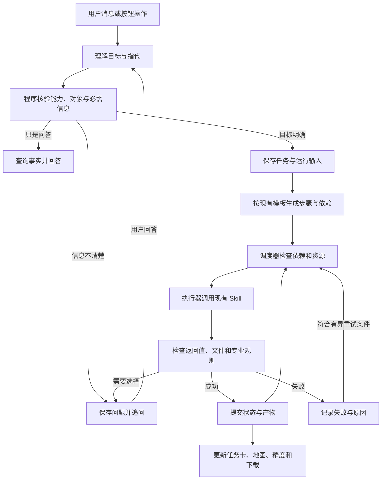
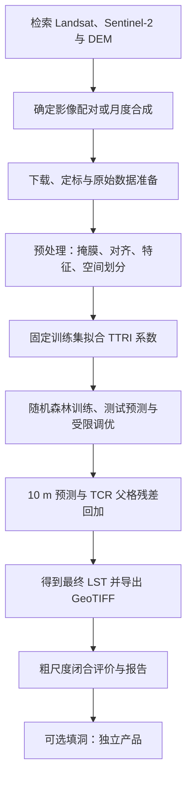
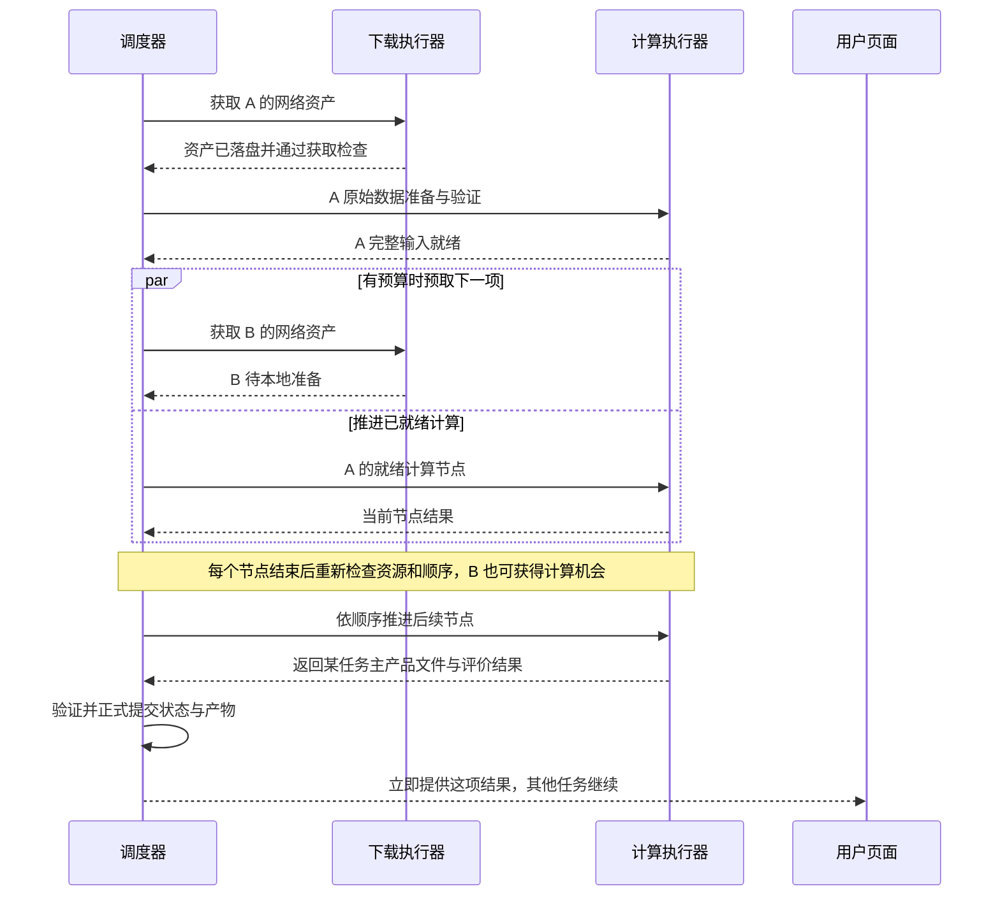
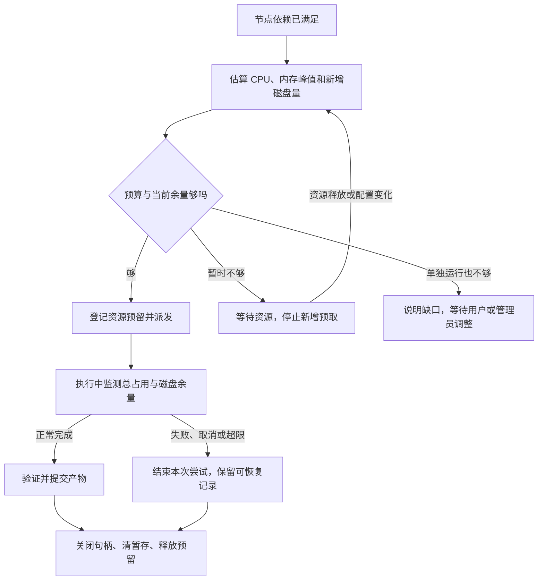
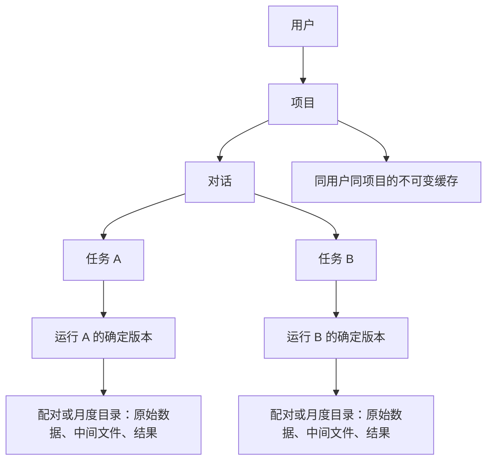

# GeoThermoAI 自然语言任务与执行编排改造说明（最终版）

修订日期：2026-09-08。适用分支：`CameronKwan/research-restart`。

**本文是当前实现依据。部署目标改为用户自有服务器上的 Docker，不再把魔搭创空间的硬件、目录、端口规则或休眠机制作为产品约束。** 自然语言理解、多角色分工和多任务交错的目标保留，资源管理改为“有默认值、可配置、按实际预算执行”。

本文只规定需要改出的行为、设计边界和验收方法，不修改代码。实现者应进仓库核对接口，不必再讨论是否保留角色、是否更换框架等已确定事项；降尺度算法和评价口径不借此重写。

| 想了解什么 | 阅读位置 |
|---|---|
| 最终要做成什么 | 第 1 节：目标与总图 |
| 为什么这样改，当前实际怎样运行 | 第 2 节：仓库现状；第 3 节：框架对照 |
| 怎样听懂用户、少问废话、处理多个目标 | 第 4 节：任务理解 |
| Agent、程序、记忆分别负责什么 | 第 5 节：分工和状态 |
| 怎样交错下载与计算 | 第 6 节：调度 |
| 怎样管理内存和磁盘，又利用更好的服务器 | 第 7 节：资源管理 |
| 怎样避免混结果、断线丢任务、重试互相覆盖 | 第 8 节：文件、恢复和界面 |
| 实现者从哪里接入，怎样验收 | 第 9、10 节；附录 A：代码证据 |

## 1. 要交付什么

### 1.1 已确定的设计

**保留现有专业角色和科学算法；不整体换 Agent 框架。** 把“一条消息对应一份计划、一条线程跑到底”，改成“消息操作独立任务，程序按依赖和资源执行”。

| 能力 | 改完后的目标行为 |
|---|---|
| 理解自然语言 | 区分问答、搜索、下载、局部处理、完整 LST 生产和已有结果填洞，不把模糊话语一律转成下载或填洞。 |
| 追问和上下文 | 只问真正缺少或有歧义的信息；知道回答属于哪个任务；允许更正、否定、继续和取消。 |
| 多任务 | 一句话可以建立几个任务，地区、月份和产品要求各自绑定；运行中仍能追加任务或回答问题。 |
| 专业角色 | 规划、数据检查、训练调优和结果评价各司其职；模型不决定资源分配，不凭文字宣布计算成功。 |
| 交错执行 | A 的输入就绪后立即进入可用计算资源，B 可同时下载；第一份结果完成就展示。 |
| 资源管理 | 根据部署预算限制作业、线程、缓存和预取；释放已不用的对象，清理可清理文件；更大服务器能够提高并发。 |
| 可恢复与可追溯 | 页面断线不取消任务；服务重启后从已提交步骤恢复；地图、精度和下载始终指向同一份结果。 |

### 1.2 系统如何合作

图中的“提交”指文件通过验证后，正式登记为可使用的产物。**任务成立不等于马上开算，下载结束不等于输入完整，报告写完也不等于算法成功。**

### 1.3 软件和部署者各自负责什么

| 部署者负责 | GeoThermoAI 必须负责 |
|---|---|
| 提供服务器，设置 Docker 的 CPU、内存限制和数据卷 | 识别实际限制，形成有限预算；没有设置限制也不能默认资源无限。 |
| 决定服务器还运行哪些服务，以及备份和运维方式 | 留出服务与波动余量，监测当前压力，不占满所有可见资源。 |
| 按业务规模调整并发和缓存预算 | 校验配置是否可行，在总预算内分配作业；不能每个任务各自占满机器。 |
| 选择域名、外部端口和反向代理 | 保留可部署的 Docker 入口，支持断线重连、状态恢复和用户权限校验。 |

Docker 解决打包与部署，不会自动消除应用的资源问题。官方说明指出，容器默认并没有 CPU、内存限制，因此应用仍需有自己的预算和管理逻辑。[Docker 资源限制说明](https://docs.docker.com/engine/containers/resource_constraints/)

本次交付面向单个服务器部署，使用一个调度器和有限数量的执行进程。无需引入分布式集群、开放工具市场、任意代码生成或完整的多租户运维平台。

## 2. 现在的系统实际怎样运行

### 2.1 阅读依据与边界

原调用链审查对应提交 `e9a5c45183db4f4a97179872fe840d1cda016393`。本次核对的提交为 `55cc73999a1f873ce13d32f093447b523f4122db`；两者之间只有本文档的新增，相关代码未变。本次另追查了下载缓冲、CPU 配额、资源监测、清理、重建和数据目录。

已阅读的是从用户输入到 10 m LST 的完整调用路径及相关实现，不声称逐行读完全部仓库。未启动服务、调用真实模型、下载生产数据或进行负载测试。下面区分**代码事实、需要改的风险和验收要求**，不把内存峰值问题直接称为已经证实的永久泄漏。

### 2.2 从自然语言到计划

| 环节 | 现状与问题 | 证据 |
|---|---|---|
| 前端 | 一次发送项目、对话、消息和模式，没有同一对话内独立的业务任务编号；页面只有一个活动事件订阅。 | R1 |
| server | 不同对话可开不同后台线程；同一对话运行中再次发消息，可能被“已有任务执行中”挡住。 | R2 |
| 默认入口 | Work 默认启用专业角色；Chat 直接走问答。旧关键词入口仍可配置启用，不能把它当成唯一主路径。 | R3 |
| 意图与槽位 | 已有模型分类和缺项追问，也能把“25 年”“7 月”合并；但只保存一套信息，无法可靠绑定“武汉七月、南京八月”。 | R4 |
| 关键词覆盖 | “继续”遇到已有 LST 可能被强制改成填洞；局部步骤无法推断时默认下载，模型提出的问题也可能被清掉。 | R4 |
| 否定和默认 | 本轮否定值被移除后，旧值仍可能被合并回来；默认产品有时被记作用户明确给出。 | R4、R7 |
| 产品方式 | 整月的配对/月度选择另在计划确认后处理，未作为稳定任务信息贯穿恢复。 | R3 |
| 计划与参数 | 规划把云量等写在计划约束里，执行器却可能读步骤参数或界面设置；RF 前还会重读设置。计划摘要与实际调用可能不一致。 | R3、R4、R6 |

这里缺少的是**持久、独立、可修改和恢复的业务任务模型**，不是完全没有规划或运行状态。

### 2.3 Agent、执行器和反思

| 模块 | 当前真正做什么 |
|---|---|
| Planner（规划角色） | 理解意图、补槽、生成计划，失败时提出调整。模型输出还会受到规则修正。 |
| 角色编排层 | 创建角色，调用执行器，处理继续、重试、暂停、中止和重规划。 |
| Data（数据角色） | 按云量、覆盖和时间差等固定权重排序配对；在下载、预处理、TTRI 后执行规则检查，模型解释失败。 |
| Train（训练角色） | 组织首轮训练、手动或自动调优、最佳轮提升和清理；参数范围与停止规则由程序限制。 |
| Evaluation（评价角色） | 从真实指标组装数字、评级和口径，模型补充定性说明；可调用既有填洞技能。 |
| executor 与 Skill | 注入路径和参数，调用 Python 算法并收集返回结果；不是四个角色各自同时跑计算。 |

四个角色共用模型客户端封装。角色实例按运行建立，server 按用户缓存顶层问答、Agent 和记忆对象；内置 Skill 在全局注册。[R3、R5、R6]

需要修正的边界有两处：

- 数据检查的硬失败不能因用户点击“接受”就变成成功。可接受的质量告警和缺文件、损坏输入必须分开。
- 现有执行器部分路径会先发“完成”回调再处理失败，个别异常后仍进入下一步；独立 pipeline 则失败即停。新的执行状态必须统一以真实结果及依赖文件为准。[R5、R6、R11]

### 2.4 10 m LST 在哪里产生

默认自然语言入口由执行器调用已有 Skill 包装器，复用下列科学算法。它没有直接调用独立 pipeline 的整套入口。

| 环节 | 必须读对、保留的事实 |
|---|---|
| 数据获取 | 搜索结果可传给下载复用；配对时间差规则为不超过 2 天，一次下载不等于遍历全部候选生产。数据源分支依传感器、配置和产品方式而异。 |
| 配对与月度 | 配对描述一次日期接近的观测组合；月度对选定时段场景做掩膜后的逐像元中位数合成，再降尺度，不是把逐日 10 m LST 简单平均。 |
| 预处理 | Landsat DN 按现有定标转 K，结合 QA、SCL 和热红外有效性，构建光谱/地形特征。训练抽样表与完整 30 m 约束层是两条不同数据流。 |
| 数据划分 | 保留空间块及缓冲区划分的训练、验证和测试集合。训练抽样不能代替全部有效 30 m 父格的约束。 |
| TTRI | 只在固定训练集拟合一次，其他集合与 10 m 特征复用系数；表达式不含拟合截距，不随 RF 每轮调优重新拟合。 |
| RF（随机森林） | 训练并预测测试集，调优在分轮目录执行，选定模型供下游使用。当前测试指标参与调优与选优，这是现有方法事实。 |
| TCR（热约束校正） | 先预测 10 m，再按真实 30 m 父格计算“参考温度减细像元预测均值”的残差并回加。默认按父格使用常量残差；平滑再归中模式存在，但不是默认。 |
| 最终温度与导出 | 最终温度已在 TCR 中算出；`core/lst_final.py` 主要验证和复制结果，导出模块按行列及格网信息生成 GeoTIFF。 |
| 评价与填洞 | RF 测试预测评价与 30 m 算术均值闭合是两件事。闭合不等于独立 10 m 观测精度，也不能称辐射或能量守恒。填洞另出产品及掩膜，不覆盖主产品。 |

代码证据见 R8–R11。独立 `core/pipeline.py` 是另一套更细的顺序接口；只改它不能宣称已改好 Agent 调度。

### 2.5 记忆、并发和资源的现有基础

| 已有基础 | 仍需补齐的边界 |
|---|---|
| 会话 JSON 保存意图、槽位、问题和重规划次数 | 只有一套槽位；不等于完整任务、执行权和恢复记录。 |
| 项目实验、偏好、成功流程及领域知识有精确读取和向量检索 | 经验可以辅助理解，不能替代当前任务状态。Chat 目前也未接入与 Work 完全相同的记忆上下文。 |
| JSON 写锁、原子替换和检索锁 | 不等于整个任务的一次事务，也不自动解决实验记录与向量记录双写。 |
| 每个项目下不同对话有独立目录 | 没有跨入口统一的下载、计算和内存预算；同一对话中的多任务也还缺运行隔离。 |
| 已有项目级原始数据缓存 | 部分复用只验存在和非空；按边界文件名和日期命中，无法充分识别同名边界替换或不同合成场景。 |
| 下载有分块请求，月度/TCR 等已有分块处理 | 下载仍累积整文件字节并复制；月度块的景数、宽度和临时数组也影响峰值。 |
| RF 能读取容器 CPU 配额，代码有释放引用和清缓存操作 | 各模型分别遵守配额不等于并发作业共享配额；释放调用也不等于已证明无泄漏。 |
| 清理、最佳轮模型删除和输入重建已存在 | 清理必须限定运行和消费者；不能在并行时从项目根清掉他人正在读取的数据。 |
| 资源面板已有用量信息 | 当前主要统计主进程内存，且缓存读数；引入子进程后不足以反映应用总占用。 |

还有两项与任务改造直接相关：审批不少依赖内存事件和存活线程；结果与续接多处按“最新文件”或混合完成步骤定位。它们分别由第 5、8 节解决。[R1、R2、R7–R14]

## 3. 为什么保留现有框架

### 3.1 外部设计怎样落回本仓库

下列框架和遥感/GIS 系统只作为设计对照，不把它们的能力算到本仓库头上。资料在原审查中核对，访问日期为 2026-09-07。

| 来源 | 借鉴什么 | 本仓库的决定 |
|---|---|---|
| [Anthropic：Building effective agents](https://www.anthropic.com/engineering/building-effective-agents) | 区分预定流程与模型自主行动，复杂度应有收益 | 科学依赖已知，继续受控流程；不增加角色辩论、自主写算法。 |
| [LangGraph：Workflows and agents](https://docs.langchain.com/oss/python/langgraph/workflows-agents) | 独立状态、节点和条件分支 | 每个遥感任务有独立输入；Agent 并行示例不等于已解决下载和计算资源调度。 |
| [LangGraph：Persistence](https://docs.langchain.com/oss/python/langgraph/persistence) 与 [Interrupts](https://docs.langchain.com/oss/python/langgraph/interrupts) | 运行检查点与长期记忆分开；暂停可保存、恢复有身份 | 问题和任务状态落盘；等待释放资源；重入时不重复执行已提交副作用。 |
| [Rasa CALM：Dialogue understanding](https://rasa.com/docs/learn/concepts/dialogue-understanding/) 与 [Writing flows](https://rasa.com/docs/pro/build/writing-flows/) | 把语言转成设值、纠错、开始和澄清等受限操作 | 改造现有 Planner 的理解层，程序更新任务并编译步骤，不引入 Rasa 运行时。 |
| [GeoGPT 原论文](https://arxiv.org/html/2307.07930v1) | 语言连接 GIS 工具，执行前检查对象与条件 | 保留 Skill 边界，校验真实输入；合法格式不等于合法遥感任务。 |
| [Earth-Agent 作者实现](https://github.com/opendatalab/Earth-Agent) | 遥感工具行动循环，评价工具选择、顺序和参数 | 验收看是否选对任务、数据和步骤，不只看是否生成一张图。 |

### 3.2 拍板后的技术选择

| 保留或新增 | 原因 |
|---|---|
| 保留 Python 编排、专业角色、规则、Skill 和科学算法 | R3–R7 已有这些基础，主要缺口在任务身份、语义后处理和生命周期。 |
| 新增一个程序调度器 | 所有入口通过它派发；同一任务不因页面数、角色数或 Web 请求数重复启动。 |
| SQLite 保存任务运行状态 | Python 已可直接使用，适合本次单服务器、有限并发；不把大数组存进数据库。 |
| 文件保存栅格、模型和表格，运行清单记录产物 | 保持现有文件算法接口，补齐输入、输出和恢复关系。 |
| 有限执行进程，按资源派发 | 隔离大计算与界面服务，按需利用多核与更大内存。 |

换框架不会自动修复缓存身份、按修改时间选结果、下载多份缓冲或底层线程争用。因此本次不迁移整个框架，也不留下“换框架或自研任选”的待定项。

一个部署只允许一个有效调度器，用启动锁防重复。执行器按任务提交结果，不直接改任务数据库。多机调度不属于本文；增加 Web 进程也不能因此产生多个相互独立的调度循环。

## 4. 自然语言怎样变成可靠任务

### 4.1 先确定用户要什么，再决定跑哪些步骤

在既有 Skill 上建立一份能力目录，写清目标、必需输入、允许参数和产物。模型只能提出目录内的候选操作，不能编造文件路径或新算法满足请求。

| 用户目标 | 必须明确的信息 | 实际执行到哪里 |
|---|---|---|
| 问方法、参数或历史指标 | 问题；涉及结果时需唯一结果引用 | 只回答。历史数值从真实记录取。 |
| 只搜索影像 | 研究区、时间、搜索条件 | 展示候选，不下载。 |
| 下载数据 | 研究区、时间、数据集合，必要的配对/月度方式 | 下载并验证指定集合后结束，不自动训练。 |
| 只预处理、只训练等 | 具体已有输入批次及必要参数 | 执行目标和已授权的必要重建；缺依赖先说明。 |
| 生成 10 m LST | 研究区、时间、产品方式及可用模型 | 编译现有完整生产链。 |
| 给已有结果填洞 | 唯一主产品及其生成时边界 | 独立填洞，不重新训练，不覆盖主图。 |
| 继续、修改、取消、问进度 | 唯一目标任务，修改时还有改动内容 | 操作已有任务，不另开一项生产。 |

未指定下载集合时，可在摘要中说明采用当前 LST 标准输入集合。没有注册的模型、1 m 实测温度或新的热岛指标不能默默换成默认 LST 产品，必须说明能力边界。

### 4.2 一条消息可以有多个操作

理解器输出“新建、补值、清除、更正、回答、继续、重试、调整优先级、取消、只回答”等受限操作，并带原句依据及目标对象。

程序按下面顺序放行：

1. 检查输出格式、操作种类和能力是否支持。
2. 检查用户权限、目标是否唯一、输入文件是否真实存在。
3. 检查地区与时间绑定、否定条件、信息冲突和依赖。
4. 保存确定信息；只对未解决部分追问。
5. 从已确认信息编译步骤，形成固定运行输入。

模型支持结构约束输出时使用它；不支持时沿用兼容格式并做本地校验，最多一次格式修复。模型超时或持续无效时保留已确认内容，明确等待，不用“默认下载”兜底。

关键词仍可辅助识别日期、别名等，但不再有“有图就填洞”“猜不到局部步骤就下载”的执行权。是否追问由真实歧义和缺项决定，不靠模型自报置信度。

### 4.3 信息的优先级与冻结方式

“槽位”就是执行目标需要的信息项，如研究区、时间、产品方式。一个任务一套槽位；任务草稿记录想做什么，运行记录某个确定版本实际做什么。

| 情况 | 固定规则 |
|---|---|
| 本轮明确给值或否定旧值 | 优先级最高；否定要真正清除，不能从旧对话补回来。 |
| 当前任务已确认信息 | 后续补答保留它，不重问已知内容。 |
| 沿用历史或现有产品 | 只有用户明确沿用，才作为输入；随口提到一个城市不算授权。 |
| 项目偏好、界面选择、历史建议、内置默认 | 依次作为较低优先级来源，明确要求优先；来源和是否已确认分别保存。 |
| 只有一个可用研究区且用户未另指地区 | 摘要说明采用它即可；多个候选、文字冲突或边界缺失才追问。 |
| 相对时间 | 按消息接收日期及时区转成绝对日期；重试、跨天恢复不重新解释。 |
| 单日或明确区间 | 不擅自补成整月；“去年夏天”等有多种合理解释时追问。 |
| 配对与月度 | 在计划确认前解决；月度已经明确不重复问。多个整月按月建任务，不把任意区间冒称整月产品。 |
| 设置变化 | 创建可执行运行快照、进入队列前就冻结参数；排队和执行中都不重读界面设置覆盖。后续修改只影响新运行，调优参数另记作本运行的轮次决定。 |

研究区保存几何内容标识和副本。更换同名文件或切换界面当前边界，不得修改已排队任务。计划摘要、保存参数和实际 Skill 调用值必须一致。

### 4.4 怎样追问、怎样接答案

| 规则 | 用户会看到什么 |
|---|---|
| 优先问决定执行方向的关键问题 | “要保留一次过境细节，还是生成整月合成产品？”并简短解释区别。 |
| 同一任务相关缺项可合并问 | 用户只补一项时，其他已知值不丢，剩余问题保留。 |
| 多任务共享缺项可合并问 | “这两个地区都用哪一年？”答案只覆盖发问时列出的任务。 |
| 文字和卡片走同一处理入口 | “第二组”“都用七月”与点按钮具有相同行为。 |
| 问题绑定任务版本 | 旧卡片不能启动修改后的任务，重复点击只返回已处理结果。 |
| 共享回答全部验证后一起提交 | 若其中南京已取消，旧“都用七月”不部分生效、不复活南京；更新范围，保留武汉已有信息。 |
| 自动执行仍不能猜语义 | 不因页面断线、等待超时或自动模式就猜边界、产品方式，或自动批准待答问题。目标和范围已确认且允许自动执行时，Data 仍可按既有规则在真实候选中选配对，并记录依据。 |

问题持久保存，不靠一条线程等待半小时。明确请求按已有执行模式推进，不额外重复问“是否真要执行”。

### 4.5 典型对话应如何处理

| 用户表达 | 应发生的行为 |
|---|---|
| “武汉七月、南京八月，都是 2025 年，做月度产品” | 两个任务，各自绑定正确月份，不交叉生成四项。 |
| “两地七月和八月都要” | 两地和年份唯一时生成四项；否则只补问缺项。 |
| “不是武汉” | 清除武汉，问新地区，不继续武汉下载。 |
| “南京改成九月，武汉照旧” | 只改南京任务版本，武汉继续。 |
| 下载后“接着生成温度图” | 绑定这个批次；完整输入可用则不重复下载，已清理输入按血缘重建。 |
| “继续”，但有两个未完成任务 | 问一次指向哪项；只有一个合理目标时直接续接。 |
| “这张图补洞” | 绑定明确主图，另出填洞产品。 |
| “重新完整做一遍，也要无空洞结果” | 完整主生产加填洞，不能被压成单步后处理。 |

一条消息产生的批次只是汇总容器。一个成员缺信息、等待或失败，不取消其他独立成员；不同城市之间不凭空添加依赖。

## 5. 角色、任务状态和记忆如何分工

### 5.1 保留专业角色，执行权归程序

| 角色或组件 | 保留的责任 | 明确边界 |
|---|---|---|
| Planner | 理解目标、解释草稿，必要时提出调整 | 固定科学步骤由模板编译，不每次让模型自由改写。 |
| Data | 配对排序、完整性及质量检查 | 缺文件或损坏输入必须阻断下游；告警被接受要记录，不能把失败变成功。 |
| Train | 合法范围内调优、分轮记录、停止判断和最佳轮选择 | 不擅改种子、用户要求的轮数或选优口径；等待选择时释放计算资源。 |
| Evaluation | 数字、评级、科学口径、结果解释 | 数字来自程序；模型解释失败用现有兜底，不掩盖已生成产品。 |
| 调度器 | 唯一负责资源派发、任务状态转换与正式提交 | 不生成科学结论，也不让每个角色自己开工作线程。 |
| 执行器与 Skill | 执行明确输入，返回事实和文件引用 | 不直接写任务完成状态，不跨任务清理或改参数。 |

角色数量不等于进程数量。正常确定性阶段不额外调用模型；需要理解、建议或解释时才调用。

网络重试和语义修改分开：网络超时可在预算内重试；扩大日期、换研究区、改产品方式或越过用户明确云量限制，必须有用户授权。自动执行也不能暗改月份。重规划、候选排除和调优次数恢复后不归零。

旧的关闭角色模式可以作为单任务兼容入口保留，但同样通过新的身份、提交、资源和失败校验；不能另开一套多任务语义或在超时后自动选第一组。

### 5.2 哪些状态必须保存

| 对象 | 意思 | 最少保存什么 |
|---|---|---|
| 任务 | 用户的一项目标 | 所属用户/项目/对话、原消息、目标、版本、优先级、槽位、歧义。 |
| 运行 | 某版任务实际执行的一次过程 | 输入快照、计划版本、绝对日期、边界副本、场景清单、参数、授权和调优历史。 |
| 节点 | 可以独立提交和恢复的一步 | 依赖、状态、资源需求、输入/输出引用、有效执行尝试。 |
| 问题 | 正在等用户回答的事项 | 真实候选、目标列表及版本、回答方式、是否已处理。 |
| 产物 | 一份经验证的文件或结果 | 所属运行、类型、位置、完整性、科学输入来源、主图或填洞身份。 |
| 事件 | 已发生的关键变化 | 归属、递增序号、类型和说明，用于界面同步与审计。 |

任务数据库保存这些精确事实。每条记录校验用户归属；大数组、整个 Agent 对象和数据集句柄不放进去，凭据只保存引用，不复制到快照或日志。

### 5.3 记忆仍有价值，但不是运行数据库

| 记忆层 | 读什么、写什么 | 不承担什么 |
|---|---|---|
| 会话 | 任务引用、当前谈论对象、待答问题引用 | 不再共用一套生产槽位。 |
| 项目实验 | 实际参数、场景、指标、结果、失败及运行编号 | 不靠历史成功记录判断新任务已完成。 |
| 项目偏好 | 用户明确说“以后默认”或接受保存的偏好 | “这次放宽云量”不变成以后默认。 |
| 成功流程 | 已真实完成的可复用经验，保留现有入库门槛 | 报告文本成功不等于流程成功；填洞与主链分别记。 |
| 领域知识 | 通过向量检索提供背景、方法和解释 | 不生成不存在的指标，不替代已确认用户要求。 |

检索资料来辅助模型回答称为 RAG（检索增强生成），向量检索是其中的一种取资料方式。任务恢复只读任务数据库及产物清单，不通过相似问答猜进度。

实验与流程记录补齐任务、运行、输入指纹和产物身份；同一尝试重复收尾只写一次。不能按整个对话删除其他任务的暂停记录，不能仅因另一个任务曾用过某个日期就排除本任务候选。

记忆写失败可告警并保留已完成产品；任务状态或问题写失败则停止派发。两者可靠性要求不同。Chat 可查询有权访问的真实历史，但继续只回答，不提交生产任务。

## 6. 下载与处理怎样交错

### 6.1 按节点调度，不按整条任务排长队

一个普通生产任务对应确定研究区、时间、产品方式，以及一组已选影像或一个月份。多个候选只有明确要求全部处理，才扩成多个任务。

| 节点类型 | 做什么 | 占用什么资源 |
|---|---|---|
| 搜索和选择 | 查询目录、保存候选、等待选择 | 少量网络及内存；等待用户不占执行资源。 |
| 网络获取 | 获取原始资产或需要的范围块，写暂存文件 | 下载连接、有限缓冲和磁盘预留。 |
| 原始数据准备 | 定标、重投影、拼接、月度合成及完整性检查 | 需要重处理时申请计算资源；不能仍算作纯下载。 |
| 科学计算 | 预处理与划分、TTRI、RF 每轮及最佳轮提升、TCR、导出、评价、可选填洞 | 进入计算队列，按该步骤分配 CPU、内存和输出空间。 |
| 状态和解释 | 提交记录、更新界面、简短模型说明 | 有限轻量资源；不长期占着重计算位置。 |

科学链上的算法节点统一从计算队列派发。少量元数据检查和状态读取可以轻量执行，但不能把栅格拼接等工作改个名字就绕过计算预算。

### 6.2 输入完整才允许生产

所有来源——新下载、缓存命中、月度合成——通过同一个交付检查。

| 任务目标 | 完成标准 |
|---|---|
| 完整 LST 生产输入 | LST、QA、所需 S2 波段、SCL、DEM 齐全且可打开；元数据、来源、波段含义及研究区相符；满足既有有效性检查。 |
| 月度产品输入 | 除上述要求，还要有确定的场景清单与合成成功记录。 |
| 只下载某类数据 | 按用户指定集合验证后即可完成；例如只下载 S2，不自动补其他传感器。 |
| 子集下载后继续生产 | 检查同一范围、时间与方式下缺什么，取得相应目标授权后补齐。 |

不同传感器原始分辨率可以不同，只要规格正确且可对齐；最终对齐仍属于预处理。完整包验证通过后登记“LST 输入就绪”，不是看到某个目录非空就放行。

### 6.3 两个任务的典型时序

以下表示一个下载作业、一个计算作业时的交错示例，不是实测耗时，也不规定 B 必须等 A 整条任务结束。

下载侧不能持有整幅数组等待计算，计算侧也不能占着计算资源等待长时间远端下载。仍保留按研究区窗口读取云端栅格的能力，不能为了拆节点强制改成整景下载。

### 6.4 先出结果，也不遗忘其他任务

| 顺序规则 | 执行办法 |
|---|---|
| 用户明确优先级 | 优先处理指定任务，显示原因，不强行中断正在进行的数值步骤。 |
| 没有优先级 | 下载按接收顺序；已进入生产且下一步就绪的任务优先推进主结果。 |
| 防止一直插队 | 同优先级的就绪任务被跳过两个计算派发机会后进入保护队列，按入队顺序获得一次节点机会，再清零计数。 |
| 等输入或遇到失败 | 释放资源，其他独立任务继续，不阻塞整批。 |
| 可选填洞 | 不长期挡住其他尚无主产品的任务；用户明确指定优先则遵从。 |

每完成一个节点重新选任务，不能把整条流程绑在某个进程里一直等待。保护队列只是一份短列表和计数，不另建复杂调度平台；保证的是获得机会，不承诺巨大节点在固定时间结束。

## 7. 资源管理：默认稳健，配置后能扩展

### 7.1 不把服务器大小写死

**默认采用一个重计算作业与一个下载作业交错，但这只是开箱即用的起点，不是产品上限。** 单个计算作业可以使用分配到的多个 CPU 线程；管理员提高作业并发后，程序仍按总预算派发。

| 配置项（中文含义） | 默认设计 | 如何扩展 |
|---|---|---|
| 同时重计算的作业数 | 1；每个作业可使用多线程 | 可设为 2 或更多，必须同时满足总 CPU、内存和磁盘条件。 |
| 同时下载的作业数 | 1 | 可增加，仍共用连接及缓冲预算。 |
| 分块下载连接总数 | 全应用最多 8，沿用现有下载规模作为起点 | 可调整；不能每加一个任务再独立开 8 条连接。 |
| 后续数据预取数量 | 最多 1 份尚未进入本地准备的数据包 | 可增加，按预计字节数预留磁盘；任务队列本身不预加载数组。 |
| 模型请求、目录检索 | 两类各默认最多 2 项同时请求 | 可配置；查询已保存状态、按钮取消和提交答案不排在远端请求之后。 |
| CPU 使用预算 | 读取实际可用额度，默认至少留出约一个核心的余量；不足两核时保留一个计算线程并服从容器限额 | 管理员可明确设置预算，不固定单线程，不按物理主机核数盲开线程。 |
| 内存使用预算 | 采用实际边界的 80% 作为默认应用总预算，其余留作波动余量 | 可显式配置预算及余量，但不能超出有效容器限制。 |
| 磁盘缓存预算 | 可再生缓存默认不超过数据卷容量的 10%，且默认最多 20 GB | 可调整；这是可淘汰缓存上限，不是用户输入、正式结果或研究区规模上限。 |

这些数值是工程默认值，不是已测出的最优参数。部署配置使用清楚的名称和说明，启动日志显示实际生效预算及检测来源。不要要求普通科研用户逐个配置内部线程变量。

**预算的取法必须一致：**

- CPU 同时考虑容器配额、允许使用的核心和管理员设置，取最严格限制。少于一个完整核心的配额仍交由容器限制实际 CPU 时间。
- 内存先取管理员分配的应用边界、容器有效上限和可见物理内存中最严格的值，再扣默认余量；不存在容器上限不表示可无限用宿主内存。
- 没有可信检测结果时，只维持轻量服务并提示设置预算，不自动增加重任务。共享服务器还要检查当前可用量，避免其他程序已经占满时继续派发。
- 运行中提高并发只影响后续派发；降低预算时先停止新派发与预取，不突然把已经开始的计算改成另一种算法。

例如，检测到 8 核且没有更小限制时，一个计算作业可分到约 7 个核心的线程预算；若允许两个作业同时运行，它们共享这 7 个核心，而非各自再用 7 个。内存不足以容纳两项时，仍只运行一项。

### 7.2 派发前、执行中、结束后都要管

估计依据至少包含栅格尺寸、波段/景数、数据类型、样本表大小、模型参数和该节点历史峰值。月度合成不能只看行块数而忽略整块宽度及场景数量。

资源账本分别记录常驻服务占用和在运行节点的峰值预留，不能漏记下载缓冲、地图、记忆，也不能把同一份内存重复预留两遍。派发前的预留检查与执行中的实测压力检查同时存在。

| 遇到的情况 | 应采取的行为 |
|---|---|
| 已有任务占用较高 | 先停新预取、减缓下载，再停止派发其他重节点；显示具体等待原因。 |
| 对节点峰值还没有可信估计 | 采用保守估计并独占计算、不叠加预取，记录峰值；不能把“未知”当成零。 |
| 单任务预计也放不下 | 说明输入规模、估计需求和当前预算；允许管理员提高预算或用户修改范围。不得静默抽样、降分辨率或少处理几景。 |
| 执行时超出预留 | 停止新派发；在现有等价分块/缓存能力范围内降低额外占用，不能改变科学输入。无法控制时结束受影响尝试并报告资源失败。 |
| 重计算进程异常退出 | 该节点失败，下游不启动；释放实际已结束进程的预留，其他任务按剩余资源继续。 |
| 服务自身也被容器终止 | 重启按持久状态对账恢复，不声称子进程隔离能保证任何内存溢出都不影响主服务。 |

同一资源失败不得无限自动重试。只有预算、占用或输入条件发生变化后才重新派发；网络重试则继续受单独次数限制。

### 7.3 内存：先消除不必要的驻留

| 已发现的代码事实 | 必须改出的行为 |
|---|---|
| 普通下载把全部块存入列表再拼接；并行下载保留整文件缓冲、请求结果，再复制成字节串 | 逐块写本次尝试的暂存文件，限制在途请求与缓冲；取数完成后释放响应和块引用。不能只把 HTTP 调成流式就算完成。 |
| RF 训练和验证表仍有整表载入 | 保留算法，计入最低内存需求；不承诺仅靠调小读取块就能训练任意范围。 |
| 月度、TCR 和部分表格操作已有分块 | 在不改变数值口径前提下利用既有分块，避免重复物化全量数据；新实现保持块边界之外的科学一致性。 |
| GDAL、地图瓦片、模型与记忆可能常驻 | 缓存有容量和闲置淘汰；关闭数据集、文件和线程池。清理一项任务不能破坏其他任务正在用的缓存。 |
| 每用户记忆对象可能创建同一嵌入模型；搜索缓存过期检查不等于清除条目 | 可复用经过并发验证的只读模型，用户集合与权限独立；搜索缓存到期删除并限制条目数，闲置用户对象可释放后重建。 |
| 已有释放引用和内存归还工具 | 保留有用措施，补齐异常与取消路径；“调用了垃圾回收”不是验收结论。 |

重计算按节点交给独立子进程，节点结束后退出，避免原生库或模型跨任务长期驻留。排队任务只保留文件引用及小型记录，不各自持有 Agent、栅格和训练表。

子进程不继承整套用户记忆客户端；并发数量由第 7.1 节决定。RF 的 `n_jobs` 表示模型的并行工作数，GDAL 和数值库线程也必须服从同一节点预算，避免外层开两个进程、每层库又各自占满 CPU。

轻量缓存默认合计不得超过应用内存预算的 10%，且计入常驻服务预算；已被活动请求使用的对象先固定引用，不能被淘汰。固定模型自身放不进预算时说明需求，不能强制反复加载形成抖动。

### 7.4 磁盘：文件按用途决定保留与清理

**磁盘管理的目标是避免无用文件无限积累，不是悄悄删除科研结果。**

| 文件类型 | 默认处理规则 |
|---|---|
| 用户上传边界、明确要求下载的数据产品、正式 LST/填洞结果、最佳模型及必要说明 | 保留，计入用量。默认不自动删除；用户删除或明确配置保留策略后才清理。 |
| 活动任务依赖、待审批输入、调优仍需的轮次文件 | 固定引用，在消费者结束前不能淘汰。 |
| 失败或取消留下的下载暂存 | 可恢复且有续传价值的分片默认保留最多 24 小时；无效分片及时删。清理前再次确认无活动写入者。 |
| 成功节点的临时文件、导出/压缩交接副本 | 正式提交且没有消费者后及时删除；交接期间预留新旧副本空间。 |
| 非最佳轮模型、可再生中间结果 | 沿用现有清理/重建规则，确认不影响调优和续接再删除；保存重建所需的输入身份与参数。 |
| 可再生共享缓存 | 受第 7.1 节容量限制；优先淘汰最久未使用且没有活动引用的条目。 |
| 下载 ZIP、临时打包文件 | 传输句柄关闭后清理；中断也必须收尾，不能每点一次下载就永久留一份。 |
| 高频日志与过程事件 | 日志按大小轮转、默认合计 200 MB；保留关键任务转换和最终摘要。旧过程事件可按已保存快照压缩，重连游标太旧时返回快照。 |

共享缓存上限不能变成任务输入大小上限。某项资产超过缓存限额，但任务磁盘预算足够时，直接存入任务自有目录并跳过共享缓存；活动必需输入不因缓存限额被拒绝或淘汰。任务结束后按文件用途决定保留或清理，不能把整份文件强塞进缓存突破限额。

磁盘准入同时计算：当前输入、中间结果、即将新增输出、原子提交交接副本、压缩打包和必要重建空间。数据盘与临时盘分别检查，处于同一卷时合并计账，不能重复把同一块剩余空间分给多个节点。

默认保留数据卷容量 5% 的安全余量，取值不低于 1 GB、不高于 10 GB；管理员可调整。这只是紧急缓冲，还须另外预留节点实际需要写入的字节数，不是“剩 10 GB 就能跑任何任务”。

空间不足时依次执行：

1. 停止新下载预取和新增写盘节点。
2. 清理已关闭、已失效的暂存和符合条件的缓存，更新用量。
3. 仍不足则显示所缺空间和可清理类别，等待用户或管理员处理。
4. 写入中遇到磁盘满，关闭文件并将节点标为资源失败，不发布残缺结果、不覆盖已有正式文件。

清理必须通过文件索引确认运行归属、读写引用和重建条件；检查解析后的真实路径及链接目标，不越出本次运行或明确缓存目录。清理失败要记录并有界重试，不能通过反复建新临时目录掩盖旧文件未删除。

### 7.5 持久目录与监测

| 对象 | 部署规则 |
|---|---|
| 账号、设置、对话、边界、记忆、任务数据库 | 统一可配置的持久数据根，Docker 默认 `/app/data`，部署者挂载数据卷或主机目录。 |
| 项目栅格与结果 | 默认在持久根下，可另设大容量项目盘；任务记录保存真实位置并核验归属。 |
| 下载、处理和打包暂存 | 使用受预算管理的临时根；需要跨重启续传的部分位于持久卷，其他可删除暂存明确标记。 |
| 数据库和产物提交暂存 | 数据库使用支持其锁和同步要求的本地持久存储；最终提升尽量在目标文件系统内完成，跨卷复制先落目标暂存再验证。 |

现有 `WORKSPACE_ROOT` 表示**项目数据根目录**，并未统一控制账号和记忆。实现时必须接通这些目录的持久化，保留旧路径读取；不能只搬任务数据库就宣称重建容器后仍能恢复原用户任务。[R13]

数据卷的生命周期与容器分开，但不会替代备份。应验证使用同一挂载数据重建容器后仍可恢复，不把容器可写层当长期数据库。[Docker 数据卷说明](https://docs.docker.com/engine/storage/volumes/)

资源监测必须覆盖应用主进程和所有计算、下载及打包子进程，并结合容器总占用判断压力。不能拿当前仅主进程的内存读数证明新系统受控；派发使用新鲜读数，不使用面板里缓存的旧值。[R14]

## 8. 文件、恢复和界面如何保持一致

### 8.1 目录与身份

每个任务、运行和产物都有后端编号。目录名便于阅读，真正身份还包括研究区几何、场景、日期、产品方式和参数。相同日期的两城、同名但不同几何的边界、真实配对与月度代表日都不得混用。

| 对象 | 规则 |
|---|---|
| 运行输出 | 一次运行独立写自己的固定文件名与阶段清单；改版本建立新运行，不覆盖旧结果。 |
| 项目缓存 | 显式传缓存根，不通过目录倒数第几层猜；默认只在同用户同项目复用。 |
| 缓存身份 | 包含几何/裁剪范围、源场景与资产、格网和定标规格；月度另含场景清单、掩膜与合成方式。 |
| 缓存发布 | 一个写入者，验证完整后发布；另一任务等待或读取已提交项。非空、临时扩展名和下载线程结束都不足以证明完整。 |
| 硬链接 | 只链接不可变文件；不能随后原地修改共享目标。 |
| 结果选择 | 地图、像元查询、精度、下载、填洞和续接使用同一运行与产物身份，不按最后修改时间猜。 |

### 8.2 成功、失败与等待

| 节点状态 | 后续行为 |
|---|---|
| 未满足依赖 | 不派发，说明缺什么。 |
| 已就绪但资源不足 | 等待资源，不提前加载大数组。 |
| 执行中 | 记录本次尝试及资源预留。 |
| 等待回答 | 保存上下文，释放计算与下载资源。 |
| 成功 | 文件和返回值都验证后提交，才允许依赖节点继续。 |
| 失败或上游阻塞 | 不继续依赖链，独立任务继续。 |
| 请求取消 | 停止新派发，等待当前步骤可安全退出。 |
| 已取消 | 不发布未提交输出，已完成产品保留。 |

Skill 返回失败、抛异常、输出缺失和完整性检查失败都进入同一路径。不能先展示成功再处理错误。

### 8.3 只让有效尝试提交结果

每次尝试有独立暂存目录和有效执行授权。执行进程只写自己的暂存；调度器检查任务版本、运行和有效授权后，才提升正式文件、写完成标记并提交数据库。

“执行授权”在代码里可称为租约：它记录哪一次尝试有权提交以及何时失效。**授权失效不等于进程已经退出**；旧进程仍存在时继续计入资源占用，不能凭状态过期就超额启动新进程。

| 故障发生的位置 | 恢复办法 |
|---|---|
| 暂存未完成 | 校验可续传部分，无法续传则重做该节点；不发布半成品。 |
| 文件已提交，数据库尚未登记 | 对账验证身份与内容后补登记。 |
| 数据库说成功，文件意外缺失或不符 | 撤销对应产物的可消费资格，按本运行输入恢复；依赖该文件的下游不继续。 |
| 中间文件按保留策略正常清理，且已有清理记录 | 保留节点历史成功，不因此重跑已完成任务；以后实际需要该输入时才按本运行血缘重建。清理记录与意外丢失必须可区分。 |
| RF 正在一轮中间 | 该轮可重跑，不恢复 Python 调用栈或半轮内存。 |
| 最佳轮已提交 | 保留选定事实，不重新随机选模型。 |
| 正在等用户回答 | 恢复同一问题和版本，不自动接受、不重新耗尽一遍等待时间。 |
| 旧尝试迟到返回 | 只留在其暂存区，不能覆盖新尝试的正式模型、栅格或事件。 |

文件系统与数据库不是一个原子事务，对账是必做项。正式文件只有调度器提交路径可以发布，阶段清单由同一运行的协调写入者维护。

### 8.4 修改、取消、重启

| 操作 | 目标行为 |
|---|---|
| 修改排队任务 | 验证新要求，旧计划失效，生成新运行快照。 |
| 修改执行中任务 | 旧运行停止派发，在安全边界退出；新版本重新排队，完整不可变输入可验证后复用。 |
| 取消 | 只取消指定任务。网络分块和可检查的循环及时响应，不能用删除目录代替停止。 |
| 不可安全中断的算法 | 显示“正在停止，当前计算结束后生效”；必要的资源故障终止只针对该尝试，不停止其他用户任务。 |
| 删除项目或对话 | 先停止所属写入者并确认退出，再执行删除。 |
| 页面关闭或切换 | 不改变后台任务；服务仍在运行时继续执行。 |
| 服务停止、崩溃或重建容器 | 有完整持久数据时，从已提交节点恢复；无法恢复要说明缺失内容。 |

不承诺任意服务器故障都无损恢复；必须保证不伪造成功、不混入其他运行的“最新模型”。已完成输入是否能直接复用取决于仍存在且通过校验；按明确保留策略清理过的内容，通过记录的来源重建并如实显示。

### 8.5 用户看到的状态与结果

一个对话的消息理解按接收顺序更新，已确认任务独立推进。运行中允许追加、补答、查询和取消；Chat 仍只答不执行，Work 中的知识问答也不启动 Skill。

SSE 指服务器持续推送事件的连接。任务先保存事实、再推送事件；浏览器不在线也必须产生关键记录。重连按序号补取，事件已压缩则返回当前快照。

| 界面情形 | 应显示什么 |
|---|---|
| 多个任务 | 简洁任务卡：地区、时间、方式、目标、阶段、等待原因和操作入口。 |
| GeoTIFF 已提交、评价尚未完成 | “产品已生成，评价进行中”，允许查看主图，不假装已有最终精度。 |
| 主产品和评价已提交 | 立即更新地图、精度和下载，其他任务继续。 |
| 还要求填洞 | “主结果可用，填洞处理中”；填洞完成才算全部目标完成。 |
| 正在看武汉，南京稍后完成 | 提示南京有新结果，不擅自切换当前地图和精度。 |
| 月度产品 | 显示实际月份与合成身份，不把目录代表日写成观测日。 |
| 连接中断 | 显示等待同步；取到后端状态后更新，不用前端计时器假装计算持续。 |

保留一条活动对话事件订阅即可，多任务共用它；项目列表展示其他对话的紧凑状态。模型逐字回复和任务事件分别归属，不能混入同一个文本累加器。

普通 Docker 保留当前容器内 7860 入口作为默认，部署者可映射任意适合的外部端口。新增接口继续使用统一鉴权与对象校验；直连和常见反向代理路径都要验证，不新增平台专属请求头要求，也不借此重做登录系统。

## 9. 实现范围与不可改变的约束

### 9.1 哪些地方要接通

下表给出职责落点，不指定改到某一行。函数和接口由实现者核对；目标行为按本文执行。

| 改动区域 | 必须完成什么 |
|---|---|
| 前端聊天、项目状态及审批组件 | 一会话多任务、运行中补答/追加/取消、问题归属、任务卡和事件恢复。 |
| server 与新增任务运行模块 | 命令入口、唯一调度器、状态查询、任务数据库、执行尝试、预算与资源监测。 |
| Planner、槽位解析、提示词和计划契约 | 受限语义操作、否定/修改、多任务绑定、按能力追问、固定模板编译。 |
| 角色编排、反思与执行器 | 角色返回事实/建议，硬失败停止，等待不占资源，运行快照与受限重规划。 |
| 数据获取、月度合成及包装器 | 取数与本地重处理分开；流式落盘、有界缓冲；统一输入验证与全局连接预算。 |
| RF/GDAL 相关调用边界 | 传入分配的线程和缓存预算；按节点管理对象及进程，数值协议不变。 |
| 产物清单、重建、清理与打包 | 运行身份、可消费提交、引用计数/固定使用关系、分级清理、跨卷交接与失败收尾。 |
| 记忆模块 | 与运行状态分开，稳定任务/运行编号、重复写回只记一次、有界缓存和用户隔离。 |
| 地图、精度、下载与填洞入口 | 统一选择同一产物；第一份结果即时可见；不按文件修改时间换对象。 |
| Docker、数据根目录和账号路径 | 持久数据完整挂载、临时空间纳入预算、可配置并发与资源说明、重建容器后的恢复。 |

本次不要求更改创空间部署配置，也不把其兼容性作为验收门槛。实现交付包括必要配置说明、旧数据兼容、可运行验证用例和验收报告；不能只加提示词、任务卡或在整条执行器外套线程池。

### 9.2 科学边界不能被资源优化改变

| 必须保留 | 不能为了提速或省内存暗改 |
|---|---|
| 定标、QA/SCL、有效像元及 NoData 规则 | 换掩膜、舍弃场景或减少用户要求的输入。 |
| 训练抽样与完整 30 m 约束层分离 | 用抽样表冒充完整闭合参考。 |
| 空间块和缓冲划分、固定训练集拟合 TTRI | 重新划分、更换随机种子、每轮重拟合。 |
| 当前 RF 参数含义、调优与选优口径 | 少跑必要步骤、悄悄降低科学要求。线程分配可变，科学参数不可借机变。 |
| 父格映射、默认 TCR 校正和闭合算子 | 改热约束模式、宣称新的守恒性质。 |
| 主产品和填洞产品分开 | 填洞覆盖主产品，或混入主精度结论。 |

分块读写、有限缓存、释放对象、进程边界和资源参数传递属于本次允许的接口及内存管理改造；必须通过同输入结果回归。算法确实需要的内存放不下时明确报告，不假装资源优化可以消除全部计算下限。

### 9.3 状态与权限约束

- 所有执行入口共享同一部署预算，包括不同账号、对话、项目和旧兼容路径。
- 一个运行只使用自己的边界、场景、模型与参数；不得跨运行扫描最新文件补缺。
- 数据库控制派发，文件清单记录实际产物；聊天气泡、SSE、RAG 和目录存在性不另建推进逻辑。
- 旧结果保留可读。迁移先备份、验证真实引用；缺证据标为旧运行未核验，不伪造成功记录。
- 用户明确授权的动作不重复确认；语义缺失或扩大科学范围才需要追问。
- 凭据不进入任务快照、日志和事件，所有文件与记录访问检查当前用户归属。

## 10. 做完怎样算对

### 10.1 自然语言验收

准备固定研究区、同名地区候选、已有产品、下载完成未训练、执行中和待审批任务。固定日期及时区，例如 2026-09-08、Asia/Shanghai（中国标准时间）。比较真实操作与计划，不要求模型回答逐字相同。

| 输入场景 | 必须观察到的结果 |
|---|---|
| Chat：“帮我生成武汉温度图” | 说明到 Work 执行，生产队列不增加任务。 |
| Work 先问“认识武汉吗”，再说“南京去年七月做配对 LST” | 第一轮只回答，第二轮仅南京、2025 年 7 月。 |
| “武汉去年七月生成 10 m LST，配对模式”，边界已在 | 不重复追问地区、月份、方式或程序能确定的目录。 |
| “武汉 25 年”→“7 月”→“月度合成” | 同一草稿逐步补齐，不丢年份，不重新问地区。 |
| “不是武汉” | 武汉值失效，不启动武汉下载。 |
| “武汉 2025-07-15”或“最近十五天” | 单日不扩成整月；相对日期第二天恢复时不漂移。 |
| “去年夏天想看看哪里热” | 先明确查看还是生产、区域和时间解释，不先猜月份下载。 |
| “只搜索，不下载” | 只有搜索结果，无下载或训练。 |
| “只预处理”，明确输入完整 | 只处理目标及内部必要划分，不自动训练或重问下载日期。 |
| “只下载 Sentinel-2” | 按子集完成，不补其他传感器，不声称全套 LST 输入就绪。 |
| “继续”，同时有两项未完成 | 只问目标归属；唯一合理目标时直接恢复，不自动填洞最新图。 |
| “武汉七月、南京八月，2025 年，月度产品” | 两项任务，正确绑定地区与时间。 |
| “南京改九月，武汉照旧” | 只有南京产生新版本，武汉参数与进度不变。 |
| “重新全流程并填洞”与“只给这张填洞” | 分别编译完整生产加填洞、明确已有主图的后处理。 |
| 执行中输入“第二组”“都用七月”或追加任务 | 正确绑定问题/任务，不被活线程一律拒绝。 |
| 合并问题后南京取消，再答“都用七月” | 不部分提交旧答案、不复活南京，更新问题范围。 |
| 模型超时、无效格式或未注册技能 | 保留已知信息，无默认城市、整月、下载或全流程的误执行。 |
| 无候选，需要扩月份 | 未获允许前不扩大搜索生产范围。 |
| 确认云量后进入队列，在排队中及执行中分别改界面设置 | 原运行摘要、记录与实际调用一致，新设置仅用于新运行。 |

这些场景中的危险误执行必须为零。再用提示词未见过的同义句和多轮纠错盲测，记录操作准确率、信息绑定准确率、漏追问、不必要追问、平均补答轮数和误执行次数，并保留模型候选与程序校验记录。

### 10.2 调度、身份和恢复验收

先用可控制耗时和失败点的替身核对时序，再用小范围真实数据验证文件与格网；替身不能代替真实端到端验证。

| 检查 | 通过标准 |
|---|---|
| 下载与计算确实重叠 | 有足够资源时，A 输入就绪后在一个调度周期内进入可用计算资源，B 下载在 A 主结果完成前开始；记录有实际重叠，调度周期默认不超过 1 秒。 |
| 第一份结果及时可见 | 主产品和评价提交后 2 秒内，受控网络下已连接页面能选择地图、精度和下载；其他任务继续。未评价时如实标明。 |
| 不预设加速倍数 | 同缓存、数据、参数与模型决定下比较整任务串行和交错，报告首张图、首份带评价结果及全部完成时间。 |
| 等待与失败互不阻塞 | A 等配对/调优回答或下载失败时，B 仍能获得资源；切换刷新后 A 问题仍有效。 |
| 不长期漏调任务 | 至少四个同优先级就绪任务验证跳过两次后的保护顺序；有多计算位置时仍按同一规则派发。 |
| 不混数据 | 同日两城、同名不同边界、配对与月度代表日并存时，模型、约束、图层、指标均属本运行。 |
| 不读半成品 | 缺 DEM、少波段、损坏缓存、零字节或未完成月度输入时，下游不启动。 |
| 页面不决定状态 | 全程无事件订阅也有完整关键状态和产物；重连补取或快照均正确。 |
| 中断恢复 | 在下载暂存、输入提交、RF 半轮、最佳轮提升、等待回答、文件已提交而数据库未登记等点中断，恢复符合第 8.3 节。 |
| 修改与取消无串扰 | 旧运行不再派发、新运行用新快照；删除等待写入者退出；另一任务不受影响。 |
| 重复请求无重复动作 | 重复提交、重复答复、多页面操作只产生一次有效状态转换。 |
| 旧尝试迟到也无害 | 正式结果保持当前有效尝试；旧进程未退出期间仍计资源，不能通过租约到期突破上限。 |

### 10.3 内存、磁盘和不同服务器预算验收

同一 Docker 镜像设置不同资源边界，覆盖稳健默认与提高并发两种配置；不固定某家平台或某个内存档位。

| 测试 | 通过标准 |
|---|---|
| 默认即可交错 | 一个计算作业与一个下载作业能实际重叠；计算线程按额度使用，不被固定为一条。 |
| 更大预算能利用 | 配置两个或更多计算作业、输入和预算足够时出现真实并发；线程总额、内存预留和连接数不超配置。 |
| 受限时自动等待 | 缩小预算或模拟外部压力后，停止预取/新派发，状态说明原因；资源恢复后继续，不永久挂住。 |
| 统计没有漏子进程 | 用容器或进程树观测值核对面板与派发依据；主进程很小、计算子进程很大时仍显示真实压力。 |
| 下载缓冲有界 | 固定连接/块大小，增加资产总字节数，内存不随整个文件大小同比增长；数据逐步写入暂存。 |
| 重复任务无持续积累 | 固定输入至少运行 10 轮，含成功、失败、取消；排除保留产品和有界热缓存后，常驻内存、句柄、线程和进程数进入稳定区间。 |
| 内存检查可复现 | 验收前写明稳定区间与容差，对比第 3–5 轮和第 8–10 轮空闲占用及趋势；容差不能随轮次增长而放宽，不要求操作系统页缓存立即归零。 |
| 磁盘低水位 | 分别限制数据盘和临时盘；任务停止新增写入、按规则清理或等待，不发布残缺文件。 |
| 清理有实际效果 | 连续下载、取消、失败、打包、重试后，过期暂存与非必要副本被清理，缓存保持容量上限；活动依赖及正式结果不被误删。 |
| 缓存限额不是输入限额 | 输入资产大于共享缓存上限、但任务磁盘预算足够时仍能执行；文件在任务目录管理，未挤占或突破共享缓存。 |
| 正常清理不触发假恢复 | 已登记清理的中间文件缺失，重启后仍保留完成状态；实际续接需要它时才重建，意外丢失则进入异常对账。 |
| 原子提交需要双份空间 | 空间仅够旧文件、不够新文件交接时不覆盖旧结果；失败后可对账恢复。 |
| 两账号同时操作 | 共享预算但看不到对方数据；取消、清理和并发不会越权。 |
| 服务响应仍可用 | 计算中状态、答案提交、取消可返回；记录响应延迟，不把远端模型耗时算成本地调度阻塞。 |

测试报告须区分：预期算法工作集、可回收缓存、操作系统缓存与无法释放的持续增长。不能只展示一次内存截图或垃圾回收调用。

### 10.4 Docker 与持久化验收

- 在普通服务器 Docker 中，用相同挂载数据重建容器，原账号、边界、对话、问题、任务和结果可找回。
- 更换主机目录挂载位置或外部映射端口后仍能运行，不依赖平台专属路径和请求头。
- 持久目录不可写、配置预算无效时给出明确原因并停止生产派发，不悄悄写入另一个临时目录。
- 直连和反向代理下核对登录、事件重连、答复、取消和文件下载；日志不泄露登录凭据。
- 不增加外部队列或数据库也能完成本文目标；部署说明讲清资源、卷和备份责任，不宣称 Docker 会自动解决这些问题。

### 10.5 科学结果回归

选择小研究区的配对、月度各一例，冻结原始输入、参数、随机种子、库环境和调优决定。比较原串行路径与新默认及并发路径：

| 比较对象 | 要求 |
|---|---|
| 有效掩膜、坐标参考、格网原点/像元大小与行列尺寸 | 一致。 |
| 训练划分、TTRI 系数、选定模型和指标 | 科学输入与决定一致，不能因任务顺序而改变。 |
| TCR、最终 LST、粗尺度闭合与填洞掩膜 | 数值一致；库并行带来浮点差异时使用验收前明确的合理容差，并解释原因。 |
| 输入损坏与旧模型残留 | 当前任务失败，不读其他运行的旧成果兜底。 |
| 清理后续接 | 按本运行血缘重建，保持原划分、参数和科学含义。 |

**完成标准是上述用户行为、资源行为、恢复和科学回归同时通过。** 角色更多、提示词更长、队列能排起来或页面出现“思考中”，都不能单独算完成。

## 附录 A. 仓库证据与查找入口

下表保留审查依据，供实现者核对职责和调用。无需先理解每个函数名再读正文。

| 编号 | 仓库入口 | 支撑的事实 |
|---|---|---|
| R1 | [聊天状态](../frontend/src/stores/chat.js)、[项目状态](../frontend/src/stores/project.js)、[聊天输入](../frontend/src/components/ChatInput.vue)、[API 封装](../frontend/src/api/index.js) | 当前消息参数、事件订阅、运行中交互与鉴权。 |
| R2 | [server](../server.py) | 对话线程、项目目录、审批恢复、结果选择、资源接口与用户缓存。 |
| R3 | [Agent 入口](../core/agent/geo_thermo_agent.py)、[角色流程](../core/agent/orchestrator/role_flow.py)、[角色配置](../core/agent/orchestrator/agent_config.py)、[设置](../config/settings.json) | 默认角色路径、旧入口、审批、重规划及配置覆盖。 |
| R4 | [Planner](../core/agent/roles/planner_agent.py)、[提示词](../core/agent/roles/prompts/planner.py)、[槽位解析](../core/agent/roles/slots.py)、[关键词](../core/agent/orchestrator/keywords.py)、[计划契约](../core/agent/plan_schema.py) | 分类及关键词覆盖、单套槽位、时间与研究区匹配。 |
| R5 | [角色钩子](../core/agent/orchestrator/role_hooks.py)、[角色目录](../core/agent/roles)、[反思规则](../core/agent/reflection)、[审批协议](../core/agent/orchestrator/approval.py) | Data/Train/Evaluation 的判断、权限、调优和报告。 |
| R6 | [执行器](../core/agent/executor.py)、[Skill 基类](../core/skills/base_skill.py)、[注册表](../core/skills/skill_registry.py)、[模型客户端](../core/ai_assistant.py) | 顺序 Python 调用、参数注入、结果及清理。 |
| R7 | [记忆模块](../core/memory) | 会话、实验、偏好、成功流程与领域知识的读写和缓存。 |
| R8 | [数据获取](../core/skills/builtin/data_acquisition.py)、[S2 定标](../core/skills/builtin/sentinel2_calibration.py)、[月度合成](../core/monthly_composite.py) | 数据源、缓存、完整输入、整文件下载缓冲与本地重处理。 |
| R9 | [预处理 Skill](../core/skills/builtin/data_pipeline.py)、[预处理](../core/data_preprocessing.py)、[划分](../core/split_dataset.py)、[TTRI](../core/ttri.py)、[RF](../core/rf_model.py) | 样本与完整约束层、TTRI 拟合、训练内存及 CPU 配额。 |
| R10 | [TCR](../core/tcr.py)、[格网映射](../core/grid_mapping.py)、[最终 LST](../core/lst_final.py)、[导出](../core/export_geotiff.py)、[评价](../core/evaluation.py)、[填洞](../core/gapfill.py) | 最终温度真实计算点、闭合、格网与产物边界。 |
| R11 | [独立 pipeline](../core/pipeline.py)、[产物清单](../core/manifest.py)、[重建](../core/stage_rebuild.py)、[清理](../core/intermediate_cleanup.py)、[原子写入](../core/atomic_io.py) | 独立顺序流程、阶段恢复及清理范围。 |
| R12 | [可视化](../core/visualization.py)、[地图](../frontend/src/components/panels/MapView.vue)、[精度](../frontend/src/components/panels/Accuracy.vue)、[文件下载](../frontend/src/components/panels/FileDownload.vue) | 当前结果定位，改为共同产物身份的接入点。 |
| R13 | [Dockerfile](../Dockerfile)、[构建排除规则](../.dockerignore)、[账号模块](../core/auth.py)、[server](../server.py) | Docker 默认数据根、账号/记忆与项目根分离、挂载和临时路径。 |
| R14 | [内存归还](../core/memtrim.py)、[server](../server.py)、[记忆管理](../core/memory/memory_manager.py)、[下载模块](../core/skills/builtin/data_acquisition.py) | 已有释放措施、主进程资源统计、用户对象缓存及搜索缓存。 |

## 附录 B. 必要术语

| 名称 | 中文意思 |
|---|---|
| 槽位 | 完成目标需要的信息项，例如地区、时间、产品方式。 |
| 节点 | 可独立提交的一步工作，不一定对应一个 Agent。 |
| 运行快照 | 某次运行使用的输入与参数副本，开始后不被界面设置暗改。 |
| 血缘/指纹 | 文件来自哪个输入、场景、边界和参数版本；指纹用于判断是否还是同一份内容。 |
| manifest | 本次运行的阶段和产物清单。 |
| 幂等 | 同一请求重复到达，只发生一次有效动作。 |
| worker | 执行工作的进程或线程，不是额外专业角色。 |
| SSE | 服务器向页面持续推送事件的连接。 |
| RAG | 从知识或经验中检索相关内容供模型参考。 |
| Range 请求 | 按文件字节范围获取数据的网络请求。 |
| uid / project_id / conv_id | 用户、项目、对话编号；部分旧接口把对话写作 conv 或 cid。 |
| task_id / run_id / question_id / artifact_id | 任务、运行、问题、产物编号，均由后端产生。 |
| attempt ID | 某个节点本次执行尝试的编号。 |
| raw / processed / results | 现有目录中原始输入、处理中间文件和结果的名称。 |
| raw_ready | 完整 LST 原始输入包已验证的状态，不适用于只下载子集的完成声明。 |
