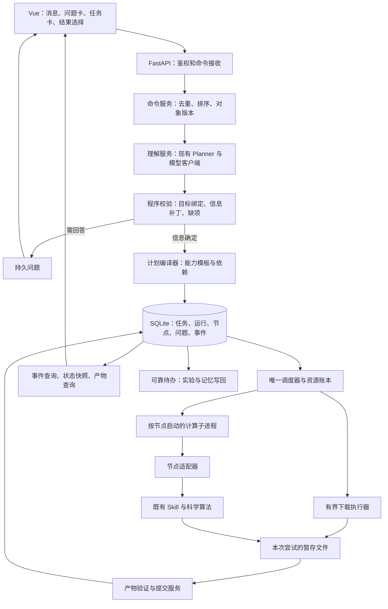
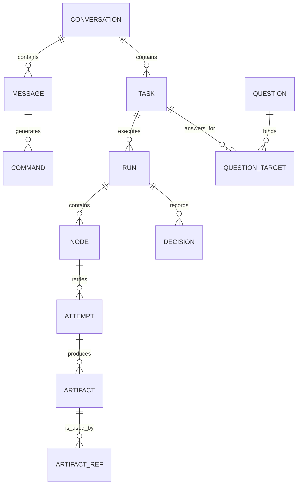
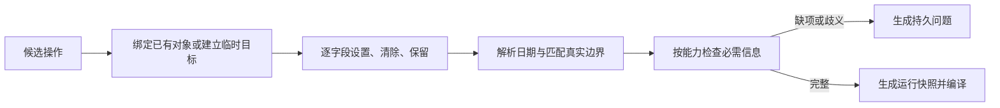
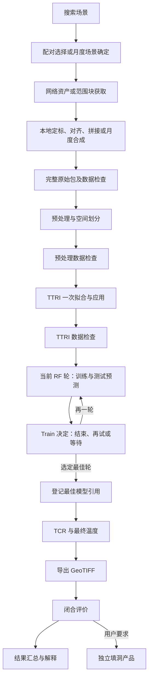
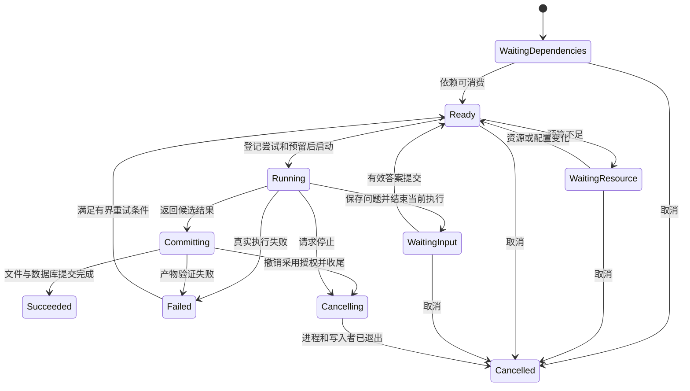
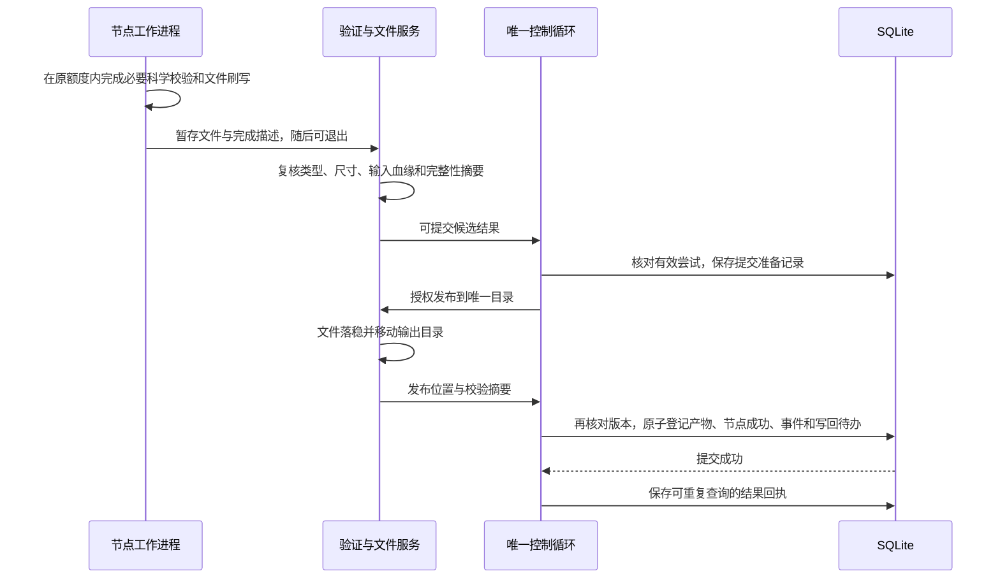
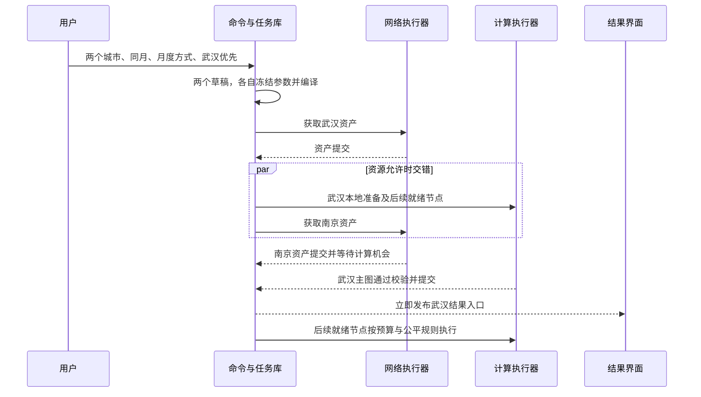

# GeoThermoAI 自然语言任务与执行编排：总体技术方案

编写日期：2026-09-08。适用分支：`CameronKwan/research-restart`。核对代码提交：`55cc73999a1f873ce13d32f093447b523f4122db`。

本方案在[现有最终版](agent_task_orchestration_redesign_最终版.md)确定的目标上补齐技术路线、数据契约、调用边界、事务、调度、资源和恢复机制。本文可作为实现主依据；原文档保留，不覆盖。文中的新增模块、表和接口是**拟实现设计**，不是声称仓库已经具备的能力。

部署面向用户自有服务器上的 Docker，资源有限且可配置，不受魔搭的规格或目录限制。保留专业角色、现有 Skill 与降尺度算法，不整体换框架，不引入多机执行平台。只读代码、编写文档，本次没有运行生产任务或修改代码。

## 阅读导航

| 想解决的问题 | 看哪一节 |
|---|---|
| 整体怎样搭，为什么这么搭 | 1：架构与现状依据 |
| 新模块如何与旧代码衔接 | 2：模块边界与接口 |
| 哪些状态入库，如何防止重复和覆盖 | 3：数据模型与事务 |
| 自然语言怎样变成多个可执行任务 | 4：理解与补槽；5：计划编译 |
| 专业角色、调优循环怎样接入 | 6：角色与执行适配 |
| 下载与处理具体怎么拆 | 7：数据获取与原始包 |
| 调度循环与资源分配怎么实现 | 8：调度；9：资源预算 |
| 文件如何提交，清理和重启怎样安全 | 10：产物；11：恢复与清理 |
| 后端接口、前端、记忆如何接通 | 12：API 和事件；13：记忆与部署 |
| 一条真实请求怎样走完，如何验收 | 14：贯穿示例；15：验证与交付 |

编号、字段名均配中文含义；不要求终端用户填写内部编号。正文给出的文件位置用于划分责任，实现者需核对真实函数签名，不按某一行机械修改。

## 1. 总体架构与技术决定

### 1.1 主技术路线

**语言模型提出候选操作，程序更新任务并编译固定流程，调度器按资源派发节点，节点适配器调用原有算法，产物验证后才提交状态。**

图中的“唯一调度器”是同一部署内的状态协调者；可以管理多个计算进程。专业角色不是四个常驻计算服务，多个访客也不会各自获得一套独立资源预算。

### 1.2 当前路径与需要接管的责任

| 当前实现 | 已核对事实 | 新方案接管什么 |
|---|---|---|
| `server.AppBackend.chat_start()` | 保存消息、创建对话后台线程；同对话活线程可能拒绝后续输入 | 改成接收命令，长生产生命周期交给任务运行模块。 |
| `PlannerAgent.run()` 与 `slots.py` | 分类、合槽、匹配边界、生成计划混在一条路径；关键词可能覆盖意图 | 分出候选理解、程序补丁更新与模板编译。 |
| `role_flow.run_with_roles()`、`RoleHooks` | 组织审批、顺序求解、调优和重规划，暂停依赖回调等待 | 改为产生可保存的角色决定与节点，不保存等待线程。 |
| `executor.execute_plan()`、`ExecContext` | 参数注入、路径推断、Skill 调用、反思、实验收尾混合 | 提取单节点参数适配和执行，状态、路径、资源、收尾分别接管。 |
| `BaseSkill.execute()`、`SkillResult` | 输入字典和回调；返回成功标记、说明、数据及文件路径 | 保留门面，增加托管执行上下文，规范输出描述。 |
| `data_acquisition.py` | 搜索、获取、定标、Warp、月度合成混合；下载存在整文件多份缓冲 | 拆清单、取数、本地准备、验证，按文件交接。 |
| `manifest.py`、`stage_rebuild.py`、`intermediate_cleanup.py` | 按目录反推根、可隐式补上游、递归按文件名清理 | 显式运行根、显式重建依赖、基于产物引用的清理。 |
| 前端 API 与结果面板 | 事件结束可能关闭整个订阅；结果多处按“最新文件”定位 | 任务事件与对话流分开，所有结果接口绑定明确产物。 |

代码入口详见附录 A。当前已有配置、角色、规则和记忆，欠缺的是贯穿这些模块的任务身份与生命周期，而不是再套一层模型对话。

### 1.3 固定采用的技术组合

| 选择 | 技术理由与边界 |
|---|---|
| 原 Python 编排体系，不迁移 Agent 框架 | 保留现有科学检查；框架替换不能自动修复参数覆盖、路径混用和资源竞争。 |
| Python 标准库 SQLite | 一台服务器、短事务、有限并发即可承载任务控制数据，无需 Redis/Celery。 |
| 一个控制线程负责运行数据库写入 | Web、模型和算法都不自行改变运行状态；消除多份可变计划和竞争写入。 |
| 下载与计算都按尝试启动独立进程，下载进程内使用有界 HTTP 线程 | 可统一取消、资源归因和退出回收；轻量模型请求与目录检索仍在主服务有界线程池执行。 |
| 显式依赖图，加有限动态 RF 轮次 | 固定科学主链可验证；调优用已有规则决定是否追加一轮，不引入自由工作流生成。 |
| 不可变产物目录与数据库索引 | 旧尝试只能写自己的暂存，迟到结果不能覆盖正式结果。 |

参考主流设计时只借鉴机制：Anthropic 对预定流程与自主行动的区分，LangGraph 的状态/暂停分离，Rasa 的受限语义命令，GeoGPT 与 Earth-Agent 的真实工具和结果校验。对应来源列在附录 B；本方案不要求安装这些运行框架。

## 2. 模块边界与核心接口

### 2.1 建议的代码组织

下列路径是拟新增职责模块。可以合并很小的文件，但不得合并回“一个函数同时理解、算图、改状态”的控制方式。

| 建议位置 | 责任 | 输入 → 输出 |
|---|---|---|
| `core/task_runtime/service.py` | 应用启动、命令接收、唯一控制循环 | 用户命令或执行结果 → 已持久接收的回执/状态转换 |
| `core/task_runtime/store.py` | SQLite 表、查询、事务与版本校验 | 经过校验的更新 → 任务状态和事件 |
| `core/agent/task_understanding.py` | 组织上下文、调用现有 Planner 理解 | 消息及可见对象 → 候选操作，不直接入库 |
| `core/agent/task_resolution.py` | 绑定对象、解释时间、应用字段补丁 | 候选操作及真实对象 → 草稿修改或待答问题 |
| `core/agent/task_compiler.py` | 能力模板、参数映射、依赖检查 | 已确认草稿 → 运行快照与节点图 |
| `core/task_runtime/scheduler.py` | 就绪检查、公平顺序、派发和回收 | 节点状态及资源账本 → 本次执行授权 |
| `core/task_runtime/resources.py` | 配额检测、峰值估计、预留及实测 | 节点规模、配置、实测 → 可否派发及额度 |
| `core/task_runtime/adapters/` | 托管上下文转换为原有 Skill 参数 | 文件引用、科学参数、执行额度 → 单节点调用 |
| `core/task_runtime/worker.py` | 子进程入口、回调收集、关闭与退出 | 可序列化节点请求 → 结果描述与文件清单 |
| `core/task_runtime/artifacts.py` | 输入引用、提交、恢复对账及清理 | 暂存结果 → 不可变产物或明确失败 |
| `core/task_runtime/projections.py` | 对话/实验/记忆兼容视图与可靠写回 | 已提交事件或待办 → 旧 JSON/RAG 兼容记录 |

不新增“调度 Agent”“编译 Agent”或“内存 Agent”。这些模块都是普通程序，结果可复现，也能用确定性测试验证。

### 2.2 三个边界对象

| 对象 | 内容 | 明确禁止 |
|---|---|---|
| **理解上下文** | 当前消息、接收日期/时区、Chat/Work、执行模式、可访问任务与版本、有效问题、选中产物、边界目录、能力描述、短历史 | 凭据、整幅栅格、把所有历史城市当作当前已确认输入 |
| **节点请求** | 用户/任务/运行/节点/尝试编号；输入产物引用；科学参数快照；可信执行额度；私有暂存根；取消信号 | 整个 Agent、记忆客户端、DataFrame、已打开 GDAL 句柄、模型自由生成的绝对路径 |
| **节点结果** | 成功或失败类别；实际参数摘要；必要指标；输出相对路径、类型、尺寸和校验信息；资源峰值 | 宣布整个任务完成、直接改正式目录、把大数组塞进进程消息 |

原 `SkillResult` 的四个字段仍可保留：`success` 为是否成功，`message` 为说明，`data` 为小型结构化结果，`artifacts` 为输出路径。适配器把它转换为规范节点结果；只有调度器有权正式提交。

### 2.3 现有执行上下文如何拆

`ExecContext` 当前含 Agent、registry、settings 路径、memory、pause callback 和本轮数据。不能直接把它发给子进程。

拆成两类：

- **控制上下文**留在主服务：角色对象、模型请求、待答问题、任务版本、调优决定和预算计数。重计算需要的数据只保留引用。
- **执行上下文**进入子进程：当前节点必要文件、冻结参数、CPU/内存/缓存预算、私有目录和取消信号。只建立该节点必要的 Skill 实例。

托管上下文额外明确三件事：禁止隐式重建、禁止越界清理、不能重读界面设置覆盖参数。旧单任务门面也要经过这套适配，不允许从另一入口绕过资源预算。

## 3. 数据模型与事务设计

### 3.1 对象关系

图中英文仅是对应对象：对话、消息、命令、任务、运行、节点、尝试、产物、问题、问题目标、产物引用、专业决定。SQL 表名可以使用下表中的英文，中文说明是字段语义契约。

### 3.2 必需的表和关键约束

所有业务对象使用后端生成的 UUID 编号，时间存 UTC，解释自然日期另存用户时区。用户归属来自鉴权，不接受模型或请求任意指定。

| 表 | 最少数据 | 索引和约束 |
|---|---|---|
| `conversations`（对话控制状态） | 用户/项目/旧对话编号映射、语义版本、下一消息序号、对话焦点 | 用户、项目、对话组合唯一；旧编号保留映射 |
| `messages`（消息） | 对话、序号、角色、原文或最终回答、对应命令、生成状态 | 对话内序号唯一；重试不能重复写用户消息 |
| `commands`（命令） | 用户、请求去重键、载荷指纹、消息、操作类型、接收/处理状态、结果 | 用户与去重键唯一；同键不同载荷报冲突 |
| `tasks`（任务草稿） | 用户/项目/对话、目标能力、任务版本、槽位、歧义、汇总状态、优先级、当前运行、累计记录 | 按对话和状态查询；更新需比较任务版本 |
| `runs`（一次运行） | 任务及版本、模板版本、冻结输入、场景绑定、替代运行、状态、取消标记 | 同任务允许历史运行；新版本不能改旧快照 |
| `nodes`、`node_edges`（节点与依赖） | 节点类型、参数、输入/输出契约、状态、就绪时间、执行顺序；前驱/后继 | 运行内节点键唯一；依赖必须同运行或显式已授权产物引用；禁止环 |
| `attempts`（执行尝试） | 节点、次数、有效授权、启动批次、进程编号及启动时间、暂存目录、状态、错误、峰值 | 节点最多一个有提交权的尝试；重试新建记录 |
| `questions`、`question_targets`（问题及覆盖目标） | 类型、候选内容、回答约束、状态；目标任务、任务版本、可选运行、字段 | 一个共享问题的目标列表固定，答案一次消费 |
| `decisions`（角色决定） | 运行、触发节点/轮次、角色、选项、参数补丁、理由、预算消耗 | 同触发点同决定序号唯一；恢复不重复调优 |
| `artifacts`（产物） | 生成尝试、类型、目录/路径、内容标识、输入来源、可用性、保留类别 | 正式路径唯一；按任务/运行/类型查询 |
| `artifact_refs`（使用关系） | 产物、消费者类型和编号、用途、是否固定使用 | 一个消费者同用途引用唯一；活动引用禁止清理 |
| `commit_intents`（文件提交意向） | 尝试、输入签名、源/目标目录、输出清单、提交状态 | 每次尝试至多一份意向，恢复据此对账 |
| `events`（关键事件） | 全局递增序号、归属、类型、对象版本、小型载荷 | 按用户、对话、序号读取；不写逐像元/逐 token 事件 |
| `projection_jobs`（可靠写回待办） | 事件/运行、目标存储、状态、次数、下次重试时间 | 来源事件与目标唯一；经验写回重复请求只记一次 |

槽位、冻结参数、候选列表及小型结果可以保存为带版本的 JSON；需要查询、排序或关联的状态、编号、时间必须是独立列。不要把所有任务打成一个大 JSON 文件反复覆盖。

资源预留作为尝试记录的一部分持久化，并由内存账本索引。重启时根据真实存活进程、已写文件和尝试记录重建，不能照抄上次“空闲槽数量”。

### 3.3 数据库写入方式

采用 SQLite 默认回滚日志模式，明确开启外键检查，完整同步写入，写锁等待默认 5 秒。控制循环拥有唯一写连接；Web 状态查询使用独立只读连接和短事务，不在 SSE 生命周期内一直持有读事务。

理由是这里主要写小型控制记录，单写者足够，不为事件流增加网络数据库。SQLite 本身支持多个读事务，但同时只有一个写事务。[SQLite 事务说明](https://www.sqlite.org/lang_transaction.html)

写事务使用 `BEGIN IMMEDIATE`，含义是提交前先取得写事务资格；任何磁盘或数据库错误都显式回滚，不能吞掉异常继续派发。不要在事务中调用模型、下载、计算校验和大文件复制。

本次不启用 WAL 作为必需条件，也不把任务库放在网络共享目录上；避免下一位实现者未经核验就依赖共享文件锁或跨主机访问。WAL 对同主机及文件系统有额外要求。[SQLite WAL 说明](https://www.sqlite.org/wal.html)

### 3.4 六类原子操作

| 操作 | 同一短事务内必须一起完成 |
|---|---|
| 接收消息 | 命令去重、消息编号、命令载荷、接收事件；提交后才回“已接收” |
| 草稿修改 | 比较对象版本、应用补丁、生成/失效问题、递增任务/对话语义版本、记录结果 |
| 消费答案 | 校验整个问题目标列表，保存有效答复；按问题类型更新草稿或运行决定；完成原问题并原子生成仍缺信息的新问题或后续命令 |
| 派发节点 | 再验依赖与版本、新尝试与授权、输入引用、资源预留、派发事件 |
| 接受结果 | 产物索引、节点成功、依赖推进、文件预留/引用更新、事件和写回待办；CPU/内存仅在执行者确认退出后回收 |
| 取消/替换 | 停止新派发、失效旧问题/授权、记录待停止进程和新运行关系 |

普通多任务消息允许各自保存确定草稿，缺南京边界只阻塞南京；**同一共享问题的回答必须全部验证后一起提交**。两种事务粒度不要混用。

### 3.5 任务、节点和文件状态分开保存

节点状态见第 8 节；任务卡的状态由当前有效运行推导，不能被最后一次文本回调覆盖。

| 任务汇总状态 | 推导条件 |
|---|---|
| 草稿 / 等待信息 | 目标尚未编译，或有阻塞语义问题。 |
| 等待批准 | 参数已确定，但执行模式要求的批准尚未完成。 |
| 排队 / 等待资源 | 至少一个有效节点就绪，尚未获派发；保存具体等待原因。 |
| 执行中 | 当前运行至少有一个执行或提交中的节点。 |
| 等待回答 | 生产链被有效问题阻塞，且没有其他可推进的必需节点。 |
| 部分完成 | 主产品已经提交，但必需评价、用户要求的填洞等尚未全部完成，或这些后续工作失败。 |
| 完成 | 本次目标规定的全部必需节点通过；下载子集有自己的完成条件。 |
| 失败 | 必需节点失败且无可自动执行的恢复动作，尚未形成可交付主产品。 |
| 正在取消 / 已取消 | 已撤销执行授权；只有相关执行者和写入者退出后才为已取消。 |

完整 LST 的主图、评价、可选填洞分别有状态。模型解释失败可由现有确定性报告兜底，不掩盖已提交产品；不能把“主图可查看”写成“全部评价已完成”。

问题记录有待答、已回答、被新问题接替、失效状态；尝试记录有执行、结果准备、成功、失败、取消状态，并另存进程是否退出。文件是否仍可用独立于历史节点成功与否。汇总更新与相应事件在同一事务提交。

## 4. 理解层的具体实现路线

### 4.1 模型只输出候选操作

把现有 Planner 前半部分改成候选理解器，输出契约如下。

| 内容 | 含义与例子 |
|---|---|
| 操作类型 | 新建、设值、清除、更正、回答、继续、重试、取消、调整优先级、只回答 |
| 临时目标标签 | 只用于本条消息内绑定，例如 A 为武汉、B 为南京；正式编号由后端生成 |
| 目标指称 | 原句里的“南京”“第二个”“这张图”，或前端明确选中对象 |
| 能力 | 搜索、下载子集、预处理、训练、完整 LST、填洞、查询 |
| 字段补丁 | 每字段区分设置、清除、本轮未提及；值、原文片段、来源建议 |
| 共享修饰范围 | “都是 2025 年”作用于哪几个临时目标，不由程序随意做笛卡尔积 |
| 否定与歧义 | 被否定值、多个候选含义、尚缺信息 |

模型不能输出任意 Python、正式文件路径或未经注册的步骤。支持结构约束输出的供应商优先使用；不支持则沿用 JSON 兼容层、本地类型验证及最多一次格式修复。

### 4.2 目标绑定与字段补丁

绑定优先级：经过归属校验的明确编号 → 本轮地区/时间/序号等指称 → 当前有效问题或明确选中产物 → 唯一合理未完成任务。多个合理目标就追问，不按“最近修改文件”或不相关历史城市猜测。

槽位更新采用固定优先级：本轮明确值或清除 > 当前任务已确认值 > 用户明确沿用 > 项目偏好 > 界面建议 > 历史建议 > 默认。每个槽位保存值、来源、确认状态、证据消息和版本。

“清除”保留一条失效记录。例：“不是武汉”后地区为空且记录武汉被否定，下一轮不能被历史合槽重新填回。默认 RF/10 m LST 的来源始终是默认，不因模型返回了该值就标作用户原话。

日期继续复用 `slots.parse_time_expression()`，但以消息接收时间为锚点，保存解析出的绝对起止日期、时区和原表达。研究区复用匹配逻辑，先得到全部候选再判断唯一，绑定内容指纹和副本；不能取第一个模糊匹配就执行。

日期和能力的程序校验还需明确：单日与真实区间保持原范围；“最近”“夏天”等无法唯一确定时先问具体时间；不能把一个日期暗扩成整月。用户明确要求多个完整月份的月度产品时，按地区和各月分别建任务，保留共享来源，不合成一个跨月产品。

| 目标 | 编译前最低必要信息 | 仍需程序判定的事项 |
|---|---|---|
| 搜索或下载 | 真实区域、绝对时间、目标数据集合；产品方式按能力要求确定 | 日期顺序、集合是否支持、来源是否可用；不默认变成完整 LST。 |
| 完整 LST | 真实区域、绝对时间、配对/月度方式及生效科学参数 | 选择月度但给定不完整月份时澄清目标，不能擅自补齐；配对模式保留真实日期范围。 |
| 预处理或训练 | 唯一已登记输入批次、需要执行的步骤 | 必需输入是否存在、是否允许重建，不能混用两个批次。 |
| 填洞 | 唯一主 LST 产物和该产物的原研究区 | 主图是否可用、是否误选已填洞产品。 |
| 继续、重试、取消 | 唯一任务或运行对象 | 当前状态是否允许该操作，所见版本是否仍有效。 |

默认和低优先级来源可以形成摘要建议，但不能消除真实歧义。缺项问题一次列清关键缺失；用户只回答其中一部分时保留有效内容，再问剩余部分。

### 4.3 同对话顺序与模型调用竞态

一个对话按消息序号处理语义命令；模型调用在有界模型请求池里执行，不占数据库锁。传给模型的上下文带对话语义版本及所见任务版本。

结果返回后重新比较版本：

1. 只增加了不相关任务时，程序重新绑定后可提交仍有效部分。
2. 所指任务、问题或字段已修改时，旧候选不能覆盖；重新用最新上下文理解，或提示该问题已变化。
3. 按钮取消、明确编号的答案提交等确定性命令可以先处理，不需要等待一个远端模型请求返回。
4. 旧模型输出随后到达时按版本拒绝其失效操作，不重新启动已取消任务。

上述旁路只用于不需要重新理解的明确操作；自然语言“把第二个停掉”仍先经过目标绑定。同一请求的网络重试使用同一去重键；同一句用户主动再发一次是新命令，不凭文本相同强行去重。

### 4.4 澄清、审批与自动选择

| 问题类型 | 产生条件 | 解决方式 |
|---|---|---|
| 语义澄清 | 地区、时间解释、产品方式或目标不唯一 | 补槽或消歧，不能因自动模式跳过 |
| 执行审批 | 已有执行模式要求用户批准计划、候选或调优 | 校验卡片或文字对应的选项 |
| 数据异常选择 | 无候选、可接受质量告警、需要改范围 | 返回已支持选项；硬失败不能批准成成功 |

问题保存真实候选编号和当时内容。文字“第二组”映射到这份已保存候选，不按重新排序后的数组下标选择。可复用 `approval.py` 的选项与答复解析，但不再依赖 `threading.Event` 或旧进程存活。

整月的配对/月度语义前移到草稿校验，解决后再编译和确认计划。已确认范围且允许自动执行时，Data 仍按真实候选和现有评分规则自动选配对；记录分数、选择依据和场景身份。自动模式禁止的是擅自猜语义，不是禁止一切自动选择。

语义补答修改草稿及其版本；执行审批、候选选择和调优审批只记录对应运行决定，不为每次审批增加科学任务版本。部分答复在全部目标版本通过检查后原子保存，原问题标为已被新问题接替，剩余问题引用更新后的目标版本；旧卡片因此不能重复回答。

现有 `RoleHooks.rank_pairs()` 使用项目历史，`data_agent.pair_key()` 主要以两个日期标识配对；新任务不能沿用日期级硬排除。新的候选排除记录须包含任务作用域、边界内容和真实场景身份。同日不同城市不互相排除；旧日期记录仅作历史建议。缓存命中可以复用已验证文件，但不能据此拒绝用户明确要求再次生产。

### 4.5 模型失败与权限边界

Chat 从入口禁止创建生产命令，不能只写一段“不执行”提示词。Work 中的知识问答同样不启动 Skill。

模型超时、格式无效、对象不存在或能力不支持时保留已确认草稿，给出具体失败原因，不默认武汉、整月、下载或填洞。无模型配置也不妨碍查询真实状态、点击取消或提交结构化答案；只阻塞确实需要模型理解的操作。

## 5. 从任务草稿编译为节点图

### 5.1 能力目录不是新的 Skill 列表

能力描述面向用户，Skill 面向算法调用。新增能力记录至少包含：允许的目标、必需字段、允许参数、输入产物类型、输出类型、模板版本、是否产生文件。

| 能力模板 | 输入条件 | 编译结果 |
|---|---|---|
| 解释与查询 | 问题及必要的唯一结果引用 | 只查询，不建计算图 |
| 搜索 | 地区、绝对时间、条件 | 搜索节点 → 候选产物 |
| 下载子集 | 目标传感器/数据集合和获取方式 | 搜索/选择 → 指定资产获取 → 子集验证，不补其他传感器 |
| 完整 LST | 地区、时间、配对/月度、科学参数 | 编译完整主链及必要选择节点 |
| 局部处理 | 唯一输入批次和目标步骤 | 验证输入，插入已授权的必要重建，再执行目标 |
| 填洞 | 唯一已提交主图及生成时边界 | 仅填洞节点及独立产物 |
| 继续/重试 | 任务或运行唯一 | 查本运行已提交节点与可用输入，生成剩余依赖，不扫描目录猜进度 |

当前 `plan_schema.WORKFLOW_STEPS` 有七个主 Skill：数据获取、预处理、TTRI、RF、TCR、LST 导出、评价。继续用它校验完整科学主链，但数据获取内部和调优循环需要展开为节点。

原 `steps[].skill / params / reason` 分别表示技能、参数、原因，可保留作兼容视图。执行依据改为节点图；未知步骤必须返回校验失败，不能像宽松解析那样删掉后继续说计划有效。

### 5.2 完整生产模板

图中的 RF 回箭头表示有界轮次，不在数据库依赖图里建环。实现时每轮生成一个新节点，绑定前一轮决定；“追加第 2 轮”只执行一次。TTRI 节点不随 RF 轮次重复创建。

每个节点规定：输入角色、输出角色、允许参数、执行资源类型、完整性验证器、专业检查点、失败策略。算法节点可先提交有效输出，后续检查节点决定是否允许生产链继续；但完整原始包的“可用于 LST”资格必须在完整性及必要数据检查都通过后才授予。

### 5.3 参数来源必须逐项接到真实调用

| 参数类别 | 固定来源 | 接入要求 |
|---|---|---|
| 边界、日期、产品方式 | 已确认任务快照 | 匹配真实文件并保存副本，不能临时读界面当前边界 |
| 云量、数据源与检索条件 | 快照中的科学约束 | 编译到数据获取节点实际参数，不仅留在计划顶层 |
| 模型超参数 | 快照及本运行明确调优决定 | 保留科学白名单，不在 RF 执行前被 settings 覆盖 |
| 文件路径 | 产物解析器及本次尝试工作区 | 模型不生成，执行器不跨运行找最新文件 |
| CPU、GDAL 缓存、分块缓冲 | 资源账本分配的可信执行额度 | 与科学参数分开传入，不能由模型提高限额 |
| 凭据 | 当前用户的受控凭据引用 | 执行时解析，短期签名按需生成，不记录到快照和缓存键 |

**快照在进入执行队列前建立，不是进程真正开始计算时才建立。** 排队期间修改设置，也不能改变已提交任务的实际参数。

检索后才知道的场景清单采用一次性绑定：创建运行时冻结目标和检索参数，选定场景后另存不可变选择记录；资产下载节点必须引用这份选择记录，不能在执行时随意重选。

### 5.4 修改、重规划与运行版本

| 变化 | 身份处理 | 可复用什么 |
|---|---|---|
| 网络超时、进程失败，科学输入不变 | 同运行、同节点，新尝试 | 已验证资产、已提交上游 |
| 同范围内经授权重新选配对，科学输入变了 | 同任务版本生成替代运行，旧运行留档；选择记录重新固定 | 内容指纹完全一致的不可变原始资产 |
| 用户改日期/边界/产品，或接受扩大范围 | 任务版本增加，新运行；旧运行停止派发 | 验证相同的输入，不能复用不匹配模型/约束 |
| 一轮 RF 调参 | 同运行追加轮次节点和决定 | 同一次划分与 TTRI 输入 |
| 只改排队优先级 | 科学快照不变，更新调度信息 | 全部已提交状态 |

现有 `on_no_pair()`、`llm_replan_adjust()`、`adjust_for_replan()` 的输出改为建议补丁，再经过授权检查。扩大明确月份、换地区、换产品或突破用户明确阈值不能直接写入旧计划。

重规划次数、已排除候选和调优消耗持久记录；替代运行继承本任务版本已消耗的重规划额度，不因换运行编号、重启或重试清零。每个运行保留自身轮次指标，不把不同输入的最佳模型互相比选。

连续 AI 调优计数与跨运行累计消耗是两件事，按第 6.2 节分别恢复。累计记录用于审计和资源统计，不另外发明一个会提前截断现有调优的科学停止条件。

### 5.5 缺输入时如何插入重建

托管执行模式下，Skill 不再在内部调用 `ensure_stage_inputs()` 顺手启动上游。适配器先进行输入预检，返回“缺少什么、为什么缺、可从哪份已登记输入重建”。

编译器按原 `stage_rebuild.py` 的关系加入显式重建节点，保存使用的原参数、原划分与 TTRI 系数；完成后再唤醒消费节点。重建同样申请计算、内存和磁盘额度。

已经授权继续完整生产时，恢复必要中间文件属于原目标范围；如果只有“做预处理”却连原始数据也没有，不能静默扩成下载加全流程。重建有权限边界，而不是自动补齐一切。

## 6. 专业角色与旧 Skill 的适配

### 6.1 角色调用改为“事实 → 决定”

| 角色 | 输入 | 输出决定 | 何时保存 |
|---|---|---|---|
| Planner | 当前消息、草稿、诊断 | 语义操作候选或调整建议 | 程序核验后记命令与补丁 |
| Data | 已保存候选、覆盖/云量/输入探针等事实 | 合格候选选择、通过、硬失败、可接受告警、需要输入 | 对应选择或检查节点结束时 |
| Train | 已提交轮次指标、历史轨迹、剩余预算 | 再一轮及合法参数、停止、选定最佳轮、需要输入 | 调度器一次提交决定与后继节点 |
| Evaluation | 已提交主图、指标、闭合与填洞状态 | 数字及评级事实、校验后的定性报告 | 报告节点及实验写回待办 |

需要读大表或栅格才能得到的检查事实，放在计算进程生成；模型解释在轻量模型请求池运行。控制线程只处理小型结果，不因“反思”把整幅数组载入主服务。

`RoleHooks._ask()` 不再阻塞等待答案，改为返回“需要输入”的结果，包含问题类型、候选、恢复所需引用与已消耗预算。调度器存问题并结束本次执行，确认执行者退出后释放 CPU/内存，保留必要输入引用；答案到达再派发相应决定节点。

### 6.2 RF 调优和最佳轮

1. 每轮 RF 节点完成训练与测试预测，输出模型、指标和该轮必要说明。
2. 提交后将结构化指标交给 Train 的现有判断逻辑，保留参数范围、恶化/收敛和轮数规则。
3. 再训练的决定先入库，再创建唯一的下一轮节点；模型请求重试不能重复创建同一轮。
4. 最佳轮由明确轮次和产物编号定位。退出 `_promote_round()` 通过复制后修改时间、让下游挑“最新模型”的托管路径。
5. 最佳模型可用性验证通过才解除 TCR 依赖。若提升或引用校验失败，不用最近一轮默默兜底。

RF 继续沿用当前测试指标参与调优的事实，不借工程改造声称新增独立验证。非最佳模型在调优不再需要、无活动引用后清理，不能在仍可能回退时提前删除。

恢复时重建 Train 的完整控制状态：是否已决定开始调优、是否已拒绝继续、每轮属于初始/手动/AI、连续 AI 轮数、完整指标轨迹和最佳产物。不能只恢复“已经训练几次”一个数字。

现有 `ai_rounds` 表示连续 AI 调优轮数，首轮不计、手动轮按原规则重置；保留这些含义。沿用当前配置解析器给出的默认 5 轮及硬上限 8 轮，重规划默认上限 3 次；均在运行前按实际配置冻结，不借本方案改阈值。

累计轮次和资源消耗永远保留，但不替代原连续计数。重启、普通重试不能伪造一轮手动操作以重置额度；新配对的真正首轮与旧节点重试需分别标记。没有新的用户干预时，自动执行仍受既有轮数、收敛、恶化和重规划规则约束。

### 6.3 线程预算不能只塞进旧参数字典

当前 RF Skill 包装器和底层 `RF_PARAM_WHITELIST` 都不接收 `n_jobs`。`n_jobs` 是 RF 并行工作数，直接加进现有科学参数字典可能被丢弃。

拟增加独立的**执行额度参数**，由适配器传到包装器，再传到模型构造或 RF 参数合并的可信分支。该分支只接受调度器给的上限，并与容器实际额度取较小值；科学超参数白名单保持原含义。

GDAL、BLAS/OpenMP 等底层线程也限制在相同分配内，在线程库初始化前设置；不能外层两个进程、每个内部又各开全机线程。实际生效额度写入节点结果供验收。

落地时，每个节点只指定一个主要并行层。例如 RF 使用分配的模型工作数时，把内部 BLAS/OpenMP 数值线程限制为 1；栅格节点把可用线程交给 GDAL，其余嵌套层限制为 1。BLAS/OpenMP 指底层数值运算的并行库机制。初始化入口必须先应用额度再导入这些库，不能等模型构造完才设置。

### 6.4 原地改写与清理副作用

TTRI 会给训练/验证/测试表、完整约束表与 10 m 特征写入结果，其中含原地改写。因此输入不是一律“硬链接后直接调用”。

| 输入行为 | 适配方式 |
|---|---|
| 只读文件 | 直接解析不可变产物路径；必要的兼容别名只读使用 |
| 旧算法会原地改写 | 先制作本次尝试的私有副本，再调用原算法；副本空间计入预算 |
| 复制可用写时复制能力 | 可使用已验证文件系统的私有写时复制；不支持则普通复制 |
| 可能执行目录清理 | 托管模式禁用包装器自行递归清理，输出待清理建议交给产物服务 |
| 包装器写阶段清单 | 只允许写本尝试局部清单；正式运行清单由数据库已提交记录生成 |

不能用普通硬链接代替私有可写副本，修改会影响上游或其他消费者。此处改变文件生命周期，不改变 TTRI 或其他科学公式。

## 7. 下载与原始包的实现路线

### 7.1 将现有数据获取门面拆成内部步骤

| 当前代码边界 | 提取后的责任 | 交接产物 |
|---|---|---|
| `_execute_impl()` 的检索部分 | 查询数据目录，保留查询参数、候选与数据源诊断 | 候选清单 |
| 配对排序/自动选择/人工选择 | 固定一个真实配对或确定月度场景集合 | 不可变选择记录 |
| `_download_composite()` 的资产枚举及网络部分 | 枚举所需波段、QA/SCL、DEM、S2 定标元数据并取数 | 资产清单及本地文件 |
| 同函数的定标、Warp、拼接、压缩及金字塔 | 使用已获取输入进行本地准备 | 待验证原始包 |
| `_download_monthly()` | 网络获取 → 现有掩膜和逐景对齐 → 原有月度中位数合成 | 带场景清单的月度输入 |
| 新统一交付验证器 | 验证必需集合、有效性及空间契约 | 完整 LST 输入包或下载子集完成记录 |

保留旧 Skill 门面复用这些内部函数，不复制两套定标或月度算法。正常主路径已先取资产再本地 Warp，可以按这条真实边界提取。

### 7.2 资产清单与缓存身份

每个资产描述保存：提供方、集合、场景编号、波段/资产名称、源版本、预期长度/可用校验值、获取范围、本地目标和是否必需。场景元数据及 S2 定标来源也要固定。

短期签名 URL 和访问令牌执行时生成，不作为长期身份。缓存键由稳定源身份、几何内容、裁剪/格网规格和必要定标规则计算；月度另含场景集合及合成规格。

同一个缓存项只允许一个获取者。另一个任务登记等待引用，等该项完整提交后再使用，不能把“文件已创建”视为命中。

### 7.3 下载接口改为返回文件描述

现有 `_fetch_asset()` 累积块后拼接，`_fetch_asset_parallel()` 分配整文件缓冲再复制；新接口返回文件位置、长度、源版本和完成区间，不返回整文件 bytes。

| 场景 | 必须实现的处理 |
|---|---|
| 顺序下载 | 固定大小缓冲写 `.partial` 暂存文件，完成后关闭与校验 |
| Range 分块下载 | 只提交有限在途请求，完成一块补一块；直接写文件对应区间或有限分片，不一次创建全文件所有 Future |
| Range 正常响应 | 核验响应状态、实际区间、总长度与源版本，完成区间去重登记 |
| 服务端忽略 Range | 停止并行，清理不兼容分片，转一次顺序写；不能把完整响应当成某一块 |
| 源版本变化 | 旧分片失效，重新取数，不能拼接两个版本 |
| 未知总长度 | 按已知上界或分段申请新增磁盘预留；申请失败时受控暂停，不一直写到盘满 |
| 网络错误或取消 | 关闭响应、Session、文件和线程池；有价值分片保留续传记录，无效分片清理 |

在途块大小与连接数共同限定缓冲峰值；默认全应用 8 条分块连接，不是每个下载任务 8 条。下载进度、实际累计字节和磁盘预留同步更新，已写字节不再重复计作“尚待新增空间”。

### 7.4 保留范围读取能力

仓库还有按窗口访问云端 COG 的实现。COG 是可按范围读取的云优化 GeoTIFF，不能为了节点形式统一强制改成整景下载，也不在本次改造中重造源窗口、overview（低分辨率概览层）和重采样边缘算法。

主路径沿用已有的“资产获取 → 本地 Warp”。确实依赖远端窗口 Warp 的分支，保留原窗口和数值处理方式，登记为**同时需要网络与计算的混合节点**：

- 一次性申请计算位置、网络作业位置、连接、内存和磁盘，全部满足后启动，不能占一项再无限等另一项。
- GDAL 的远端连接上限、超时、缓存及线程都纳入分配；同一进程中的 HTTP 和 GDAL 不能各自再使用一份全局连接上限。
- 使用隔离执行进程，取消和资源失败按同一生命周期处理；该分支可能在等网络时持有计算额度，状态与监测如实显示。
- 用原分支的掩膜、边缘、格网和数值做回归，不要求所有来源都先物化为新的本地源窗口。

这是对现有读取分支的资源接管，不是把重计算改名为下载。普通资产下载与其他任务计算仍按主路线交错；不能为了消除所有等待而扩大科学算法改造。

### 7.5 完整包验证的输出契约

完整 LST 包需要 LST、QA、所需 S2 波段、SCL、DEM 均存在且可读，含义与元数据正确，来源与研究区契约一致，并通过现有有效性检查。不同传感器原始分辨率不必相同，最终对齐仍在既有预处理完成。

验证通过后发布的是一个包含全部必需引用的**输入包记录**，下游只接这个记录。单文件成功不解除预处理依赖。

只下载 S2 等子集时使用另一种完成类型：指定子集已验证即可完成，不额外下载别的传感器，也不发布完整 LST 输入就绪。月度包还必须包含场景清单、掩膜/合成方式和成功记录。

## 8. 调度器与工作进程

### 8.1 控制循环每次做什么

控制循环通过事件唤醒，空闲时最长 1 秒检查一次。不轮询每个栅格块，也不长时间等待任何远端服务。

1. 接收已鉴权命令、模型结果、进程结果和资源变化。
2. 以短事务处理版本、问题、取消、结果提交和必要恢复。
3. 更新真实进程状态、已写磁盘量、活动引用与可用预算。
4. 从数据库找依赖已满足且当前运行有效的节点。
5. 按用户优先级、保护队列和主产品推进顺序选择。
6. 原子登记预留与尝试后派发；没有可派发项则等待下一次事件。

Web 请求只等命令已持久接收的回执，不等整个任务结束。若接收队列已满，返回明确繁忙及重试提示，不能先回成功再丢命令。

### 8.2 派发与状态转换

英文状态依次表示：等待依赖、就绪、等待资源、执行中、等待回答、提交中、成功、失败、正在取消、已取消。实现可用对应枚举；不能只用一个 `running` 布尔值覆盖全部情况。

依赖失败时，下游标为上游阻塞，不进入就绪队列。任务汇总由节点与目标推导：主图完成而填洞未完是部分完成；仅报告模型失败不撤销已有主产品。

### 8.3 工作进程生命周期

下载和重计算尝试都采用 Python `multiprocessing` 的 `spawn` 方式启动新解释器；下载进程内部运行有界网络线程，计算进程只载入所需算法。显式初始化预算，避免继承主服务已打开的模型、记忆和 GDAL 状态。进程间只传小型可序列化对象。[Python multiprocessing 说明](https://docs.python.org/3/library/multiprocessing.html)

当前 `server.py` 在模块级创建 `AppBackend()`，并导入 Agent、记忆和可视化。仅把启动方式改为 `spawn` 不够：子进程会重新导入主模块。实现时要将应用实例及调度器启动放入服务生命周期，延迟算法/模型导入，保持可重导入入口轻量；工作入口先设置额度，再导入所需 Skill。子进程不能因导入主模块又启动一套服务或模型。

每个进程执行一个节点并退出。主服务持有进程句柄和取消信号；进程回传启动确认、进度、资源峰值和最终结果。必要句柄在正常、异常、取消路径都关闭。

节点产物的大数组/栅格校验在原进程退出前沿用本节点额度完成；后续专业检查仍可作为独立图节点。完成描述可靠落盘、通知控制端后，进程即可退出，不等待数据库提交回执。控制端同时检查退出状态与完成描述，通知丢失也能恢复结果。

CPU/内存额度在真实退出后释放，待提交文件的磁盘预留与保护继续保留。不能让原进程占住唯一计算位置等回执，而控制端又等待另一个计算位置才能验证它的结果。

进度使用有界通道：同节点频繁百分比可合并，最终结果走独立可靠回执；通道满不能无限堆日志，也不能让子进程永远等主线程消费。

派发记录写成功但进程启动失败，记失败并回收预留。进程启动成功但开始确认丢失，按句柄和尝试身份查询，不重复启动另一份。

### 8.4 执行授权、心跳与旧进程

一次尝试有唯一提交授权，绑定节点、任务版本和本次服务启动编号。心跳只用于发现异常，不代表存储事务，也不替代真实进程检查。

**授权过期不等于进程退出。** 旧进程仍在运行时继续占用 CPU、内存和输入引用。使用进程编号加启动时间核对身份，避免误认编号复用。

服务启动时先对账旧尝试：旧子进程应检测父控制通道关闭后退出；新调度器确认属于本应用的遗留进程已退出或完成受控停止后，才重新派发同节点。不能为接管而终止服务器上无关进程。

若旧尝试已留下完整输出，新调度器确认写入者已退出、任务版本仍有效且没有更新尝试后，签发**只用于该完成描述的恢复提交授权**。它不能启动计算、扩大输出清单或恢复旧进程的提交权；旧启动批次的迟到消息仍按失效处理。

### 8.5 顺序与公平的可执行规则

默认下载按接收顺序。计算同优先级时优先推进已进入生产、下一节点就绪的任务；一个任务在同优先级下连续错过两个派发机会，进入按时间排序的保护队列，获得一次节点机会后清零。

“错过机会”只统计依赖就绪且当时有足够资源可执行的任务。资源不够、等用户输入、暂停重试不计为被插队。多计算位置逐个挑选、即时更新账本，不能用同一份空闲资源快照同时派发多项。

用户明确优先级覆盖默认顺序，但不强行抢占正在执行的数值步骤。保护队列为空时继续尽快推进主结果；可选填洞不长期阻塞其他尚无主结果的任务。

## 9. 资源预算的计算与执行

### 9.1 配置、检测和生效值

软件提供有限默认值，部署者可以提高并发。Docker 的 CPU 和内存限制只是外部边界；容器默认并无限制，应用必须读取限制并管理自身预算。[Docker 资源限制说明](https://docs.docker.com/engine/containers/resource_constraints/)

启动时生成一份**生效资源配置**，记录“配置值、检测值、最后采用值、采用理由”。CPU 同时考虑容器配额、允许使用的核心集合和管理员额度；内存取管理员分配边界、容器上限及可见物理内存中的最严格者。没有可信检测结果时要求管理员设置预算，先维持轻量服务。

| 资源项 | 默认值或算法 | 执行含义 |
|---|---|---|
| 重计算作业 | 同时 1 个，可配置提高 | 作业数限制和资源量检查必须同时满足；一个作业可以多线程。 |
| 网络下载作业 | 同时 1 个，可配置提高 | 所有任务共用连接与缓冲额度。 |
| 下载连接 | 全部署最多 8 个 Range/文件传输连接，可配置 | 一个资产的分段连接也计入总数。 |
| 提前准备的数据包 | 最多 1 个尚未开始消费的下一任务输入包 | 已在准备但未完成的包也占一个位置，不能靠更名绕开。 |
| 模型调用、目录检索 | 两类分别最多 2 个，可配置 | 各自有有界队列，不阻塞状态查询和取消。 |
| CPU 计算额度 | 默认从有效额度中留出约 1 核 | 不足 2 核时仍可用 1 个计算线程，实际使用服从容器配额。 |
| 应用总内存 | 有效内存边界的 80%，可配置 | 包含主服务、模型/记忆缓存、下载缓冲、所有活动计算。 |
| 可淘汰内存缓存 | 合计不超过应用总预算的 10% | 计入上一行，不是额外增加的内存。 |
| 可再生磁盘缓存 | 数据卷容量的 10%，默认最多 20 GB | 仅限制缓存；大于缓存上限的合法输入可落到任务自有目录。 |
| 磁盘紧急余量 | 卷容量的 5%，默认下限 1 GB、上限 10 GB | 还须另算实际待写文件，不以此代替节点空间估算。 |
| 高频调试日志 | 默认合计 200 MB，按大小轮转 | 关键状态和正式结果由数据库保存。 |

这些数值是实现起点，不是性能测量结论。提高预算只作用于后续派发；降低预算先停止新派发和预取，不能在已运行算法中暗改抽样比例或空间分辨率。

CPU 配额可以是小数。有效配额不足一核时，工作线程仍为 1，账本按实际小数配额记账并服从容器限制，不向下取整为零；也不能把这个特例复制成多个各自独占同一配额的作业。

### 9.2 派发时怎样避免重复记账

资源账本以**执行尝试**为单位。先预留、后启动；确认进程及写入者退出后再释放。派发失败则在同一恢复路径撤销该预留。

| 资源 | 派发判定 | 实现注意点 |
|---|---|---|
| CPU | 已分配计算线程额度 + 新节点额度，不超过可分配总额 | 单个作业内部 RF、GDAL、数值库也共享本节点额度；嵌套并行不能相乘。 |
| 内存 | 主服务与缓存占用 + 各活动作业“预留峰值和当前实测的较大者” + 新节点估计峰值，不超过应用预算 | 当前作业实测高于预留时立即提高账本占用，不能继续按过低估计派发。 |
| 当前内存压力 | 当前可用量扣除活动作业尚可能增加的内存后，仍容得下新节点及余量 | 额外检查容器和共享主机压力，不能只看配置上限。 |
| 磁盘 | 当前可用空间 − 紧急余量 − 已有尝试尚未写出的预留，足以容纳本节点新增写入 | 已落盘部分已经减少了系统可用空间，不能再全额扣第二遍。 |
| 连接/作业位置 | 正在使用数加本节点申请量，不超过各自上限 | 超时但连接尚未关闭、取消但进程尚未退出，都继续占用。 |

内存实测优先采用容器整体使用量作为总压力依据；按进程树统计用于归因和校正预测。不能把容器总量再与其内部所有进程内存相加。只有进程 RSS（常驻内存）时采取保守估计，并说明共享页可能重复计数。

磁盘按**实际文件系统或卷**记账，不按目录名分别计算。项目目录、缓存目录和暂存目录即使路径不同，只要在同一卷上，就共用可用空间和预留账本；跨卷复制必须同时检查源文件保留和目标新增空间。

举例：有效内存边界为 32 GB，默认应用预算约 25.6 GB；常驻服务占 2 GB，活动作业预留 8 GB，另一节点预计 10 GB。账面合计 20 GB 可以容纳，但只有当前可用量也通过检查才派发。这是预算算法示例，不是要求用户服务器有 32 GB。

### 9.3 节点规模怎样估计

估计器读取元数据和已有统计，不为估算先载入整个数据集。每个节点登记估计依据、误差余量和最终实测峰值；同类节点后续采用保守的已测修正值。

尚无可信峰值模型时，不能估为零：基于已知数组与输入规模保守预留，独占计算、不叠加后台预取。连保守上界都无法建立时，先报告缺少估计依据，不冒险派发；实测校正后再允许该类节点参与并发。

| 节点 | 必须计入的量 | 不能采用的错误估计 |
|---|---|---|
| 文件下载 | 有界连接缓冲、分段写入缓冲、最终文件及有效分片 | 只算一个接收块，实际却保留整文件字节列表。 |
| 本地定标、Warp、拼接 | 输入窗口、输出窗口、库缓存、中间副本 | 只算最终 GeoTIFF 文件。 |
| 月度合成 | 场景数、处理块、Float64 堆栈、掩膜、条件数组及中位数工作区 | 用单幅 Float32 输出大小代替计算峰值。 |
| 预处理与划分 | 表格列宽、样本量、完整约束层、序列化副本 | 以训练抽样表大小代表全部输入。 |
| TTRI | 拟合/变换数组、私有可写表副本、输出文件 | 忽略其原地改写导致的文件副本需求。 |
| RF 训练和检验 | 当前实现需同时持有的训练/验证数据、树模型和并行工作区 | 假定现有 RF 已实现流式训练，或认为降低线程必然能容纳任意数据。 |
| TCR、导出、评价、填洞 | 现有块大小、映射/约束数据、输出与临时栅格 | 把所有算法都当作只处理一个小块，忽略全局数据结构。 |

当原实现确实要求一份完整表驻留内存时，预算不足必须等待或明确报告需求，不能借调度重构改成未经验证的新训练算法。分块只使用已有等价能力，新增的读取优化也必须通过科学回归。

### 9.4 执行中超量怎样处理

调度采样默认不慢于 1 秒，使用进程树、容器统计和卷空间；现有只看主进程且缓存约 30 秒的系统资源接口不能直接作为派发依据。

1. 实测超出预留时，先更新账本并停止新增计算和预取。
2. 释放未被使用的缓存，收缩尚未启动的连接和额外读取缓冲；不得删除活动输入。
3. 未知长度下载采用有上限的分段空间预留，下一批预留失败就安全暂停，不能写到磁盘满。
4. 压力仍不可控时，停止受影响尝试，回收其进程和句柄，保留正式结果并报告资源原因。外部强制内存终止也归入资源失败。
5. 相同条件下不自动反复重试。只有预算、外部占用、输入或可恢复条件发生变化后，才允许再次派发。

工作进程退出用于释放原生库和大数组；主服务的有界缓存、下载句柄和用户记忆对象仍须单独管理。不能用“每次任务后调用垃圾回收”代替这些责任。

## 10. 目录、产物引用与两步提交

### 10.1 目录兼容方式

保留现有 `raw`、`processed`、`results` 的文件分组和必要文件名，分别表示原始数据、处理中间数据和结果；但这些分组必须位于明确运行和尝试下。

| 层级 | 保存内容 | 规则 |
|---|---|---|
| 用户 / 项目 / 对话 | 权限边界、会话资料 | 沿用账号隔离，不从客户端接收任意根目录。 |
| 任务 / 运行 | 本次目标、参数快照和运行清单 | 运行目录由后端生成；日期或配对名称只作标签。 |
| 尝试暂存目录 | 私有输入映射、可写副本、候选输出、完成描述 | 每次重试使用新目录；所有旧 Skill 写入限制在这里。 |
| 已提交节点目录 | 一次成功尝试的不可变输出，内部保留上述三类分组 | 发布到唯一目录，永不覆盖同名旧结果。 |
| 项目共享缓存 | 经校验的可再生资产 | 显式传入缓存根；默认只在同用户同项目复用。 |

适配器按输入产物编号建立只读路径映射；必须原地改写的文件另建私有副本。输入区和输出区分开，提交清单只包含本节点真实输出，不能把整套上游输入再作为“新输出”复制一次。

对只会接收目录的旧接口，在尝试内建立最小兼容目录，传入其所需文件。不能让两个尝试共同写同一个 `processed`。缓存复用依赖内容、边界、源场景、参数和算法版本等匹配，不能只凭文件名或修改时间。

### 10.2 文件和数据库如何一起变成正式结果

数据库事务无法包住文件系统操作，因此使用**准备记录 → 文件发布 → 数据库确认**。只有最后确认后，界面和下游才允许消费。

具体契约：

1. 工作进程先关闭文件句柄、完成刷写，再生成小型完成描述；其中列出输出相对路径、大小、内容校验、类型、空间元数据、来源和指标。完成描述也通过临时文件再替换写入。
2. 产物提交必需的完整性和科学有效性检查，在原工作进程内沿用原额度完成。另设的专业质量检查属于提交后的后继节点，读取正式产物并决定是否放行生产链，不反过来阻塞该产物自身提交。控制端复核小型描述及完整性；哈希按流读取并计入 I/O 预算，不在数据库事务或控制线程整图计算。
3. 控制循环检查尝试身份、运行仍有效、依赖未被替换、输出位于私有根下，并写入提交准备记录。唯一性限制保证一次尝试只能有一个有效提交。
4. 优先在同一文件系统把完整输出区移动到本尝试专属发布目录，不覆盖现有目录。必要的文件和目录同步按目标操作系统支持落实；不能仅因重命名返回成功就承诺任意断电均安全。
5. 跨卷时先在目标卷临时目录完整复制并校验，再在目标卷发布。复制和双份占用均计入预算；未完成复制对下游不可见。
6. 最后一个短事务再次检查授权和取消状态，登记全部产物、必要引用、节点成功、事件及记忆写回待办。失败时不发布数据库索引，留给恢复对账。

文件准备成功后恰逢取消或目标修改，最后核对会拒绝旧结果；已产生的目录作为未采用文件清理。文件移动不等于用户结果发布，因此这段竞态不允许旧结果进入地图或下一节点。

### 10.3 什么才是可消费产物

每份产物记录生产者、类型、真实位置、完整性、算法/参数/输入血缘，以及保留政策和当前可用状态。运行清单 `manifest` 是从数据库生成的兼容视图，不允许 Skill 以重写清单的方式越过状态机。

| 情况 | 下游处理 |
|---|---|
| 正式记录存在，文件完整，运行与血缘匹配 | 获取引用后消费。 |
| 文件存在但数据库尚未确认 | 等提交恢复，不视为成功。 |
| 只有同名文件或目录中“最新文件” | 不自动采用；旧数据导入必须单独验证并登记。 |
| 中间产物按政策清理，记录为“已清理” | 历史节点仍成功；以后确实需要它时，按原血缘建立重建节点。 |
| 本应保留的文件缺失、校验不一致 | 标为不可用并说明损坏；不能仍显示可下载或静默换另一个运行。 |

“已清理”和“意外丢失”必须区分。历史执行是否成功、文件现在是否可取，是两个属性。

### 10.4 引用如何保护输入和结果

引用分成两类：

- **持久依赖**：有效下游、可恢复任务、最终模型等仍需要该产物。即使当前没有进程读文件，也不能删除。
- **活动使用**：正在计算、下载给用户或制作压缩包。登记使用者和有效期，结束后释放；重启时对账真实使用者。

领取输入和清理标记在同一控制循环中协调。文件进入“正在删除”状态后拒绝新读取；清理前必须同时没有持久保护和活动使用。前端显示结果、导出和统计查询都先通过产物服务取得授权引用。

## 11. 重启、取消和清理的实现

### 11.1 启动顺序

运行服务必须先取得数据根上的应用实例锁，并检查数据库结构版本。锁用操作系统文件锁或同等互斥机制，单纯判断锁文件存在不够；重复启动一个写入相同任务库的调度器应明确失败。

启动时先完成以下对账，再允许新派发：

1. 检查持久数据根、数据库、项目卷和暂存卷是否可写及位置是否有效。
2. 恢复任务、问题、累计重试/重规划预算、提交准备记录和未完成尝试。
3. 核对遗留进程身份及文件写入者，处理仍存活的本应用执行；重建资源预留和输入保护。
4. 恢复或撤销中断提交，检查待消费关键产物，而非启动时扫描并哈希全仓库。
5. 恢复事件投影和写回待办，随后放行就绪节点。

数据库损坏或卷不可用时停止生产派发，保留证据并说明原因；不得创建一份空数据库假装任务从未存在。

### 11.2 提交中断的处理表

| 宕机点 | 重启看到什么 | 必须采取的动作 |
|---|---|---|
| 暂存输出尚不完整 | 没有有效完成描述 | 节点未成功；结束旧写入者后按恢复政策重试或清理。 |
| 输出完整，未登记提交准备 | 完成描述与暂存文件在，数据库尝试未成功 | 核对身份与校验；仍有效可重新走提交，否则登记未采用文件。 |
| 已有提交准备，文件未移动 | 数据库待提交，源目录完整 | 验证仍有效后继续发布；不能另起一份相同计算。 |
| 文件已发布，数据库未确认 | 唯一目标目录在，提交准备未完成 | 校验目标、版本及取消状态；原子补确认或撤销采用。 |
| 数据库已确认，回执丢失 | 节点成功且产物已登记 | 返回已有结果；重复完成消息不再次追加节点或写记忆。 |
| 数据库成功但重要文件后来丢失 | 正式记录在，文件不可用 | 明确产物损坏；只在权限和血缘允许时建立恢复执行。 |
| 记忆或兼容清单写回未完成 | 正式任务成功，待办仍在 | 重试待办，不能重跑数值节点。 |

物理执行可能在崩溃后重做一次；本方案承诺的是**一次有效结果提交**，不承诺外部网络与数值计算永远恰好执行一次。

### 11.3 取消、修改与重试

取消命令先持久化并撤销后续派发/提交授权，再通知正在执行者。网络循环在有界块和超时点检查取消；数值库不能安全中断时，状态显示“正在停止当前计算”，不能先释放预算假装结束。

超过配置的停止等待时间后，可终止属于该尝试的进程及其子进程，核对退出后才释放额度、输入引用和私有暂存。停止等待默认 30 秒，可由部署者调整；这是执行资源配置，不交给模型猜。磁盘空间紧急不足或外部内存终止走同一失败收尾。

重试策略分开记录：

| 类别 | 自动处理边界 |
|---|---|
| 暂时网络故障 | 有超时、退避和固定次数上限；恢复使用同一源身份。 |
| 节点执行失败 | 仅对已分类为可恢复的错误重试，保留尝试历史。 |
| 资源失败 | 条件未变化不重复派发，显示具体需求。 |
| 数据质量硬失败 | 不能由“接受”按钮改成成功；另选数据须走授权和新运行规则。 |
| 修改日期、区域、方式 | 建立新任务版本和运行，旧尝试只能收尾。 |
| RF 调优、重新选择配对 | 按第 5、6 节维护累计预算和运行边界，不因重启或换运行清零。 |

### 11.4 清理是有记录的受控操作

保留用户上传边界、用户明确要求下载的产品、正式 LST/填洞、最佳模型及必要说明，默认不自动删除。中间文件和共享缓存只有满足重建条件且不再被引用时才可淘汰。

清理过程使用“登记待删 → 受控删除 → 确认已清理”：控制循环先检查引用并标记；文件服务解析真实路径和链接目标，确认位于该运行或指定缓存根内才删除；最后更新可用性和用量。删除失败记录原因并有界重试，不反复创建新暂存目录掩盖残留。

| 文件类别 | 默认生命周期 |
|---|---|
| 有续传价值的失败下载分片 | 最多保留 24 小时；活动写入者退出后才能清理。 |
| 无效分片、未采用旧尝试输出 | 确认无活动读写和恢复价值后清理。 |
| 可重建中间表、临时副本 | 依赖消费完毕且必要血缘/模型已保留后清理。 |
| 可再生共享缓存 | 在容量内按最近使用淘汰；活动输入不能被淘汰。 |
| 用户下载压缩包 | 生成和传输都持引用；正常完成、断连和异常均执行清理。 |
| 高频过程事件 | 在已有快照和关键状态记录基础上压缩；过旧订阅游标改取快照。 |

正式结果持续积累是正常业务占用，应在项目用量中展示。达到磁盘预算时暂停新生产并说明如何释放空间，不能把这些结果当作缓存偷偷删除。

## 12. 后端 API、事件与前端状态

### 12.1 接口边界

保留现有登录鉴权和 `/api/chat/start` 消息入口，通过适配层接入命令服务。以下新增地址是建议接口契约；可按仓库路由习惯命名，但对象身份、版本和返回语义必须保留。

| 接口用途 | 建议地址 | 必需请求信息 | 返回内容 |
|---|---|---|---|
| 接收消息 | `POST /api/chat/start` | 项目、对话、文本、Chat/Work、执行模式、客户端请求编号、可选选中任务/产物 | 持久接收后返回 202、命令编号、消息编号和处理状态；不等任务完成。 |
| 会话快照 | `GET /api/conversations/{conversation_id}/snapshot` | 路径中的对话编号 | 消息摘要、任务列表、待答问题、当前产物、事件游标。 |
| 任务详情 | `GET /api/tasks/{task_id}` | 路径中的任务编号 | 当前任务版本、运行、节点、排队原因、问题、产物和失败原因。 |
| 回答问题 | `POST /api/questions/{question_id}/answers` | 问题编号、请求编号、所见问题/目标版本、选项或文字答案 | 已采纳结果或明确过期原因。 |
| 取消、重试、优先级 | `POST /api/tasks/{task_id}/commands` | 任务编号、操作、请求编号、所见版本 | 已持久接收及作用对象；取消可先显示正在停止。 |
| 对话事件 | `GET /api/chat/stream` | 对话编号、最后已消费事件游标 | 一条持续连接传多个任务的事件。 |
| 查询或下载产物 | `GET /api/artifacts/{artifact_id}`，及其下载接口 | 产物编号 | 经过归属和可用性校验的元数据或文件。 |

花括号里的 `conversation_id`、`task_id`、`question_id`、`artifact_id` 分别是对话、任务、问题、产物编号；由后端生成，普通用户只看到名称。客户端请求编号由前端为一次提交生成，网络重发沿用它。

请求处理约定：同请求编号且载荷相同返回原回执；同编号不同载荷、对象版本过期返回 409 冲突；字段或能力不合法返回 422；接收失败或队列已满返回 503 并说明可重试。鉴权和不存在对象沿用现有错误规范，不向其他账号暴露对象细节。

旧 `/api/chat/resume` 可以转译到问题答案命令，但必须能唯一绑定一个有效问题。不得继续唤醒旧暂停线程，也不能把一条答案广播到对话里的所有等待任务。兼容入口的执行与新入口共用调度器。

### 12.2 事件契约与断线补发

持久事件至少含事件编号、对话、任务、运行、对象版本、类型、发生时间和小型内容。事件类型覆盖：命令接收、草稿变化、问题出现/关闭、排队原因、节点开始/结束、产物提交、任务汇总变化。

逐 token 文本和高频百分比可走短期有界流；最终回答和关键状态必须落库。解释文本、任务进度各自带所属编号，不能都追加到前端“最后一个助手气泡”。

首次连接和重连按以下协议执行：

1. 在同一短读事务中取得对话快照及当时最大事件编号。
2. 从该编号之后补发，再转入持续事件读取；这样快照到订阅之间发生的更新不会漏掉。
3. 前端按事件编号去重，按对象版本拒绝旧状态覆盖新状态。
4. 游标早于已压缩事件区间时，明确要求重新取快照，而不是返回空流。

事件按当前账号和对话过滤。全局事件编号出现空隙是正常的，不能因此补发其他账号事件；流里不含凭据或任意服务器文件路径。

### 12.3 Vue 状态如何改

现有 `chat.js` 已有按对话限制日志的基础，但 `paused`、`approval`、`workflowSteps` 仍主要代表一条执行链。它们分别是暂停标记、审批对象、步骤列表；需要改为按任务和问题编号存放。

| 前端状态 | 新的归属方式 | 界面行为 |
|---|---|---|
| 消息及文本流 | 按消息编号 | 当前模型回答结束只关闭该消息流状态。 |
| 任务卡与步骤 | 按任务编号、当前运行和版本 | A 等回答时，B 仍能显示下载和计算。 |
| 问题卡 | 按问题编号和固定目标列表 | 共享问题显示影响哪些任务；过期卡片不能继续提交。 |
| 当前地图与精度面板 | 绑定同一选中产物及其运行 | 切换历史结果时，图、指标和文件下载同步。 |
| 对话事件连接 | 活跃对话一条连接，多任务复用 | 一个任务完成或暂停不能关闭整个对话订阅。 |
| 日志 | 有界的对话/任务视图 | 保留现有节流思路，切换对话后旧回调不能写新对话。 |

消息输入框在生产运行中仍可用；查询、补槽、创建另一个任务和取消不依赖当前任务线程结束。切换项目或对话仅切换视图及订阅，不取消后台工作。

主 LST 提交后立即发产物事件；地图可用和最终说明生成分开。受控测试网络下，主图提交至可见任务结果入口不超过 2 秒，不等待另一个城市、填洞或模型长报告。

### 12.4 结果接口与账号隔离

地图瓦片、精度摘要、文件列表、下载和填洞输入统一从产物服务解析，不各自递归找最新文件。瓦片缓存键包含用户可访问范围、产物内容身份与绘图参数，避免不同任务同名输出混用。

用户编号由服务鉴权上下文取得，进入命令后显式保存和传递；新线程/进程不能依赖请求线程遗留的上下文。项目、任务、问题、产物逐层核验归属，不能只检查“当前已登录”。

对于旧接口传来的目录和文件路径，仅在已经登记、验证且属于当前用户的旧数据映射内解析。旧路径适配不成为新流程绕过产物索引的后门。

## 13. 记忆、兼容记录与 Docker 持久化

### 13.1 运行状态与经验分开

现有 `MemoryManager` 的领域知识、项目偏好、实验和成功流程继续使用。SQLite 保存运行事实；记忆提供建议，不决定任务是否已完成。

| 记录 | 从哪里产生 | 何时写、如何去重 |
|---|---|---|
| 对话与草稿兼容视图 | 已提交消息和任务状态 | 从数据库生成旧 JSON 视图；旧文件不再独立修改同一任务。 |
| 实验记录 | 运行、全部尝试、选择决定、真实指标和产物 | 节点/运行的重要收尾触发待办；使用运行编号派生稳定实验编号。 |
| 成功流程经验 | 满足原有成功流程条件的完整运行 | 以运行和经验类型作唯一来源，不把一次下载或部分生产写成完整成功。 |
| 项目偏好 | 用户明确保存的偏好命令 | 保存来源和作用域；一次临时放宽不写成长期默认。 |
| 领域知识检索 | 既有知识库及当前任务查询 | 按角色和权限选取短摘要，不能把检索结果当作用户授权。 |

保留 `workflow_experience.py` 现有门槛：完整流程及评价条件满足、测试集 R² 达到既有最低值 0.75，才具备成功经验资格；代码的其他校验条件也必须保留。测试 R² 是当前方法的指标，不写成独立 10 m 实测精度。

### 13.2 可靠写回怎样落到现有记忆模块

任务成功事务中登记写回待办；单独的有界执行器读取待办，调用实验 JSON、流程 JSON 和向量库适配器。每个目标分开记录状态，避免一处成功、一处失败后整份重复追加。

现有部分记忆方法捕获错误后只记日志。新适配需要返回可判定成功/失败的结果；实验编号和向量记录编号改为可从来源稳定重建。目标存储已经写入但回执丢失时，再执行应更新/核对同一记录。

写回采用有限次数的指数退避；耗尽后保留失败待办和错误供重试，不无限占模型或数据库队列。记忆失败提示“结果已生成，经验保存待重试”，不得回滚数值结果或把它显示成计算失败。

### 13.3 主服务的内存对象如何收束

用户的 Agent、Assistant、MemoryManager 缓存改为按容量和最近使用淘汰，活动调用持引用，退出后释放；用户身份不能写进所有请求共享的可变对象。

嵌入模型可在确认推理对象线程安全后共享只读实例；若不能并发安全，则通过有界推理队列串行使用。每个账号的检索范围和向量存储仍独立，不能为了省内存混合权限。

搜索缓存已有约 600 秒有效期，但“读取时发现过期不用”不等于从字典释放。需要容量限制、过期淘汰和周期清扫，连同瓦片/统计缓存计入统一缓存预算。计算子进程不加载整套记忆服务。

### 13.4 Docker 和数据根具体怎么接

当前 Docker 已以 GDAL 镜像运行 Python/FastAPI，并托管预构建 Vue 文件；继续保留这条部署路线。默认容器内端口沿用 7860，外部端口由部署者映射，无平台专属资源要求。

| 数据位置 | 改造责任 |
|---|---|
| 应用持久根，默认 `/app/data` | 统一管理账号、设置、签名密钥、对话、边界、记忆和任务数据库；启动时验证可写。 |
| 大文件项目根 | 继续支持 `WORKSPACE_ROOT`，含义是项目与栅格数据存放位置；可指向另一个大容量盘，不应把它误作全部账号/记忆数据根。 |
| 暂存根 | 下载、计算和打包都经受控目录申请；需要续传的文件必须在持久卷。 |
| SQLite 位置 | 位于单机本地持久文件系统，不能因项目盘为网络盘就跟着搬到网络共享目录。 |
| 模型及前端资源 | 镜像构建保证现有依赖和前端产物就位；运行恢复不能依赖临时下载源码或重新构建页面。 |

当前账号模块的 `data/.jwt_secret` 保存登录令牌签名密钥；它和账号记录一起持久化，避免重建容器后用户数据在、签名密钥却换了。持久根调整需接通现有各模块硬编码路径，不能只设置一个环境变量就宣称完成。

Docker 数据卷的生命周期可以独立于容器，因此容器重建恢复应由挂载完整性和应用状态恢复共同验证。[Docker 数据卷说明](https://docs.docker.com/engine/storage/volumes/)

预算配置使用带中文说明的部署配置项，分别表示作业数、连接、CPU、内存、缓存与保留规则；数值单位和范围要校验。无效配置明确拒绝生产启动，不悄悄采用无限值。正常科研操作不暴露库级线程变量。

### 13.5 旧数据与数据库版本

新运行从建立时即使用新状态体系。旧对话保留原编号映射和原文，只按明确导入规则建立兼容记录，不能把所有旧聊天自动编译成待执行任务。

旧结果只有路径、修改时间时，先核验归属、实际文件、元数据及可得血缘，再登记为历史产物。缺少的历史信息标为未知；不能补造一条“完整成功运行”，也不能凭最新文件自动续做。

数据库使用结构版本号和有事务的迁移。升级前保存可恢复备份；迁移失败维持原库并停止新派发。兼容 JSON 可以重建，源任务库和用户结果不能当作可淘汰缓存。

## 14. 贯穿示例：一条消息生成两个任务

以下是拟实现的行为与内部记录示例，不是声称当前系统已跑通。假设两个城市边界都已存在、自动执行已开启、资源允许一个计算作业与一个下载作业交错。

用户说：“做武汉和南京 2025 年 7 月的 10 m 地表温度，都按月合成，先出武汉。”

| 时点 | 技术动作 | 用户可观察到的结果 |
|---|---|---|
| 收到消息 | 先持久保存命令和消息；理解器生成两个临时目标，共享年份、月份、月度方式，武汉优先 | 输入立即获得接收状态。 |
| 草稿校验 | 绑定两个真实边界；保存字段证据与来源；分别创建任务 A、B 和各自第一个版本 | 出现两张任务卡，摘要列明区域、绝对日期、月度方式。 |
| 编译入队 | 冻结当前参数和算法模板；建立两个独立运行，检索节点可进入有界目录队列 | 任务可查询，之后修改界面设置不暗改它们。 |
| 数据选择 | Data 从各自真实场景集合生成已授权选择记录；不复用另一城市的候选序号 | 每个任务可查看各自场景及选择依据。 |
| A 取数完成 | 提交 A 的文件资产；本地准备进入计算预算，输入包验证成功后才允许预处理 | A 从下载进入数据准备。 |
| A 计算、B 下载 | 预算账本先预留 B 的下载空间和缓冲，再让网络池取 B；A 独立计算进程执行当前节点 | 两张卡同时推进，确有网络与计算重叠。 |
| A 调优 | 保存本轮指标和 Train 决定，必要时追加下一 RF 轮；B 的本地准备按优先级和公平规则等待机会 | 可看到 A 的轮次；B 不因 A 等模型建议而占着计算位置。 |
| A 主图提交 | 固定最佳模型，完成 TCR 和导出校验，正式登记 A 主图并立即发事件 | 先查看、下载武汉主图；评价状态和后续报告继续更新。 |
| B 后续执行 | 使用 B 的运行快照、输入包和已分配预算；A 评价/填洞与 B 按节点公平安排 | 不必等所有城市全部结束才看到第一个结果。 |

A、B 是正文示例简称；数据库实际使用不可碰撞的正式编号。所有复制、重试、模型调用和子进程仍计入部署总预算。

如果南京缺边界，只为 B 建问题，A 继续；若用户回答“南京用第二个边界”，答案必须指向 B 的固定候选列表。用户在 B 排队时改成 8 月，则建立 B 的新版本和运行，7 月尝试不能提交进 8 月；只有指纹完全相同且仍获授权的资产允许复用。

“继续”和“再来一张”不预设同一含义：唯一可恢复任务可续接；多个候选时先确定目标；没有可恢复任务时不能擅自改做填洞或下载。

## 15. 实现交付与验证办法

### 15.1 按契约组织修改，不按阶段组织

| 工作包 | 必须一起落地的部分 | 完成证据 |
|---|---|---|
| 语义命令 | 提示词输出契约、本地验证、绑定/清除/时间规则、缺项问题、权限和版本 | 相同上下文产生可检查的任务补丁；错误理解没有派发生产。 |
| 状态内核 | 数据表与迁移、短事务、命令去重、版本、问题原子回答、累计预算 | 重复、乱序、取消和崩溃不会产生第二次有效提交。 |
| 计划与角色 | 能力模板、冻结参数、节点依赖、Data/Train/Evaluation 决定适配 | 每个节点可追溯到目标与输入，RF 轮次和最佳模型不靠文件时间。 |
| 执行适配 | 单节点请求/结果、私有写入、无隐式重建、科学参数与线程额度分离 | 用节点测试夹具可独立执行并验证输出；不必先跑整段聊天。 |
| 下载与资源 | 清单、文件流式获取、本地准备、估计/预留/采样、取消和有界队列 | 默认交错、大预算扩展、低预算等待均有实际记录。 |
| 产物与恢复 | 两步提交、引用、清理、恢复对账、旧产物登记 | 注入故障后索引和文件一致；旧尝试、旧版本无权覆盖。 |
| Web 与部署 | 快照/事件、任务卡、结果绑定、记忆待办、完整持久根 | 断线、重启、多账号和容器重建后仍可继续操作并找到同一结果。 |

提交实现时应带上接口说明、数据库迁移、默认配置解释和验证记录。函数具体如何拆可以按代码实际调整，但不能重新讨论并削弱本文已经确定的身份、审批、科学和资源契约。

### 15.2 自然语言与命令测试

语义测试分两层：固定候选输出直接测试程序规则；再用真实模型验证自然语句到候选契约。断言任务内容、来源、问题和实际派发记录，不只断言回复里出现“已理解”。

| 输入或竞态 | 必须断言 |
|---|---|
| “武汉和南京 7 月，都按月合成” | 形成两个独立目标；年份若缺且无法唯一确定就追问，不用当前年冒充确认。 |
| “武汉 2025 年 7 月”，配对/月度不明 | 先问产品方式，再编译；自动执行不能跳过语义缺项。 |
| “不是武汉”“不用月度了” | 清除及否定记录存在；旧历史不会把值合回。 |
| 只下载 S2 | 下载子集完成，不派发 Landsat、RF 或完整输入检查。 |
| 多个任务都在等待时回答“第二个” | 不唯一时澄清；明确问题下使用保存的第二个候选。 |
| 共享问题覆盖两个任务，其中一个版本已改 | 整个旧答案拒绝，另一个也不被部分写入。 |
| 模型调用尚未返回，按钮先取消 | 取消先持久生效；迟到候选不恢复已取消执行。 |
| 只补一个缺项、审批配对、暂停后恢复调优 | 保留部分答案；审批不误增科学版本；连续 AI 计数及调优决定正确恢复，不重复首轮询问。 |
| 同项目同日但不同城市的配对 | 不被另一个城市的日期级历史硬排除；候选绑定真实场景和区域。 |
| 请求重发、双击答案、相同文本主动再发 | 网络重发去重；答案一次消费；主动新消息按新命令处理。 |
| Chat 问答、Work 问知识、无模型配置、未知 Skill | 没有越权生产；已知状态查询和结构化控制仍可用。 |
| 现有自动模式且语义完整 | Data 可按现有规则选配对；不额外增加一轮无意义确认。 |

### 15.3 调度和资源测试

使用可控制持续时间的下载、计算节点替身检查时序，再用小型真实栅格验证实际资源路径。以下门槛同时适用于多个任务、对话、项目及账号。

| 场景 | 观察与通过条件 |
|---|---|
| 一个下载加一个计算 | A 已可计算且有预算时，在最多 1 秒调度周期内派发；B 下载在 A 主图完成前启动，时间记录有真实重叠。 |
| 配置多个计算作业 | 足够 CPU/内存/磁盘时真实并行；作业线程额度之和、连接数和预留不超总额。 |
| 输入未完整 | 断言 RF/预处理未被提前启动；子集完成不会冒充完整输入包。 |
| 外部内存压力或低磁盘 | 停止预取/新增派发，说明排队原因；条件恢复后能继续。 |
| 单节点估计超过预算 | 不派发、不改科学输入；显示需求与现有预算差距。 |
| 新节点类型尚无可信峰值模型 | 保守预留、独占计算且不叠加预取；无可用上界则明确等待，不按零内存派发。 |
| 大资产超过共享缓存上限 | 任务空间足够时仍可下载到任务目录，缓存不超额。 |
| HTTP Range 被忽略或源文件改变 | 不拼出重复/混版文件；有界退出旧请求并按正确路径处理。 |
| 调优、可选填洞与其他主任务同时就绪 | 执行优先级及保护队列规则，大任务等待有可追踪原因。 |
| 已取消进程还未退出 | 资源仍被计入，不启动另一份抢占同一额度。 |

内存与磁盘回归至少连续运行 10 次相同输入，覆盖成功、下载中取消、计算失败、重试、打包断连和用户切换。记录基线、峰值、退出后内存、线程/进程/连接数及各类磁盘用量。

通过条件是：计算进程及句柄确实回收；预热后主服务与可淘汰缓存不随次数持续线性增长；缓存、日志和过期暂存最终回到预算内；主动保留的结果增长被单独列出。不要以总目录变大判定泄漏，也不要只看一次垃圾回收后的主进程内存。

### 15.4 恢复、权限和界面测试

在第 11.2 节每个提交边界注入进程退出/服务重启，另覆盖“数据库写满或写失败、文件发布失败、旧进程迟到、记忆写回失败”。验证最终只有一个有效提交，引用与预留正确，累积预算不归零。

| 场景 | 通过条件 |
|---|---|
| 文件发布成功但状态未提交 | 重启完成对账或拒绝旧结果；不重复数值生产。 |
| 正常清理中间表后再续做 | 历史成功不撤销；只为所需输入建立可追溯重建。 |
| 清理期间新请求读取同一文件 | 要么先持引用阻止删除，要么明确文件正在清理，不能返回半文件。 |
| 两个账号同名项目/文件 | 共享资源额度，但事件、地图、精度、下载、取消和清理不能串账号。 |
| A 暂停、B 完成 | 对话流持续；两张卡各自更新，切回对话由快照恢复。 |
| 重复/乱序事件、过旧游标 | 状态不倒退，不重复显示任务；旧游标走快照恢复。 |
| 主图已提交、报告模型失败 | 主图入口在受控网络下 2 秒内可见；说明可重试，不隐藏主图。 |
| 同数据卷重建 Docker 容器 | 账号、边界、任务、问题、产物和记忆均在；预算按新容器实际值重算。 |

### 15.5 科学回归与不可改动项

先冻结小研究区的配对和月度各一例：原始资产、边界、参数、随机种子、依赖版本、配对选择和调优决定均相同。对照旧串行路径、新默认交错及提高并发后的输出。

| 科学部分 | 必须守住的内容 | 对照内容 |
|---|---|---|
| 配对与月度输入 | 现有配对时间差不超过 2 天；月度是选定时段逐像元掩膜后中位数合成 | 场景身份、时间、掩膜、定标、源格网及合成结果。 |
| 预处理与划分 | 训练抽样与完整 30 m 热约束数据分开；空间块及缓冲划分不变 | 各集合成员、有效像元、父格编号、特征列和元数据。 |
| TTRI | 固定训练集只拟合一次，其他集合复用；不引入拟合截距 | 系数和各集合变换结果，不因 RF 多轮重复拟合。 |
| RF | 科学参数、调优规则与选优口径不变，当前测试指标参与调优的事实不变 | 每轮指标、最终参数和选定模型；线程不同引起差异须查明。 |
| TCR | 真实 30 m 父格下残差回加，默认父格常量残差方式不变 | 10 m 数值、父格映射和现有算术均值闭合。 |
| 最终 LST 与导出 | 最终温度已在 TCR 产生，`lst_final.py` 验证/复制后导出 | 空间参考、行列、分辨率、缺失值、单位、数值及文件可读性。 |
| 评价与填洞 | RF 测试评价、30 m 闭合、填洞产品分别保存 | 图和指标绑定同一运行；填洞不覆盖主产品；不宣称独立 10 m 观测精度或辐射守恒。 |

离散身份、集合、格网和掩膜要求一致；浮点结果使用原测试已有容差。没有现成容差的环节，先用固定环境的旧路径重复运行建立数值基线，再给出有根据的容差，禁止看到新结果后不断放宽直至通过。

本次文档编写没有执行以上生产回归；这些是后续代码实现必须交付的验证记录。

## 附录 A. 仓库查找入口

下表列的是已存在的文件，供实现时核对真实签名和调用。正文第 2 节的新模块名是拟新增位置，不应误认为代码已实现。

| 要核对的责任 | 现有入口 |
|---|---|
| 消息、模式、任务卡与事件 | [聊天状态](../frontend/src/stores/chat.js)、[项目状态](../frontend/src/stores/project.js)、[聊天输入](../frontend/src/components/ChatInput.vue)、[API 封装](../frontend/src/api/index.js) |
| 鉴权、后台线程、结果路径、资源与下载接口 | [server.py](../server.py)、[账号模块](../core/auth.py) |
| 默认 Agent 路径和角色组织 | [Agent 入口](../core/agent/geo_thermo_agent.py)、[角色流程](../core/agent/orchestrator/role_flow.py)、[角色配置](../core/agent/orchestrator/agent_config.py)、[设置](../config/settings.json) |
| 意图、合槽、提示词和计划契约 | [Planner](../core/agent/roles/planner_agent.py)、[提示词](../core/agent/roles/prompts/planner.py)、[槽位](../core/agent/roles/slots.py)、[关键词](../core/agent/orchestrator/keywords.py)、[计划结构](../core/agent/plan_schema.py) |
| 专业判断、审批和调优 | [角色钩子](../core/agent/orchestrator/role_hooks.py)、[角色目录](../core/agent/roles)、[反思规则](../core/agent/reflection)、[审批协议](../core/agent/orchestrator/approval.py) |
| 节点调用适配 | [执行器](../core/agent/executor.py)、[Skill 基类](../core/skills/base_skill.py)、[注册表](../core/skills/skill_registry.py)、[模型客户端](../core/ai_assistant.py) |
| 数据获取与合成 | [下载 Skill](../core/skills/builtin/data_acquisition.py)、[S2 定标](../core/skills/builtin/sentinel2_calibration.py)、[月度合成](../core/monthly_composite.py) |
| 预处理、TTRI 与 RF | [预处理 Skill](../core/skills/builtin/data_pipeline.py)、[预处理](../core/data_preprocessing.py)、[划分](../core/split_dataset.py)、[TTRI](../core/ttri.py)、[RF](../core/rf_model.py) |
| 10 m LST、评价和填洞 | [TCR](../core/tcr.py)、[格网映射](../core/grid_mapping.py)、[最终 LST](../core/lst_final.py)、[导出](../core/export_geotiff.py)、[评价](../core/evaluation.py)、[填洞](../core/gapfill.py) |
| 独立 pipeline、恢复和清理 | [pipeline](../core/pipeline.py)、[清单](../core/manifest.py)、[重建](../core/stage_rebuild.py)、[中间清理](../core/intermediate_cleanup.py)、[原子写入](../core/atomic_io.py)、[内存归还](../core/memtrim.py) |
| 结果展示 | [可视化](../core/visualization.py)、[地图](../frontend/src/components/panels/MapView.vue)、[精度](../frontend/src/components/panels/Accuracy.vue)、[文件下载](../frontend/src/components/panels/FileDownload.vue) |
| 记忆与经验写回 | [记忆管理](../core/memory/memory_manager.py)、[成功流程](../core/memory/workflow_experience.py)、[其余记忆模块](../core/memory) |
| 打包与部署 | [Dockerfile](../Dockerfile)、[构建排除规则](../.dockerignore)、[server.py](../server.py)、[账号模块](../core/auth.py) |

## 附录 B. 外部机制参考及采用范围

这些来源帮助确定机制，不代表本仓库已采用对应系统，也不提供本仓库性能的证据。

| 官方文档或原始来源 | 参考机制 | 本仓库的落点 |
|---|---|---|
| [Anthropic：Building effective agents](https://www.anthropic.com/engineering/building-effective-agents) | 区分固定流程与模型自主决策，按问题选择复杂度 | 科学主链使用模板；只在理解、专业判断和解释处调用模型。 |
| [LangGraph：Workflows and agents](https://docs.langchain.com/oss/python/langgraph/workflows-agents)、[Persistence](https://docs.langchain.com/oss/python/langgraph/persistence)、[Interrupts](https://docs.langchain.com/oss/python/langgraph/interrupts) | 显式状态、持久恢复与暂停/恢复输入 | 任务库、持久问题、节点结果；本方案用现有 Python 实现，不迁移框架。 |
| [Rasa：Dialogue understanding](https://rasa.com/docs/learn/concepts/dialogue-understanding/)、[Writing flows](https://rasa.com/docs/pro/build/writing-flows/) | 用受限命令连接自然语言理解与业务流程 | 候选操作、字段补丁和能力模板；补充本仓库特有的边界、配对/月度、已有产物及运行版本。 |
| [GeoGPT 原文](https://arxiv.org/html/2307.07930v1) | 将语言模型意图接到已有 GIS 工具 | 保留真实 Skill 能力与边界，模型不能虚构算法和产物。 |
| [Earth-Agent 原始仓库](https://github.com/opendatalab/Earth-Agent) | 面向遥感任务的工具执行及过程验证组织 | 每一步保留实际执行和结果证据，质量判断依赖真实数据检查。 |
| [Python multiprocessing](https://docs.python.org/3/library/multiprocessing.html) | 独立解释器进程及可序列化传递 | 显式 `spawn`、单节点生命周期、可信执行预算。 |
| [SQLite 事务](https://www.sqlite.org/lang_transaction.html)、[WAL](https://www.sqlite.org/wal.html) | 单写事务及日志/文件系统约束 | 单写控制循环、短事务、本地持久任务库；默认采用回滚日志。 |
| [Docker 资源](https://docs.docker.com/engine/containers/resource_constraints/)、[数据卷](https://docs.docker.com/engine/storage/volumes/) | 外部资源边界与独立持久存储 | 应用有限预算、持久根完整挂载、容器重建恢复。 |

