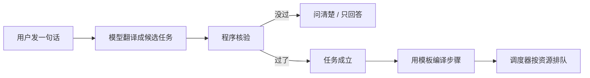
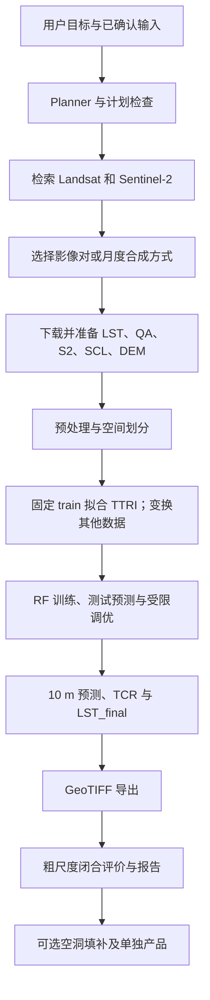
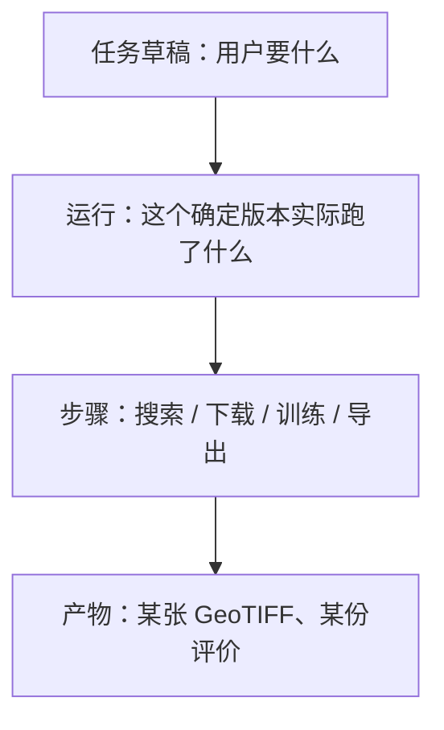
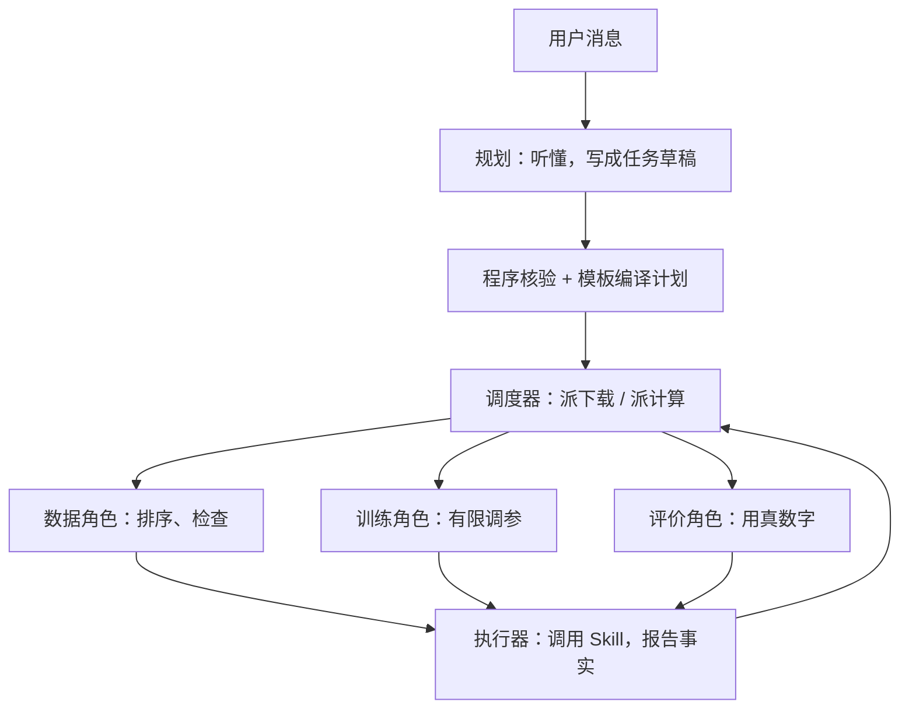
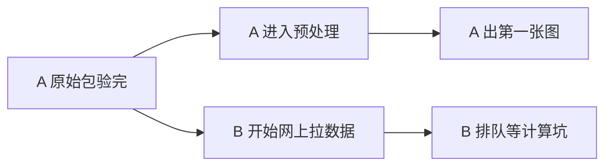
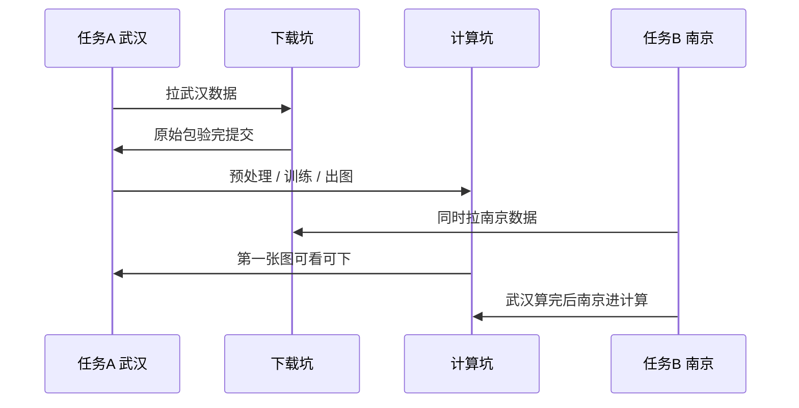
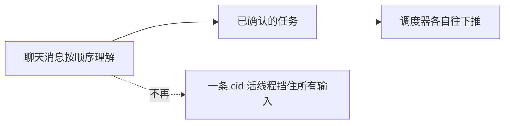

# GeoThermoAI 自然语言任务与执行编排改造说明（最终版）

发给队友和实现者用这一份。正文决定与底稿 `agent_task_orchestration_redesign_zh.md` 相同，在对应位置加了总图和总表，方便先看流程再看细节。

审查基线：`CameronKwan/research-restart`，提交 `e9a5c45183db4f4a97179872fe840d1cda016393`。阅读与资料访问日期：2026-09-07。

本文是可以交给实现者执行的设计决定，不是待选框架清单。实现者需要重新核对函数接口和调用位置，但不得以局部实现便利为由改变本文确定的用户行为。全文只讨论自然语言理解、专业角色边界，以及多个任务的下载与处理交错。降尺度算法和统计计算不在此次重写范围内。

**怎么读**

| 你想先搞清什么 | 看哪 |
|---|---|
| 原来怎么走、改完怎么走 | 下面两张总图 |
| 要交付什么、线上机器有多小 | 第 1 节 |
| 现在代码卡在哪 | 第 2 节开头的问题表，细节跟在后面 |
| 消息如何变成任务 | 第 4 节 |
| 下载和计算怎么错开 | 第 6 节的时序图和资源表 |
| 怎样算做完 | 第 10 节 |

---

## 0. 总流程

改造只动三件事：听懂人话、拆成几单任务、在小机器上排队。10 m 温度怎么算（定标、TTRI、随机森林、TCR、闭合、填洞）这次不重写。

### 原来


整段聊天共用一套字段。同一对话里线程还活着，再打字常被挡：「已有任务执行中」。目录里有张温度图，你说「继续」，有时会被当成填洞。

### 改完



模型负责听懂。程序负责放不放行、谁占用下载坑和计算坑。任务成立了才跑，不是模型说一句就开始算。

---

## 1. 结论与改造边界

**保留 Planner、Data、Train、Evaluation 的专业职责，保留现有 Python Skill 和确定性算法；不整体迁移到新的 Agent 框架。** 将目前围绕“一轮消息、一份计划、一条执行线程”的控制方式，改成“消息可操作多个独立任务；任务有明确输入、版本、依赖和产物；程序按资源条件执行”。

需要交付的能力只有以下几项，后面的设计和验收都围绕它们展开。

| 要改的能力 | 改完后的明确行为 |
|---|---|
| 自然语言理解 | 能区分解释、检索、下载、局部处理、完整生成和已有产品填洞；一条消息可以包含多个目标，城市、日期和产品要求绑定到正确任务。 |
| 缺槽追问与上下文延续 | 只问当前目标真正缺少或存在歧义的信息；回答补到指定任务；“继续”“改成九月”“就第二个”不会因目录里有某张图而被强制解释成另一种操作。 |
| 专业角色协作 | 保留分工和规则保护。模型负责语义理解、有限建议和解释；程序负责计划编译、依赖检查、资源分配、状态提交和运行恢复。 |
| 多任务交错 | 一个任务的数据完整就绪后即可处理，另一个任务可以同时进行有资源预算的网络下载；无需等全部任务下载完，也无需等第一个任务全流程结束才开始第二个。 |
| 与上述能力配套的状态和界面 | 用户能看到每个任务在下载、计算、排队还是等回答；关闭页面不会改变执行状态；第一份有效产品完成后即可查看和下载，其他任务继续。 |

本次采用本地持久任务状态、单一调度入口和受限工作进程。不要引入分布式集群、自由代码生成、任意 GIS 工具市场、城市热岛新算法或统一科研平台等额外目标。多个城市只是多个任务的一种输入，不假设当前仓库已有跨城市调度。

### 1.1 魔搭创空间是必须支持的部署环境

**本项目线上是一台大家共用的小机器：魔搭创空间的免费 CPU 实例，约两核、16 GB 内存，不是按访客隔离的集群。** 注册两个账号、打开两个对话或创建两个项目，都不会多得到一份机器资源。账号系统隔离的是数据和访问权限，CPU、内存、磁盘和网络仍由整个应用共用。这与 README「快速上手与在线体验」、仓库部署配置和本次查询到的线上运行配置一致，证据见第 2.6 节。

预期访问人数不多。改造主要服务于“一位用户提交两三个任务”和“偶尔两位用户同时使用”，不按大规模公共服务设计。采用一个应用容器、一个调度入口、一份小型任务数据库，以及全应用共用的一个重计算位置和一个下载位置。保留专业角色不意味着为四个角色各开进程，更不意味着为每个访客启动一套模型与执行服务。少量任务用简单队列即可，不新增分布式消息系统、租户配额平台或弹性扩容设施。

在这台机器上，交错执行的目标是让 A 计算时顺便获取 B 的数据，减少等待并及时展示第一份结果；不是同时训练两个大区域。内存不足时允许暂时回到串行，单个任务也放不下时明确说明需要缩小用户选择的范围或转到本地 Docker，不能暗中降低分辨率、减少科学步骤或改算法。两核、16 GB 是部署预算，不是保证任意城市都能生成产品的承诺。

下文名称便于对照代码，不要求用户填写。ID 都由后端产生。

| 名称 | 意思 |
|---|---|
| uid | 用户编号 |
| project_id | 项目编号 |
| conv_id（部分接口写作 `conv` 或 `cid`） | 对话编号 |
| task_id | 任务编号，例如武汉七月 LST |
| run_id | 这一单某个确定版本真正跑起来的那一次 |
| question_id | 待回答问题编号 |
| artifact_id | 产物编号，某张图或某个文件 |
| attempt ID | 某个节点本次尝试的编号 |
| SSE | 服务器向页面持续推送事件的连接。进度真相在任务库，不在这条管道里 |
| worker | 实际执行工作的进程或线程，不是另一个会思考的 Agent |
| raw_ready | 完整出 LST 所需原始包已验证 |
| 配对 / 月度 | 两种产品语义，不是两种下载按钮 |

## 2. 阅读范围与事实依据

现状可以先看成下面这张问题表，细节和代码位置在本节后文。

| 问题 | 现在实际怎样 |
|---|---|
| 没有「任务」这个对象 | 前端只发项目、对话、这句话、Chat/Work、执行模式。没有任务编号。[R1] |
| 一条线程咬死对话 | server 给这次对话开后台线程。线程活着时再发消息，经常被拒。[R2] |
| 一套字段绑不住两城 | `merge_slots` 能把「25 年」和「7 月」拼上，拼不出「武汉七月、南京八月」。[R4] |
| 关键词盖过模型 | 「继续 + 有 LST 图」可能改成填洞。局部步骤猜不出就默认下载。[R4] |
| 计划文字和真参数脱节 | 规划把云量写在约束里；执行器常从步骤参数或界面设置取。[R3、R4、R6] |
| 完成气泡不等于成功 | 数据检查失败，审批有时还能点接受。有的步骤先报完成再处理失败。[R5、R6、R11] |
| 找不到稳定的那张图 | 地图、精度、下载常按文件修改时间挑「最新的」。[R12] |
| 审批在内存里 | 等你选影像、等审批，不少靠 SSE 写进内存、线程挂着等。[R1、R2] |
| 没有全场资源队列 | 不同对话的线程可以同时跑。没有「全应用 1 个下载、1 个计算」。下载默认 8 条分块连接。[R8] |
| 线上盘没接全 | 项目数据指向 `/mnt/workspace/data`。账号、对话、记忆很多还在 `/app/data`。[R13] |

这次做的是沿调用链的静态审查：阅读了前端发送与恢复路径、server 的用户/项目/对话与后台执行、默认和旧 Agent 入口、角色编排/反思/执行、记忆读写、Skill 注册及主流程包装器，并追到下载、预处理、TTRI、随机森林、TCR、导出和评价的实现。没有声称逐行读完全部仓库。

未启动服务，未调用真实 LLM 或下载遥感影像，未训练模型，也未测量吞吐和首份产品耗时。因此，下面的“现状”来自代码；并发冲突的实际发生概率、性能收益和外部数据服务可用性没有经过运行验证。代码注释里提到的历史测试通过记录不视为本次测试结果。

以下索引供实现者追证据。函数名用于说明现状的调用位置，不表示实现时只能改这些函数。

| 编号 | 已追到的代码位置 | 能证明的事实 |
|---|---|---|
| R1 | [聊天 store](../frontend/src/stores/chat.js)、[项目 store](../frontend/src/stores/project.js)、[ChatInput](../frontend/src/components/ChatInput.vue)、[API 封装](../frontend/src/api/index.js) | 发送一个 message，绑定一个 project/conv；前端只有一个活动 SSE 订阅，切换对话关闭订阅但不取消后台工作。 |
| R2 | [server](../server.py)：`chat_start`、`_conv_project_dir`、`_stream_events`、`chat_resume`、`_latest_pair_root` | 每对话线程与目录、SSE 驱动部分状态更新、内存审批恢复，以及按最新配对取结果。 |
| R3 | [GeoThermoAgent](../core/agent/geo_thermo_agent.py)、[角色入口](../core/agent/orchestrator/role_flow.py)、[Agent 配置](../core/agent/orchestrator/agent_config.py)、[现有设置](../config/settings.json) | 默认启用角色路径；规划、审批、顺序求解、回退重规划；旧路径仍可被配置启用。 |
| R4 | [Planner](../core/agent/roles/planner_agent.py)、[Planner 提示词](../core/agent/roles/prompts/planner.py)、[槽位解析](../core/agent/roles/slots.py)、[关键词](../core/agent/orchestrator/keywords.py)、[计划 schema](../core/agent/plan_schema.py) | LLM 分类及后续关键词覆盖、单套槽位、内置步骤、相对时间和研究区匹配。 |
| R5 | [RoleHooks](../core/agent/orchestrator/role_hooks.py)、[角色目录](../core/agent/roles)、[反思规则目录](../core/agent/reflection)、[审批协议](../core/agent/orchestrator/approval.py) | 角色介入点、确定性检查与有限调优、暂停和回退权限。 |
| R6 | [执行引擎](../core/agent/executor.py)、[Skill 基类](../core/skills/base_skill.py)、[注册表](../core/skills/skill_registry.py)、[LLM 客户端](../core/ai_assistant.py) | 按步骤调用 Python Skill，执行时注入路径/参数；不是模型自由调用任意程序。 |
| R7 | [记忆目录](../core/memory)：`memory_manager.py`、`session_state.py`、`experiment_log.py`、`workflow_experience.py`、`preferences.py`、`rag_store.py` | 会话槽位、项目实验与偏好、领域/经验检索的不同范围及写入条件。 |
| R8 | [数据获取 Skill](../core/skills/builtin/data_acquisition.py)、[S2 定标](../core/skills/builtin/sentinel2_calibration.py)、[月度合成](../core/monthly_composite.py) | 搜索/选择/下载、局部 Range 并行、项目缓存、定标与合成；下载含本地计算。 |
| R9 | [预处理 Skill](../core/skills/builtin/data_pipeline.py)、[预处理](../core/data_preprocessing.py)、[数据集划分](../core/split_dataset.py)、[TTRI](../core/ttri.py)、[RF](../core/rf_model.py) | 两条 30 m 数据流、10 m 特征、固定划分、TTRI 系数拟合和模型训练。 |
| R10 | [TCR](../core/tcr.py)、[格网映射](../core/grid_mapping.py)、[LST final](../core/lst_final.py)、[GeoTIFF 导出](../core/export_geotiff.py)、[评价](../core/evaluation.py)、[填洞](../core/gapfill.py) | 最终 LST 实际计算点、父格闭合、GeoTIFF 和评价/填洞边界。 |
| R11 | [独立 pipeline](../core/pipeline.py)、[manifest](../core/manifest.py)、[输入重建](../core/stage_rebuild.py)、[中间文件清理](../core/intermediate_cleanup.py)、[原子写入](../core/atomic_io.py) | 存在另一套顺序 pipeline；阶段清单和文件原子写入不等于任务调度与恢复。 |
| R12 | [地图可视化](../core/visualization.py)、[地图面板](../frontend/src/components/panels/MapView.vue)、[精度面板](../frontend/src/components/panels/Accuracy.vue)、[文件面板](../frontend/src/components/panels/FileDownload.vue) | 地图、精度与文件列表的当前定位方式不同，需要共同绑定任务产物。 |
| R13 | [README 的在线体验说明](../README.md)、[创空间部署配置](../ms_deploy.json)、[Dockerfile](../Dockerfile)、[构建排除规则](../.dockerignore)、[账号模块](../core/auth.py)，以及 R1、R2、R7 | 共用免费 CPU 实例；Docker 单服务入口；项目数据与账号/记忆当前根目录不同；前端已有魔搭代理下的登录凭据传递适配。 |

### 2.1 从一句话到执行计划


用户在前端选择项目、对话、Chat/Work 和执行模式，上传研究区，然后输入自然语言。聊天状态模块将项目、对话、消息、聊天模式和执行模式发到 `/api/chat/start`（聊天启动接口）；对应字段依次为 `project`、`conv`、`message`、`chat_mode`、`exec_mode`。这里没有任务数组，也没有可用于区分同一对话内多个目标的任务编号。[R1]

server 确认所属项目/对话，保存消息，取得对话工作目录，创建后台线程。Chat 模式直接进入问答流接口 `GeoThermoAI_Assistant.ask_stream`；Work 模式在默认配置下进入角色化 Agent。角色开关 `roles_enabled` 默认开启，重规划上限为 3、自动调优默认 5 轮、审批等待为 1800 秒、默认采用审批执行模式；用户设置可覆盖相应配置。不能把旧入口的关键词分流当成默认入口。[R2、R3]

角色路径创建规划角色、规划上下文和运行状态，读取会话槽位，附上最近对话、已上传研究区、配置、已有文件摘要和技能描述。Planner 首先调用 LLM，输出一个总意图及研究区名、时间表达、产品和模型；然后合并槽位、解析时间、将研究区名称匹配到真实文件，必要时返回问题。信息足够后生成计划，再经过规划反思和硬规则校验。[R3、R4]

这条链已经有自然语言理解和缺槽追问，问题不在于“完全没有理解能力”。其后还有多层补丁：明确填洞关键词可能强制改判为后处理意图（postprocess）；存在已有 LST 时，“继续/处理一下”等词也会被如此改判；局部执行意图（partial）的步骤最终强制使用关键词推断结果，并清空该意图携带的 LLM 问题。局部步骤推断函数 `_infer_partial_steps` 无法判定时默认下载。模型对原句的理解可能在这里被更窄的规则覆盖。[R4]

槽位合并逻辑 `merge_slots` 已支持“25 年”与下一轮“7 月”合并，也支持最近若干天、上个月等表达。它仍只有一套槽位，不能表达“武汉七月、南京八月”的两个绑定。否定词从本轮提取值中剥离后，旧槽位仍可能被合并回来；缺少显式“清除某个已确认值”的状态操作。其当前的来源标记也不能完全代表确认过程，例如默认补成 10 m LST 产品后，可能被记为“用户给出”（`source=user`），而非系统默认。[R4、R7]

整月的配对/月度选择在计划确认之后另外处理，主要看本轮原文关键词；没有作为完整槽位稳定贯穿规划、确认和恢复。它在 auto 模式也可能弹出，这是产品语义尚未确定，而非用户设置失效。改造应保留“歧义不能靠 auto 猜测”的原则，但统一问题状态和提问时机。[R3]

计划文字与实际参数也没有完全连通。Planner 把云量、数据源等放在计划顶层的约束字段 `constraints`，重规划也修改这里；执行器则从步骤参数或用户设置 settings 取下载配置，没有统一把这份约束编译到实际调用。RF 执行前还会再次读取用户设置覆盖部分参数。因此，计划摘要说“阈值已调整”不证明下载真的用了它；任务执行中修改设置也可能影响后续步骤。这是自然语言落到真实遥感任务必须补上的一环。[R3、R4、R6]

### 2.2 Agent 如何分工，谁真正执行

| 模块 | 当前实际责任 | 执行与判断的性质 |
|---|---|---|
| Planner | 意图、槽位、计划；失败时提出调整计划 | LLM 与规则混合。完整生产计划会被规则补齐和排序。 |
| `role_flow` / `RoleHooks` | 实例化角色，顺序调用执行引擎；处理 continue/retry/pause/abort/replan | 中央控制流。子角色通过钩子提出回退，由总流程组织新的计划。 |
| Data | 配对排序、自动选择；下载、预处理和 TTRI 后的数据检查 | 配对分数由云量、覆盖、日期差、景数的固定权重计算；D1–D7 决定检查结论，LLM 解释失败。 |
| Train | 首轮结果、手动/自动调优、有限重试、最佳轮提升与清理 | LLM 可建议动作和参数；参数范围、收敛/恶化/轮数等由规则约束。调优以现有测试集指标（`test_metrics`）等数据做决定。 |
| Evaluation | 收集 TCR、导出、评价结果；报告与可选填洞 | 数字、评级和口径句由程序组装，LLM 只写经过校验的定性段落；填洞仍调用既有 Skill。 |
| executor + Skill | 注入路径/配置，运行下载与算法，收集结果及产物 | 顺序 Python 调用。不是四个角色同时执行，也没有多 Agent 辩论或动态 worker 池。 |

四个角色共用 LLM 客户端封装，提示词、角色记忆范围不同。Planner、Data、Train、Eval 实例在角色执行路径内创建；server 则按用户缓存顶层 assistant/agent/memory，全局注册 Skill 实例。本次没有看到各内置计算 Skill 用实例字段保存整轮栅格，但这不能证明所有底层库与共享缓存线程安全。[R5、R6]

技能注册表 `SkillRegistry` 将 Python 技能实例按名称和分组注册，执行契约是参数字典、进度/日志回调与技能结果 `SkillResult`；结果中分别记录是否成功、说明、结构化数据和产物。server 注册 9 个内置 Skill，包括问答技能 `ai_assistant` 和可选填洞技能 `lst_gapfill`；S2 定标是下载器调用的工具模块。`config/skills_config.json` 目前为空，不能视为现成的意图目录或调度配置；注册表虽有第三方加载方法，当前主入口没有据此形成开放工具执行系统。[R2、R6、R8]

控制边界也有不一致处，实施时不能只保留注释：Data 规则检查失败后，审批分支存在 ACCEPT 放行；executor 在个别异常捕获后会退出本步再进入下一步，且 Skill 返回后会先发 completed 回调再处理失败结果；而 `EasyLSTPipeline.run_full` 明确失败即停止。新任务状态必须按真实成功与依赖产物决定推进，不继承“有完成气泡就可以运行下游”的语义。[R5、R6、R11]

### 2.3 10 m LST 到底怎样产生

默认 Agent 主路径如下。箭头表示数据依赖，不表示每一项都各有一个独立 Agent。



1. **数据获取。** `data_acquisition` 被执行引擎用于搜索和下载两次调用，搜索返回的 STAC 条目可以经 `cached_search` 带入下载，避免重复搜索。配对模式选择一组日期接近的 Landsat/Sentinel-2，时间差规则为不超过 2 天；一次调用并不是把全部候选逐对生产完。Landsat 使用 Planetary Computer，Sentinel-2 在配置条件满足时可优先走 Copernicus Data Space 并回退。DEM 有项目级复用及来源分支，月度分支的 DEM 可走 Planetary Computer。不要仅凭 README 写成所有模式都严格采用同一来源顺序。[R6、R8]
2. **配对与月度是不同产品语义。** 配对模式准备 Landsat LST、QA、Sentinel-2 五个光谱波段、SCL 和 DEM。月度模式按选定时段景集合做掩膜后逐像元中位数合成，再进入降尺度；不是把逐日 10 m LST 简单平均。现有目录用月末代表日构造伪配对，因此仅靠日期名不能区分同日真实配对与月度产品。[R8]
3. **预处理。** `DataPipelineSkill` 调 `process_preprocessing`，对齐栅格、组合 Landsat QA、SCL 有效类别和热红外有效性，按现有定标将 Landsat DN 转 K，计算光谱指数与地形特征。生成训练样本表、完整 `30m_constraint_grid.parquet` 和 10 m 预测特征/格网元数据。训练样本是否 step=2 取决于有效像元量；完整约束层仍覆盖全部有效 30 m 父格，不能用抽样训练表替代。[R9]
4. **划分与 TTRI。** 按空间块和 guard buffer 划分 train/validate/test。TTRI 系数只用固定 train 拟合一次，其他集合和 10 m 空间化复用这组系数；TTRI 表达式不含拟合截距。该步骤在角色边界上归 Data，不要因为含“拟合”就改为每轮 RF 调优都重新拟合。[R5、R9]
5. **RF。** `RFModelSkill` 训练并预测测试集，TrainAgent 在独立轮次目录下调参，最终提升选定模型供下游使用。当前最佳轮选择和调优读现有测试指标，这是现有方法事实；本文不修改其统计协议，也不把调优后的指标重新包装成额外独立验证。[R5、R9]
6. **TCR 与最终温度。** `TCRComputeSkill` 调 `core/tcr.py`，先对 10 m 特征预测，再按 `grid_mapping` 映射到真实 30 m 父格，计算“30 m 参考 LST 减去该父格有效子像元预测均值”的残差，并加回细像元。默认是 `block_constant`；`smooth_recentered` 已存在但不是默认。`LST_final` 在这里已算出。`core/lst_final.py` 主要验证并复制结果，随后 `export_geotiff` 按 row/col 和元数据导出。`lst_export` 包装器的部分描述仍说它计算相加公式，不能据此误判真实计算位置。[R10]
7. **评价与展示。** RF 的测试预测评价和最终产品的 30 m 算术均值闭合是两件事。`accuracy_eval` 对完整约束层与最终细格结果执行闭合评价；Evaluation 汇总这些事实。结果是受粗尺度参考约束的 10 m 估计，不是独立 10 m 热红外观测，也不能将算术均值闭合称为辐射/能量守恒。填洞生成独立产品和掩膜，不能覆盖主产品或混入主精度结论。[R5、R10]

`core/pipeline.py` 中的 `EasyLSTPipeline` 是另一套十步顺序接口，包含预处理、拆分、TTRI、RF、预测、TCR、导出、评价等更细步骤。默认自然语言路径没有直接调用它的 `run_full`，而是由 executor 调七个主 Skill 包装器，二者复用底层算法。不能只改这个 pipeline 就宣称改好了 Agent 调度。[R6、R11]

### 2.4 记忆现在保存什么

| 记忆 | 当前读写与作用 | 与执行状态的边界 |
|---|---|---|
| 对话槽位 | 用户记忆目录下 `sessions/{conv_id}.json` 保存意图、槽位、待答问题、计划编号、重规划次数等；角色入口读写 | 只有一套槽位；不是多个任务、完整计划、下载执行权或可恢复工作进程的记录。 |
| 项目实验 | `projects/{project_id}/experiments.json` 加 Chroma 项目集合；executor 收尾写参数、影像对、指标、失败/暂停等 | 用于精确查指标和检索经验，不应拿 success/paused 记录来决定某个新任务的当前步骤。 |
| 项目偏好 | `preferences.json` 支持偏好模型、云量阈值等键值，Planner 可读取 | 存在写入 API，但本次没追到聊天入口自动把偏好写进去的完整调用；不能写成已经能自动学习所有用户习惯。 |
| 成功流程 | `workflows.json` 加向量段落；Evaluation 在评价后写入，Planner 可查同区域记录 | 当前写回以无已记录失败、`eval_passed=True` 和 R²≥0.75 为条件；这里的“评估通过”不是另一次独立科学审查。记录目前也没有完整任务/运行血缘。 |
| 领域知识 | 种子知识写入用户级 Chroma 的 global_knowledge；BGE ONNX 优先，失败时回退；角色按不同范围检索 | 是理解与说明资料，不是已确认用户意图，不是产物存在性证明。 |

记忆读取同时有语义检索和 JSON 精确查询，按角色注入知识、经验、历史最佳与偏好。已有 JSON 写锁、原子替换和 RAG 锁值得保留，但会话的多步读改写、实验与向量双写都不是整个任务的事务。实验 ID 当前含项目前缀和秒级时间，多任务下还需要独立稳定 ID。`load_used_pairs` 主要按项目历史影像日期判断尝试过的配对，不足以表达“哪个研究区、哪版边界、哪种合成方式、哪次任务尝试过”。[R7]

此外，显式 Chat 模式直接调用问答客户端，其 server 上下文没有接入和 Work 角色路径同样的记忆注入；不要把角色分支能查历史的能力无条件推广到所有入口。[R2、R7]

### 2.5 目前能并行到哪里

现有项目根下有 `convs/{conv_id}`，同一项目的不同对话有独立工作目录；选对后使用 `pairs/L日期_S日期/{raw,processed,results}`。因此不能说所有对话共用一个 results。不同对话后台线程也可同时运行，同一对话通常会被“已有任务执行中”挡住。[R1、R2、R6]

但这里没有全局下载/计算队列、内存预算、公平性或任务优先级。单个执行计划仍顺序跑完所选配对。下载器的并行主要在单资产 HTTP Range 层，默认 8 个连接、4 MB 块；波段和景的组织仍大量串行，且整文件 bytes 与本地处理可能同时占内存。RF 已按容器 CPU 配额约束单个模型的 `n_jobs`，这不代表多个 RF 同时运行会共享总配额。[R8、R9]

已有跨对话项目缓存，不能写成“尚无复用”。它按研究区文件名构造缓存标识，按日期组织影像，DEM 也按研究区名缓存；复用分支不少只检查存在且非空。这比完全共享同日文件更谨慎，但仍不能识别同名边界被替换、场景清单变化或合成方式变化。[R8]

下载阶段还做 S2 定标、GDAL warp、拼接、压缩、overview 和月度合成。`SkillResult.success` 也不是统一的完整原始数据交付契约：例如月度分支的返回检查与非月度新文件验证并不完全一致。因此，不能把“下载线程结束”直接等同于“所有必需输入已验证”。[R8]

暂停和结果定位是另两个并行障碍。待选配对、待审批载荷主要由 SSE 消费时写到内存；暂停线程等待 Event，超时结束后恢复 API 依赖的队列已经清理。前端在暂停时允许重新打字，却仍走 chat_start，可能被原活线程拒绝。断线后能恢复部分气泡不等于能恢复任务。[R1、R2]

同一对话的地图、精度和填洞输入多处按文件最后修改时间（mtime）选最新影像配对目录或文件；Planner 续接则把不同配对下发现的完成步骤合并成集合。一个对话出现多个任务后，这些方式既不能稳定选择“武汉的结果”，也不能判断“南京的数据是否完整”。manifest 是阶段与产物清单，已有状态、产物和签名字段，但并非统一校验所有输入后才复用，原子替换也不能阻止同一文件的并发读改写丢更新。[R4、R6、R11、R12]

### 2.6 创空间官方说明、线上应用与仓库的核对

本次访问了用户提供的[创空间介绍](https://modelscope.cn/docs/studios/intro)、[创空间首页](https://www.modelscope.cn/studios)和[GeoThermoAI 在线应用](https://modelscope.cn/studios/Adhara/GeoThermoAI)。这些页面主要由浏览器脚本加载，普通网页提取没有得到正文。因此进一步沿官方页面的数据来源读取了介绍、Docker 和资源规格文档，并查询了该应用的公开运行信息；没有把空页面当作已阅读内容。官方正文来自[文档版本接口](https://modelscope.cn/api/v1/document/main_doc_CN_prod)指向的当日文档资源。应用公开接口返回运行中，类型为 Docker，当前生效硬件为两核、16 GB 的 CPU 档位，并给出了应用入口；该入口访问返回 HTTP 403，未进入登录后的实际操作页面，也未测量实时可用内存或执行线上任务。

| 核对对象 | 已核实的事实及对本设计的影响 |
|---|---|
| 官方[创空间介绍](https://modelscope.cn/docs/studios/intro)与首页 | 创空间用于托管和展示应用；首页是应用发现入口。介绍里的 AI 作画排队是示例应用的行为，不能据此推断平台已替 GeoThermoAI 做了遥感任务调度。 |
| 官方[资源规格](https://modelscope.cn/docs/studios/resource-selections) | 免费资源是 2v CPU、16 GB；实例一段时间未使用会休眠，重新访问会激活。文档没有说明无访客时长下载如何判定活跃，也没有给出本应用的磁盘配额；不能保证关页面后一直计算，也不能编造固定休眠时长或可用磁盘大小。 |
| [GeoThermoAI 公开运行信息](https://modelscope.cn/openapi/v1/studios/Adhara/GeoThermoAI)与仓库 README | 线上生效配置与 README 描述一致。这里的免费资源属于部署这个应用的实例，不是给每位访问者另分配一台机器；应用自行用账号隔离数据。预期少量访问是本次产品设计前提，不把累计浏览数当作同时在线人数。 |
| 官方[Docker 说明](https://modelscope.cn/docs/studios/docker)与仓库 Dockerfile | 创空间支持 FastAPI 等自定义应用，对外入口为 `0.0.0.0:7860`，即监听所有容器网卡的 7860 端口；8080 被平台进程占用。仓库已用 FastAPI 同时托管 Vue 构建产物、业务接口和事件流，启动命令只运行 `server.py`，没有配置多个 Web 工作进程。保留这条部署路径，无需改成 Gradio，也不为调度器新增公网端口。 |
| 官方 Docker 持久化说明与仓库目录 | 普通容器目录的运行数据在重启时会丢失；`/mnt/workspace` 是运行时提供的持久卷，重启后保留，但转移或重命名创空间仍会丢失，构建镜像时也不能使用该卷。仓库将项目数据指向 `/mnt/workspace/data`，而账号注册表、对话、设置、研究区和记忆仍由代码定位到 `/app/data` 下；登录签名密钥未另设时也保存在那里。仅配置项目根目录不能证明整套用户状态已持久化。 |
| 官方[部署配置格式](https://modelscope.cn/api/v1/studios/deploy_schema.json)与 `ms_deploy.json` | 配置里的 `sdk_type` 表示部署类型，现值为 Docker；`resource_configuration` 表示硬件档位，现值 `platform/2v-cpu-16g-mem` 对应免费两核、16 GB；`WORKSPACE_ROOT` 表示项目数据根目录，现值为 `/mnt/workspace/data`。另有实际格式差异：官方格式把 `environment_variables`（运行时注入的环境变量）定义为列表，仓库目前写成对象。实现时需按平台实际支持格式对齐并核验注入结果，不能因为已有配置文件就断言变量已在线生效；本次不修改配置文件，也不据此断言现网部署失败。 |

官方 Docker 文档还说明 `Authorization`（通常用于传登录凭据的请求头）及 `X-modelscope-*`、`X-studio-*`（平台保留的请求头名称前缀）由平台占用。仓库前端已经将本应用的登录凭据同时放入 URL 查询参数 `token`，用于穿过代理访问普通接口、SSE 和下载，后端也支持该入口。[R1、R2、R13] 新增任务、答复、取消、事件补取和产物接口必须沿用这套兼容入口与用户归属校验，不能只在本地用请求头测试通过。凭据不得写进任务日志或事件；以上只是对现有兼容方式的延续，不扩展为登录系统重做。

上述核对补充了部署事实，未改变第 2 节的静态审查边界。尤其没有做线上重启、存储迁移或压力测试；它们是实现后的验收要求，不是本次已通过的结果。

## 3. 框架对照后的设计决定

参考资料只用于对照设计，不把外部系统的功能算到本仓库头上。

| 对照来源 | 借鉴内容 | 本仓库采用的决定 |
|---|---|---|
| [Anthropic：Building effective agents](https://www.anthropic.com/engineering/building-effective-agents) | 区分预定代码流程与模型自主决定步骤；复杂度需要实际收益支持 | LST 科学依赖已知，保留受控工作流；不增加角色讨论、投票或自主写代码。 |
| [LangGraph：Workflows and agents](https://docs.langchain.com/oss/python/langgraph/workflows-agents) | 显式状态、节点、条件分支，以及给不同 worker 独立输入 | 每个遥感任务有独立状态，不能共享一份可变计划。并行 Agent 示例不等于下载/计算资源调度。 |
| [LangGraph：Persistence](https://docs.langchain.com/oss/python/langgraph/persistence) | 运行 checkpoint 与长期 store 分开 | 任务运行事实独立持久化；继续保留领域 RAG 和实验经验，不让 RAG 决定进度。 |
| [LangGraph：Interrupts](https://docs.langchain.com/oss/python/langgraph/interrupts) | 可序列化暂停、稳定标识恢复；重入节点前的副作用要幂等 | 问题绑定 task/run/question ID；等待时释放工作槽，重连不重新下载已提交数据。 |
| [Rasa CALM：Dialogue understanding](https://rasa.com/docs/learn/concepts/dialogue-understanding/) 与 [Writing flows](https://rasa.com/docs/pro/build/writing-flows/) | 理解层生成设槽、开始、纠错、澄清等受限命令；流程定义槽位和动作 | 在现有 Planner 前半部形成语义操作，再确定性更新任务和编译 Skill 计划，不引入 Rasa 运行时。 |
| [GeoGPT 原论文](https://arxiv.org/html/2307.07930v1) | 自然语言连接 GIS 工具，运行前检查文件和工具条件；论文也讨论幻觉与保护机制的局限 | 保留 Skill 工具边界，增加真实对象/输入检查。合法 JSON 不等于合法遥感任务。 |
| [Earth-Agent 作者实现](https://github.com/opendatalab/Earth-Agent) | 遥感工具调用与行动循环；评测关注结果以及工具选择、顺序和参数 | 验收必须看选了什么任务、数据和工具；不只看最终有没有一张图。该仓库不能证明本系统已有长期下载调度。 |

不整体换框架的依据是 R3–R7：这里已经有角色、计划 schema、钩子、审批、规则和记忆，主要缺口是任务对象与生命周期不完整、语义后处理互相覆盖，以及执行调度和展示订阅耦合。换框架不会自动修复缓存键、mtime 选结果、GDAL 共享状态或 CPU 竞争，反而需要重新适配既有科学检查。

**本次采用现有 Python 编排体系，加本地事务型任务存储和程序调度器。** 使用 Python 标准库 SQLite 保存任务、运行、节点、问题、事件和产物索引；栅格、模型、Parquet 仍在文件系统，原 manifest 保留为运行产物清单。魔搭创空间的单个应用进程只启动一个调度器，用启动锁防止重复启动；不同 Web 请求只提交命令，不能各自启动调度循环。节点仍需记录哪次尝试有效，避免取消或恢复后的旧结果迟到覆盖，但不为这台小机器引入分布式领导者选举。无需 Redis、Celery 或额外云服务。

| 存什么 | 放哪 |
|---|---|
| 任务、运行、步骤、问题、事件、产物索引 | SQLite。创空间固定：`/mnt/workspace/data/task_runtime.sqlite3` |
| 栅格、模型、Parquet | 文件系统。原 manifest 当「这一次运行产出了什么」 |
| 账号、对话、设置、研究区、记忆、没另配的登录密钥 | 同一持久数据根，按用户分子目录 |

创空间任务库固定放在 `/mnt/workspace/data/task_runtime.sqlite3`，与任务产物一同使用平台持久卷。账号注册表、对话、设置、研究区、记忆及未外部配置的登录签名密钥也必须接入这一持久数据根目录，保留各用户子目录和既有项目路径的可读兼容；不能只保存任务表，却在重启后丢失账号和输入边界。本地 Docker 继续使用挂载的 `/app/data`，非容器本地运行可使用仓库 `data`。这些是不同部署下的数据根目录，不另建一套任务实现。迁移只搬接已有记录与引用，旧数据先备份，不能覆盖冲突文件或擅自创建成功记录。

启动时检查持久目录可写、数据库事务和文件锁可用，再恢复任务；不能在持久卷不可用时悄悄回退到容器临时盘。SQLite 只由本实例协调写入，不由多个服务跨机器共享；不能未核验卷的锁与同步语义就启用依赖它们的并发数据库模式。库内所有业务记录带用户/项目归属，Web 查询强制按当前用户过滤。任务库不放在研究区目录，也不代替每用户的 RAG 库。普通重启可恢复以这些数据仍完整为前提；转移、重命名创空间前另行备份数据，本文不将外部对象存储或托管数据库设为部署前置条件。

这是一项明确选择，不把“LangGraph 或自研任选”留给下一轮方案讨论。以后若确需多机执行可以重新评估，但不属于本文交付。

## 4. 自然语言先形成任务，再编译执行计划


模型只提供候选理解，不直接改变运行记录。程序验证后，任务才成立。

### 4.1 给理解器一份实际能力目录

在现有 Skill 契约上增加一层面向用户目标的能力描述，保持与已注册能力一致。模型看到的是能完成的目标、所需输入、可用对象和限制；文件路径由程序解析，模型不能生成路径来满足缺槽。

| 用户目标 | 必须确定的信息 | 编译后的行为 |
|---|---|---|
| 解释方法、参数或已有指标 | 问题；涉及历史结果时需要唯一结果引用 | 只回答，不启动计算。 |
| 仅搜索影像 | 研究区、时间、搜索条件 | 检索并展示候选，不自动下载。现有 executor 将搜索接到下载的行为需要拆开。 |
| 下载数据 | 研究区、时间、所需数据集合；涉及配对/月度时确定获取方式 | 搜索、选择并下载，验证交付后结束，不自动预处理或训练。未指定集合时说明采用当前 LST 标准输入集合。 |
| 预处理或训练等局部步骤 | 明确的已有输入批次/运行；相应阶段参数 | 只运行目标及被明确允许的必要重建。缺原始数据时说明依赖缺失，不悄悄升级为全流程。 |
| 生成 10 m LST | 研究区、时间、配对/月度语义；可用模型与可选填洞要求 | 使用既有完整科学步骤模板，附必要的选择和检查节点。 |
| 对已有产品填洞 | 唯一主产品及其生成时研究区 | 运行既有填洞算法，生成带血缘的新产品，不重新训练。 |
| 继续、重试、修改、取消、查进度 | 指向唯一任务/运行，修改时还需具体字段 | 更新对应任务状态；控制命令本身不被当成新生产请求。 |

不支持的产品或模型必须明确说明，并给出系统内可行的替代选项；用户接受前不能静默换成 RF 或 10 m LST。例如“出 1 m 实测温度”“直接算热岛强度”不能靠默认 `lst_10m` 吞掉差别。没有注册的模型不能仅凭 model 字符串进入计划。

### 4.2 语义输出和可信边界

一次用户输入允许产生多个有序语义操作：新建目标、给某目标补值、清除/更正值、回答问题、继续、重试、调整优先级、取消，或只回答知识问题。每个操作都带目标对象和来自原句的简短依据；跨多个目标共享的时间、模型或产品只在原句明确共享时传播。

结构化输出中至少表达：操作类型、目标任务候选、新任务列表、槽位更新/清除、所指运行或产品、否定条件、用户明确优先顺序、歧义候选和问题。模型只提供候选理解，不直接改变运行记录。程序执行枚举、类型、能力支持、对象归属、依赖及语义一致性验证后，才更新任务。

编译后的运行参数是唯一执行输入：已确认槽位和约束按明确映射进入各节点参数，实际调用值、任务摘要和运行记录必须一致。settings 只在生成快照时读取，后续修改只影响新快照；节点执行时不能再覆盖已确认值。调优产生的新参数保存为本运行内的新轮次决定，不能冒充用户原始要求。接口适配必须把调度分配的 CPU 配额传到 RF/GDAL 等实际调用，不能只在调度表记录一个未生效的数字。

优先使用模型服务支持的 schema 约束输出；不支持时继续使用现有 JSON 兼容层，加本地严格验证和至多一次格式修复。`json_object` 只保证 JSON 形状的部分条件，不能替代业务验证。保留当前模型服务兼容能力，不因新设计强制更换供应商。

关键词保留为候选识别、明显格式解析和接口不可用时的窄范围辅助，取消其直接推翻目标对象的执行权。

| 废除的旧规矩 | 改完后 |
|---|---|
| 「继续」+ 目录有图 = 填洞 | 继续就是继续。填洞必须明确指向那张图 |
| 局部步骤猜不出 = 默认下载 | 问清楚，或说明依赖缺失。不默认去下载 |

模型自己报出的置信度只作参考；真正的追问依据是目标数量、槽位冲突、对象唯一性和能力/依赖检查。

理解输出应说明“我把你的要求理解为哪些任务”，无需展示推理链。清楚的指令直接给简短任务摘要并按执行模式推进；不额外多问一次“是否真想执行”。

### 4.3 任务草稿与槽位

任务草稿和运行分开。草稿保存用户要什么；运行保存某个已确定版本实际执行了什么。



| 对象 | 必须保存的内容 |
|---|---|
| 任务 Task | 后端生成的任务编号、所属用户/项目/对话编号、创建消息、目标能力、任务版本、状态、优先级、槽位及待解决歧义。 |
| 槽位 | 值、来源、确认状态、原句依据/消息 ID、被修改版本。被否定值有明确清除/失效语义，不能靠空字符串表达。 |
| 运行 Run | 运行编号、所属任务及版本、计划/模板版本、研究区快照、绝对日期、模式、参数和执行授权范围、选定数据清单、节点状态、重试/调优历史。 |
| 产物 Artifact | 产物编号、所属运行/节点、类型、路径、完整性信息、研究区与数据/参数血缘、主产品或填洞产品身份。 |

槽位优先级固定为：本轮明确给出的值或明确清除 > 当前任务已确认值 > 用户明确指定沿用的任务/产物上下文 > 显式项目偏好 > 当前界面候选和历史经验建议 > 内置默认。来源和是否确认分别保存。聊天里“认识武汉吗”只产生提及，不自动变成下一项生产任务的已确认研究区；自动补的 RF/10 m LST 标记为默认而非用户原话。

研究区使用真实文件绑定，记录几何内容标识和生成时副本。用户没有说地区、且只有一个明确可用研究区时，可在摘要中说明采用它，不必重复索要；文件与文字冲突、多个同名候选或边界缺失时要问。改动 `.current.txt`、上传同名新边界或者在另一个对话切换研究区，不能改变已排队运行的输入。

相对时间在该条消息被接收时按用户时区解析成绝对日期，并保存解析锚点；重试或跨天恢复不重新解释“去年”“最近十五天”。单独日期必须保持日粒度；明确区间不能被补成整月。“去年夏天”“最近比较热的时候”等不足以定义目标的表达，提供简短候选解释并追问，不用当前月份或经验月份填上。

配对/月度方式作为产品语义槽位在执行计划确认前解决。明确说月度合成就不再弹同一问题；只给整月且两种产品都合理时，问“要保留一次过境细节，还是要整月合成产品”，并解释两者区别。明确要求多个整月的月度序列时，按月形成独立任务；非完整月份却要求“月度产品”时先确认，不把任意日期段静默称为整月。

### 4.4 问题与回答必须指向对象

所有缺槽、歧义选择、计划审批、影像选择和调优选择使用同一等待输入机制，保留不同的问题类型。每条问题保存 question_id、真实候选、回答方式、问题状态和目标列表；每个目标含 task_id、任务版本、可选 run_id、需要补的字段。普通问题的目标列表只有一项，合并问题明确列出其覆盖的所有任务。生成问题后持久化，然后释放执行槽；不会靠活线程等待半小时维持问题。

界面继续提供现有审批卡和配对卡，也支持文字回复。卡片选择和文字“第二组”“都用七月”“南京取消”进入同一语义/校验入口。文字答复只有在能唯一匹配当前有效问题时才生效；多个任务同时等不同答案时，在卡片上标城市/时间/任务，并在必要时问一句具体归属。不能因用户正浏览南京地图，就把“武汉改成九月”写给南京。

一次尽量问一个决定执行方向的问题，可把同一任务紧密相关的两项缺失合并提问。多个任务共享缺项时合并问一次；用户只回答其中一项时保留其他值和待答问题，不重问已知信息。不需要模型、文件目录等默认/程序可确定的信息，不阻塞用户。

答案提交按 question_id 和目标列表中的任务版本原子消费。共享答案先逐目标校验，再在一个事务里全部提交；若其中任务已修改或取消，该共享答复不部分生效，返回受影响对象并更新待答问题，保留其他任务原有信息。“都”只覆盖问题生成时列出的目标，不自动包含后来新增的任务。重复点击只返回既有处理结果，旧版本卡片不能启动新版本运行。问题不会因 SSE 断开或等待超时被自动批准。auto 表示在明确目标和允许范围内自动执行，不表示替用户猜研究区、产品方式或所指任务。

### 4.5 一条消息中的多任务绑定

本次至少支持：多个明确研究区、多个明确月份、同一对话运行中追加目标，以及对其中一个任务修改/取消。拆分按用户语义，不按逗号机械切句。

| 用户表达与已有条件 | 应发生的行为 |
|---|---|
| “武汉、南京都做去年七月的 10 m LST，用配对模式” | 两项任务，共享明确时间和产品模式。地区各绑定自己的边界；缺南京边界只阻塞南京。 |
| “武汉七月，南京八月，都是 2025 年，做月度的” | 武汉绑定 2025-07，南京绑定 2025-08，不交叉组合成四项任务。 |
| “两地的七月和八月都要” | 上下文中两地和年份唯一时生成四项目标；否则只问缺失对象/年份。 |
| “不是武汉” | 清除被否定研究区并追问新的目标，不把武汉从旧槽位恢复。 |
| “南京改成九月，武汉照旧” | 只更改南京任务版本；武汉继续。若南京正在执行，按修改规则处理旧运行。 |
| 下载完成后“接着生成温度图” | 绑定该数据批次，补完整生成所需步骤；不重新搜索下载。输入被清理时按既有血缘重建。 |
| 已有结果，但另有未完成任务，用户说“继续” | 优先解析明确待恢复对象；不因有结果就填洞。存在多个合理对象时给短问。 |
| “这张图补一下空洞” | 引用明确选中的 artifact；无唯一产品时问哪张。输出是独立填洞产品。 |
| “重新跑完整流程，也要无空洞结果” | 完整生产加明确填洞步骤，不被后处理关键词压成单步。 |

批次只是方便汇总这些任务的容器；一个成员等待或失败，不自动撤销其他独立成员。任务依赖只在复用某个输入/产物时建立。不要为同一消息拆出的不同城市添加不存在的数据依赖。

## 5. 保留角色，收紧控制权

真正跑算法的仍然是执行器按顺序调 Python Skill。不是四个模型同时执行。



| 角色 | 保留 | 收紧 |
|---|---|---|
| 规划 | 听懂、写草稿 | 完整出图那几步用带版本的模板编译，不让模型每次自由重写七步。未知技能要报校验失败，不许默默删步 |
| 数据 | 写死的打分和 D1–D7 检查 | 失败、缺文件、覆盖不够、没有候选，分开记。不能靠 ACCEPT 把失败提交成成功 |
| 训练 | 参数范围、轮数、分轮目录、选优 | 不能为了早点出图少做用户要求的调参、改种子。正常阶段不额外调模型 |
| 评价 | 数字、评级、口径句由程序组装 | 报告能看、GeoTIFF 能下、填洞做完，分开显示 |
| 调度器 | 原来没有这个独立对象 | 独占状态转换。角色不能自己开线程、改别人参数、把任务写成完成 |

Planner 负责自然语言目标和任务草稿的语义解释，不再让 LLM 每次自由重写固定七步。信息确定后由版本化模板编译计划，完整生成、局部操作和填洞各有明确依赖。已有 `plan_schema`、Skill 描述和规则检查可复用，但未知 Skill 或不支持参数应形成可解释校验结果，不能静默删除后宣称计划已满足用户要求。

Data 保留确定性排序和质量诊断。下载失败、文件缺失、数据覆盖不足、候选不存在等是不同事件；可以请模型解释原因和提出有依据的调整建议，不允许它把“失败”改写为“数据已就绪”。完整性失败必须阻止下游；质量告警如现有产品允许用户接受，必须标明告警和接受记录，不能借 ACCEPT 把失败节点提交为成功。

Train 保留现有参数边界、调优轮数/收敛规则、分轮目录、最佳轮提升和延迟清理。每轮已提交结果形成一个可恢复节点，等待用户选择时不占计算槽。模型建议仍需白名单和边界检查；不因追求首份结果而擅自减少用户明确要求的调优、改随机种子或修改选优口径。对于正常阶段不新增 LLM 调用；只在需要建议或解释时调用。

Evaluation 继续用真实结构化结果生成数字、评级和口径说明，LLM 定性说明失败时使用已有兜底。报告可用、原始产品可下载和可选填洞完成要分别表示；即使某段模型解释失败，也不能掩盖已经成功的 GeoTIFF 或阻塞其他任务。

总调度器独占任务状态转换权。角色只能返回结构化建议/决定，不能自行启动后台线程、改变其他任务参数、清理共享文件或写任务完成状态。执行器负责调用和报告事实；调度器验证输出后提交节点。现有运行状态对象 `RunState` 可以继续作为内存视图，但以持久状态为准。

重试分为两类：网络超时等不改变任务目标的重试，在预算内自动进行；改研究区、日期范围、产品方式，或者突破用户明确云量限制，是任务语义修改。后者必须回到用户确认或已有明确授权范围，不能把当前 `widen_time` 自动扩前后 30 天的策略无条件迁移到新任务。auto 也不得暗改用户指定月份。重规划计数、候选排除和调优预算按 run/task 记录，跨轮恢复不会归零。

旧 `roles_enabled=false` 路径保留为旧单任务兼容入口，但不能绕过新提交校验、身份绑定、资源预算和失败停止规则。新多任务统一使用上述控制链，不能再由旧路径在超时后自动选第一组。不要同时维护两套互相矛盾的多任务语义。

## 6. 下载与处理怎样交错

### 6.1 并行单位和提交边界

一个普通生产任务对应一个确定研究区、一段确定时间、一种获取方式和一个所选配对/月份产品。多个配对若都要处理，需明确扩展成多个任务，不把候选列表误当已经授权的批处理清单。

执行单位是可提交的节点：搜索、选择、网络资产获取、原始数据准备/校验、预处理与划分、TTRI、RF 每轮与最终提升、TCR、导出、评价、可选填洞。沿用已有算法包装器；只在调度需要的边界拆开调用与状态提交，不改它们的数值计算。

任务 A 的完整原始数据包验证并提交后即可进入预处理。此时任务 B 可以下载其网络资产。不等待 B 数据全部准备好，也不等待 A 完成全部计算才允许 B 开始。任一任务内部仍按现有科学依赖顺序处理，不允许某一波段刚下载完就用半套数据训练。



raw 就绪检查统一覆盖新下载、缓存命中和月度合成：必需的 LST、QA、S2、SCL、DEM 均存在、能打开，波段数/含义正确，元数据有效，来源和研究区/格网契约匹配，并完成当前算法要求的有效性检查。不同原始传感器无需已经同一分辨率；检查的是各自规格与可对齐性，最终对齐继续交给预处理。月度合成还要有确定的场景清单和合成成功记录。缺 DEM、少 S2 波段或损坏缓存不能提交 raw_ready。

这里的 raw_ready 专指完整 LST 生产输入包。只下载 Sentinel-2 等子集的任务，按用户已确认的数据集合完成验证后即可标记 download_complete；不为了凑全套而补下载其他传感器。以后继续生产 LST 时，再检查同一研究区/时间/模式下还缺什么，取得相应目标授权后补齐，才提交完整 raw_ready。

### 6.2 魔搭免费 CPU 实例的资源策略

创空间默认同时允许 **全应用共用 1 个资产下载作业和 1 个重计算作业**。这份限额覆盖所有账号、项目和对话，不因访客增多而复制。

| 资源 | 上限 |
|---|---|
| 网上拉数据 | 全应用 1 个作业 |
| 重计算（预处理、TTRI、warp/拼接/压缩、月度合成、RF、TCR、导出/评价、填洞、下载器内的本地重处理） | 全应用 1 个作业 |
| 分块下载连接（Range） | 总共 2 条（现有下载器默认 8） |
| 遥感目录检索 / 需要模型理解的请求 | 各最多同时 1 项 |
| 计算线程（创空间初值） | 1 |

Range 指按文件字节范围分块取数的 HTTP 请求。下载以流式写暂存文件为主，不先把整个资产放入内存。查看已保存状态、取消和提交卡片答案不等远端模型返回，也不被长计算占住 Web 请求线程。上述数字是本次采用的保守初值，不是已测出的最优值。

重计算默认只有一个槽，涵盖预处理、TTRI、大栅格 warp/拼接/压缩、月度合成、RF、TCR、导出/评价和填洞中需要大量内存的操作。下载器内的本地重处理也通过这个槽调度。**网络取数和重处理必须能分开等待**：网络资产落到任务暂存文件后交出下载槽，本地准备进计算队列；不能在下载 worker 内拿着大数组阻塞等计算，也不能占住计算槽等待远端长下载。

拆分取数与处理时保留现有按研究区窗口/范围读取云端栅格的能力，不强制把原本可按 COG 范围获取的数据改为下载整景。暂存对象可以是已确定的范围块或现有下载输出；其完整性和重建方式必须明确，不能靠更大的无关下载量换取表面上的流水线重叠。

默认最多预取一个后续待准备的数据包，另设暂存磁盘和内存上限。约 16 GB 内存要同时容纳 Web 服务、记忆检索、地图读取、下载缓冲和当前算法，不能全部分配给 RF。实现时按容器实际内存上限扣除常驻服务、缓存及安全余量，再估算节点工作集；记录每类节点的峰值用于校准，不只检查当前剩余内存。磁盘按持久卷实际剩余空间，预留本轮输出与必要重建空间后再允许预取，不把 16 GB 内存误写为磁盘容量，也不写死未经核实的平台磁盘额度。

超过预算时先暂停新资产获取，界面显示“等待共享机器资源”，已经在算的任务继续；不知道能否放下的重节点不与预取叠加。使用文件引用跨进程传数据，避免把整幅栅格经队列复制。单个任务在串行条件下仍预计超限时，保留草稿和完整已下载文件，说明当前创空间无法承载这个范围，让用户选择缩小范围或本地运行；不得自动删掉其他用户结果来腾空间。这里的准入不能保证任意输入都不会内存溢出，意外资源失败仍按节点失败与恢复规则处理。

保留一个 Web 应用进程承载接口与调度，仅按需启动一个受控计算子进程；下载使用有界的轻量工作线程，不建立按用户或角色划分的常驻进程池。计算子进程接收不可变节点输入与任务身份，返回结构化结果/文件引用；进程内只创建必要算法对象，不复制整个 Agent、RAG 客户端或已打开的数据集句柄。既有记忆按需加载，不因为任务增多再创建多套嵌入模型；若复用只读模型对象，用户的记忆集合和查询权限仍必须分别校验。现有 GDAL 全局缓存调整、瓦片缓存清理不能由一个任务收尾去影响另一个正在读取结果的地图请求。

RF 的 CPU 配额检测继续使用，但传入的是该节点分到的配额；GDAL 和其他底层线程也受同一预算约束。创空间重计算初始按 1 个计算线程运行，为两核机器上的接口、下载和记忆检索留出调度余地；这只是线程预算，不是假设容器能独占或固定绑定某个物理核。RF 的 `n_jobs` 表示模型使用的并行工作数，不能仍让每个库自行占满所有核心。更大内存的本地 Docker 可显式调整线程、下载连接和计算位置数量，但需重新通过资源及结果回归验收；魔搭免费配置始终采用本节保守默认值。

### 6.3 先出第一份结果，同时避免长期饿死任务

调度顺序由程序决定：用户明确优先级优先；无优先级时按任务接收顺序选下载；已经进入生产且下一个计算节点就绪的任务，优先把主产品链推进到导出与评价。新任务的耗时估计不足时不假装能算出最短作业，首份结果优先主要通过及时启动、连续推进和预取下一份数据实现。

每完成一个节点释放工作槽重新检查队列。在同优先级下，其他就绪任务连续被跳过两个计算调度机会后进入保护队列；保护队列按进入时间 FIFO 排序，优先于该优先级的普通候选，每次派发最早一项。获得一次节点机会后清零计数，后继节点重新参与选择。多个任务同时达到条件时按原接收顺序入队，不承诺它们都在同一个“下一次”获得槽。主产品已完成后的可选填洞不长期挡住尚无主产品的任务。正在运行的数值计算不强行抢占；若用户明确要求某任务始终优先，按该要求安排并在界面显示原因。

这里的 FIFO 就是先进入队列的先执行。上述保护只需在小队列中记录跳过次数和入队顺序，不建设独立公平调度服务，也不增加账号等级、积分或用户配额。两三项任务已经足以受益，四项及以上用例用于核验不会长期漏掉某项，不代表预期大量用户访问。这是获得执行机会的公平，不保证某个巨大节点在固定秒数内结束。下载失败、等待影像选择、等待调优确认的任务释放资源，其他任务继续；不得因一项等待而阻塞整个批次。

下面只表示时序关系，不是性能测量。B 的本地拼接/合成若需要重计算，仍须等计算槽。



| 时段 | 下载侧 | 计算侧 | 用户看到什么 |
|---|---|---|---|
| A 输入准备中 | 获取 A 网络资产 | 必要时准备 A 原始数据 | A 准备数据，B 排队。 |
| A 原始数据提交后 | 预取 B 网络资产 | A 预处理 → TTRI → RF 等 | A 计算、B 下载；不用等 B 完成。 |
| A 产品导出并评价后 | B 后续获取或下一项预取 | B 原始准备/处理获得计算槽 | A 结果立即可查看和下载，B 继续。 |
| A 等用户选项时 | B 可继续 | B 可继续 | A 等回答，并标明不会阻塞 B。 |

### 6.4 目录、缓存与产物身份

保留项目和对话隔离，在项目目录内依次组织“对话 → 任务 → 运行 → 影像配对 → 原始数据、处理中间文件、结果”。

```
项目 /
  对话 /
    任务 /
      运行 /
        影像配对 /
          raw · processed · results
```

其中对话、任务和运行用后端生成的编号定位；原有 `raw`、`processed`、`results` 分别是后三类数据目录，既有固定文件名和分轮布局在独立运行里继续使用。创空间的这一整条目录必须位于第 3 节的持久数据根下。这里确定目录层级契约，最终接口命名由实现者核对；不能让 LLM 自由指定目录。

影像配对的目录标签（pair_key）只是运行内便于阅读的名称，真实身份包含研究区几何指纹、实际场景 ID、日期、配对/月度方式与处理规格。两个任务即使日期完全相同也不会写入同一可变目录。修改任务版本创建新的运行编号，旧运行产物保持可追溯。

给执行上下文显式传项目缓存根和运行输出根；不要继续通过“路径倒数第二层是否 convs”猜共享目录。原始缓存限同用户同项目复用，缓存键至少包含研究区几何/裁剪范围、目标 CRS/格网规格、源集合和 scene/asset 标识、必要定标规则；月度键还含场景清单、掩膜/合成方式。云量条件影响场景选择，不能只按研究区文件名和日期命中。

缓存不可变，建立单写者和完整提交标志。同一资产两个任务同时请求时由一个获取，另一个等待或复用已完成条目。共享硬链接只连接不可变文件；后续重建不得原地修改硬链接目标。临时文件、`.partial` 和只有 size>0 的文件不能供消费者读取。失败仅清理本次尝试的暂存区域。

结果选择全面使用 task/run/artifact ID：地图图层、像元温度、精度、文件下载、填洞和续接读相同对象。用户选中武汉结果后，南京稍后完成不会自动把地图和精度切过去；界面提示南京新结果可选。单任务默认显示该任务最新成功运行，多任务显示明确列表；旧数据可在兼容入口中选一次并记录身份，不能继续以 mtime 作为运行决策依据。

### 6.5 失败、重试、恢复与修改

任务节点最少区分未满足依赖、已就绪、执行中、等待回答、成功、失败、请求取消、已取消和上游阻塞；任务汇总再表示排队、运行、等待、已完成、部分完成等。某节点失败后不派发其依赖节点，其他独立任务继续。Skill 返回失败、抛异常和输出验证失败统一进入此路径，不先显示“已完成”。

同一节点只允许一项有效执行授权，记录由哪次尝试持有、何时失效，下文称为执行租约。每次尝试有独立编号和暂存目录；工作进程只向本次暂存目录写文件和局部清单，不能直接改正式固定路径。调度器校验当前运行、任务版本和租约后，在独占提交区内验证并提升正式产物、写完成标记，再事务提交节点状态、产物索引和事件。租约失效、版本过期或取消后的工作进程即使迟到返回，也不能覆盖正式文件；其暂存结果不发布。

文件系统与 SQLite 无法形成单一原子事务，需要明确恢复对账：已提交文件但未记数据库时验证后补登记；数据库说成功但文件缺失/不符时撤销其可消费资格并进入恢复，不能继续发布完成事件。正式产物提升始终只有调度器一个写入者；新旧 worker 不得争写同名模型或栅格。

恢复保证在**已提交节点边界**成立，不承诺恢复 Python 调用栈或 RF 半轮内存。重启后重新认领未完成节点；完整已提交 raw 不重复下载，RF 未完成轮可从该轮重跑，已接受最佳轮不重新随机选择。恢复前校验任务版本、输入指纹和产物存在性，清理造成的缺输入依既有重建能力恢复；不使用别的运行的最新模型兜底。

魔搭休眠、唤醒和容器重启也使用这条恢复路径。停止时尽力保存当前状态并停止派发，但不能依赖平台一定给足收尾时间；突然终止后仍要能对账。**关闭页面本身不取消任务，只要实例仍运行就继续；平台若休眠或重启，恢复运行后再从已提交边界续接。** 对无访客期间持续运算不作全天候承诺，也不通过自动访问页面来规避平台休眠。任务库或关键产物丢失时明确显示无法恢复的原因，不能把重新开始包装成无损续跑。

修改排队任务先校验新目标，失效旧计划并生成新运行快照。修改正在执行任务时标记旧运行停止派发，在最近可安全停止处退出；完成的新目标再排队，界面清楚区分旧运行与新要求。修改时保留可复用的不可变输入，复用必须通过指纹检查，不覆盖已经展示的旧产品。

取消只作用于指定任务，取消确认后不再启动新节点；网络分块和支持回调的循环尽快检查取消标志。对于无法安全中断的库调用，显示“正在停止，当前计算结束后生效”，到边界退出；不能用删目录代替取消。取消后已经完成的产品保留，未提交输出不发布。删除项目/对话必须先使其任务停止并确认不再写入，之后再执行既有删除语义。

任务状态及待回答问题写失败时不能带着不明状态继续派发；实验经验/RAG 写失败仍可沿用“只告警、不阻断已完成产品”。这是两种不同可靠性要求，不能把所有记忆的容错约定照搬到任务库。

## 7. 对话、记忆与界面一起接通

### 7.1 消息不再等同于运行线程



保留现有消息入口及 Chat/Work 开关。一个会话的消息理解按接收顺序串行提交，避免同时补槽覆盖；其已确认生产任务可由调度器独立推进。运行中允许追加任务、问进度、回答问题或取消，不再因同一个 cid 有活线程拒绝所有输入。

Chat 模式继续只回答，不提交生产任务或改变任务配置；可以查询用户有权访问的真实任务与指标。Work 模式的知识问答也不启动 Skill。只有经语义校验的命令才影响任务。自然语言“把南京停下”和按钮取消使用相同后端状态接口；不要为两种入口维护不同状态机。

### 7.2 SSE 只负责观察

任务创建、节点推进、待答问题、失败和产物提交由生产侧先持久化并产生事件，再由 SSE 推送。每个事件带用户、项目、对话、任务和运行归属，以及递增事件序号和类型；客户端根据序号去重，重连按最后收到的序号补取，快照接口用于补全当前状态。高频日志可合并/限流，关键状态事件不得依赖浏览器是否正在消费。

保持一个活动对话订阅即可，不要求为每个任务打开一条 SSE。该订阅可承载本对话多个任务，项目列表用紧凑汇总展示其他对话的运行/等待/完成数。聊天正文中的实时 token 流和长任务事件流分开处理，不把多个并行执行器的全文 token 混到同一气泡累加器。

同一用户多开页面可以观察同一任务，但只有一次有效状态提交；审批重复请求幂等。切换项目不会修改任务的研究区、设置或产物选择，也不会隐式取消。

创空间仍通过既有 7860 端口和平台代理提供上述接口。页面重载、嵌入式页面中的浏览器存储受限、代理断开事件流和实例唤醒都不能产生新任务副本。连接中断时先展示“正在重新连接，任务状态待同步”，取到后端快照后再显示进度，不让前端计时器假装后台仍在运行。短暂代理断流可重连补取事件；平台实例停止期间不能继续许诺实时推送。

### 7.3 记忆保留分层，不承担当下运行真相

会话层保存任务引用、对话焦点和待答问题引用；每个任务自身保存槽位。领域知识和项目经验保持现有 RAG/JSON 双轨。运行恢复只读任务库与文件产物清单，不通过向量检索猜“上一轮应该跑到哪里”。

实验和工作流记录补齐 task_id、run_id、任务版本、实际研究区指纹、获取方式、数据清单和产物引用，使用稳定唯一 ID。重试收尾以 ID 幂等写入，不能按同一个 conv 删除其他任务的 paused 记录。已尝试影像对按研究区/模式/数据身份及本运行尝试范围判断；“以前另一个任务用过”不等于“这次不能再用”。

项目偏好只有用户明确说“以后默认”或明确接受保存时才持久化；“这次云量放宽一点”只改本任务授权范围。历史同区域经验可作为参数建议，显式用户要求优先。自然语言历史查询先定位真实任务/实验，再取指标；RAG 用于解释背景，不能生成缺失数值。

继续保留当前成功流程入库门槛及指标口径，新增写回时机要求：对应主生产链已真实完成并提交后才记录可复用流程，不以“报告文本生成成功”代替节点成功。填洞成败单独记录，不改主产品的数值评价，也不把等待最终确认误写成其他任务失败。

### 7.4 用户能看见任务和第一份结果

对话中显示简洁任务卡：地区、时间、配对/月度、目标、当前阶段、等待原因、查看结果/取消入口。调度参数、内部路径和规则编号保留在日志或开发诊断里，不要求普通用户理解。

原始 GeoTIFF 提交后可先显示“产品已生成，评价进行中”；主评价提交后显示可查看的完整主结果。批次尚未全部结束也立即刷新该任务的地图、精度与下载入口。若用户还要求填洞，显示“主结果可用，填洞处理中”，整体目标到填洞完成才算全部完成。后续任务失败不覆盖前一个任务的成功状态。

所有面板显示相同的任务/运行/数据日期。月度显示真实月份和合成身份，不把目录代表日当观测日。下载列表可继续提供项目级浏览，但每个正式结果标出任务归属，默认展示用户当前选择的产物。

## 8. 实现必须守住的约束

1. **科学计算不随 Agent 改造改写。** 保持定标、QA/SCL、训练抽样与完整约束层分离、空间块/缓冲划分、train-only TTRI、当前 RF 参数/指标、格网映射、TCR 默认模式、闭合算子、NoData 和填洞边界。只允许为节点调用、资源控制、输入/输出引用和失败传播做必要接口适配。
2. **固定参数运行的结果应与串行基线一致。** 并行的是任务，不是重新定义算法；不能靠换种子、降低质量、跳评价或减少用户要求的步骤取得加速。模型决策带来的差异与调度差异分别记录。
3. **一个运行快照只能描述一套科学输入。** 研究区、时间、模式、影像和参数明确绑定；不混用 A 的模型和 B 的约束层。模型和产物查找不得跨运行扫描最新文件。
4. **执行权限来自已确定的目标和执行模式。** 明确请求无需重复确认；语义缺失不能以 auto 默认补齐。扩大科学范围、替换产品方式等越过已授权范围时必须澄清。
5. **状态只有一个权威来源。** SQLite 任务状态控制派发，manifest 记录本运行实际产物；SSE、气泡、RAG、目录存在性都是视图或证据，不能另成一套推进逻辑。
6. **资源上限覆盖所有入口和账号。** 魔搭免费创空间中所有访客共用约两核、16 GB，以及一个下载位置、一个重计算位置。同一对话、不同对话、不同项目以及旧兼容入口都进入同一预算。不能保留可绕过预算的后台完整流水线或整条执行器线程入口。少量访问不免除资源约束，也不成为建设多租户平台的理由。
7. **暂停不占下载/计算工作槽。** 不必序列化任意 Python 栈；必须保存恢复所需的节点上下文、选择、数据特征引用、调优轨迹、最佳轮与预算。
8. **重试和清理不能破坏其他任务。** 本地 manifest 每运行单写者；共享缓存不可变；清理限定本运行已无消费者的文件。保留现有阶段清理/重建能力，不能从项目根递归删掉并行任务正在读的中间文件。
9. **结果可追溯且诚实。** 未运行/缺失不显示成零误差，失败不显示完成，闭合不称独立 10 m 精度。保留当前 `test_metrics` 参与调优这一方法事实，不借此次工程改造抬高验证结论。
10. **用户隔离与历史兼容不退化。** 所有任务、问题、事件和文件访问校验所属用户/项目。旧对话、旧产物保留可读；迁移只建立可证实的引用，缺证据标旧运行未核验，不凭文件夹就补造成功记录。禁止把配置凭据复制进任务快照或日志；只保存所用配置的非敏感版本信息和凭据引用。
11. **创空间部署可以直接成立。** 保留单 Docker 应用和 7860 对外端口，不把外部队列、额外公网服务、GPU 或付费资源作为必要条件。账号、输入、任务状态及结果都进入运行时持久卷；不在镜像构建时访问该卷。平台休眠后的恢复和代理下的登录、事件及下载兼容必须实测，不能以本地浏览器能打开替代。

## 9. 实现落点与交付范围

下表按能力明确改动职责，具体函数接口由实现者进仓库核对。

| 改动区域 | 必须完成的接入 |
|---|---|
| `frontend/src/stores/chat.js`、`project.js` 和聊天/审批组件 | 允许一会话多任务消息，问题有归属，卡片与文字都能答；SSE 按任务更新，运行中能追加/取消/问进度。 |
| `server.py` | 保留用户/项目/对话 API 语义，改为提交命令、查任务、答问题和订阅事件；抽离长运行生命周期及资源调度；所有结果接口接任务/产物身份。 |
| `core/agent/roles/planner_agent.py`、`slots.py`、提示词与计划契约 | 受限语义操作、多任务槽位、显式清除/修改与指代；按能力缺槽；确定性模板编译，取消危险关键词强制路由。 |
| `core/agent/orchestrator/`、`executor.py` 与新增任务运行模块 | 持久任务/节点/等待机制、单实例调度器、按需计算子进程、输入快照、全应用资源限制、依赖失败传播、恢复与取消。 |
| 专业角色及 `reflection/` | 保留科学判断与已有规则；角色返回可记录决定；审批与调优能在已提交节点后退出并恢复；重规划按目标授权范围执行。 |
| `core/skills/builtin/data_acquisition.py` | 将纯检索、网络获取与本地重处理接到节点边界；缓存/新下载/月度统一 raw 交付验证；全局连接预算及取消。 |
| Skill 包装器、`manifest.py`、`stage_rebuild.py`、`intermediate_cleanup.py` | 明确输入/输出血缘，运行内固定路径、真实成功提交、独立 manifest；重建与清理不越界，不靠旧模型兜底。 |
| `core/memory/` | 任务状态与 RAG 分开；实验和经验补稳定运行 ID、幂等写回及精确作用域；偏好来源不覆盖明确用户要求。 |
| `visualization.py`、地图/精度/文件面板 | 用同一个 artifact/run 选择结果；产物提交事件即时刷新；多任务完成顺序不改变用户选中对象。 |
| `ms_deploy.json`、`Dockerfile`、数据根目录解析与 `core/auth.py` | 保留免费 CPU 的 Docker 部署和 7860 入口；核验环境变量格式与运行时注入；将账号及业务状态接入持久根目录；启动单调度器，应用创空间资源默认值，接好重启恢复。只做本设计所需的部署适配，不扩展登录功能。 |

实现交付应包含数据契约说明、必要的旧数据兼容读取、可运行验证用例，以及记录本次验收结果的简短报告。不要只提交新 prompt 或任务表 UI，也不要只在 executor 外套线程池后宣称完成。

## 10. 做完怎样算对

### 10.1 自然语言与追问验收

建立固定输入夹具：武汉/南京及两个同名地名候选的研究区、多个已提交产品、下载完成但未训练的任务、正在下载/等待审批的任务。冻结时区与接收日期，例如 2026-09-07 Asia/Shanghai。测试对照语义操作、任务草稿、问题与最终编译步骤，不依赖回答文案逐字一致。

以下均为必须通过的用户行为场景；对应明确场景的危险误执行必须为零。

| 场景 | 验收结果 |
|---|---|
| Chat：“帮我生成武汉温度图” | 说明如何到 Work 执行；生产队列没有新增节点。 |
| Work：“你认识武汉吗”后接“南京去年七月做配对 LST” | 第一轮只回答；第二轮只有南京、2025-07，不继承武汉。 |
| “武汉去年七月生成 10 m LST，配对模式”且边界已在 | 一项完整任务；不追问目录/模型/已知月份/已知获取方式。 |
| “武汉 25 年”→“7 月”→“月度合成” | 同一草稿逐步补齐，月份补齐不丢年份，模式回答不再重新问地区。 |
| “不是武汉” | 原武汉槽位失效；没有武汉下载动作。 |
| “武汉 2025-07-15” | 保持明确日期，不扩展到整月；无可用数据时按同一日期条件解释和询问。 |
| “最近十五天”后第二天恢复 | 仍使用首次消息解析出的绝对区间，不随恢复日期移动。 |
| “去年夏天想看看哪里热” | 先分清要看已有结果还是生产、所指区域和时间解释；没有先猜月份下载。 |
| “只搜索影像，不下载” | 有候选搜索结果，无资产下载、训练或导出。 |
| “只做预处理”且指定 raw 已完整 | 只做预处理及其内部拆分；不反问下载时间、不自动训练。 |
| “只下载 Sentinel-2” | 所需子集验证后完成，不补下载 Landsat/DEM；也不错误声明完整 LST 输入已就绪。 |
| “继续”且有两个未完成任务 | 问清目标一次；不自动填洞最新图。只有一个唯一待恢复目标时直接恢复它。 |
| “武汉七月、南京八月，2025 年，月度产品” | 两项任务，城市与月份正确绑定。 |
| “把南京改成九月，武汉照旧” | 南京新版本，武汉的输入快照、计划与进度完全不变。 |
| “重新全流程并填洞” | 完整主生产加填洞；仅“这张填洞”则只处理明确已有 artifact。 |
| 问题卡存在时文字“第二组”/“都用七月” | 解析到真实问题和对象，答案只消费一次；不报“已有任务执行中”。 |
| 合并问题发出后，南京已取消，再回答“都用七月” | 旧共享答案不部分提交、不复活南京；更新问题范围，武汉既有槽位不丢。 |
| 模型超时/返回无效 JSON/未注册技能 | 已确认槽位保留；需要新理解的部分明确等待；不默认武汉、整月、下载或全流程。 |
| 配对失败需要扩大用户明确月份 | 只提出可解释选择；用户未允许前没有扩大范围下载。 |
| 明确云量上限后开始任务，再修改界面设置 | 原运行的摘要、实际下载参数和日志一致且不变；新设置仅用于新快照。 |

除必过场景，再用未出现在提示词中的同义句和多轮改写做盲测，记录目标操作准确率、任务/槽位绑定准确率、必要追问召回、无必要追问率、平均补答轮数与危险误执行次数。固定同一模型配置及基线代码对照，原始模型输出、校验结果和计划可审计。不能用“LLM 自报高置信度”或几个演示成功替代验收。

### 10.2 调度与恢复验收

使用可控制耗时的下载/计算替身验证时序和错误，再用小范围真实数据做端到端核对。替身不能代替真实格网/文件校验。

- **交错发生：** 在资源足够的夹具下，A 的完整原始输入提交后一个调度周期内进入处理，B 网络获取在 A 主结果完成前开始。默认调度周期上限 1 秒。执行时间记录中能看到 A 计算与 B 网络获取的时间重叠；不能只是两个“运行中”标签。
- **首份结果及时：** A 的正式主结果提交后 2 秒内，已连接前端可查看地图、精度和下载，B 仍可运行。导出后但评价未完成时必须如实标注。记录首份 GeoTIFF 可用时间、首份带评价主结果时间和全部完成时间，比较同一缓存/数据/模型条件下的整任务串行与交错执行；不预先承诺固定加速倍数。
- **资源受控：** 魔搭免费配置下，整个应用任意时刻重计算作业不超过 1、下载作业不超过 1、分块下载连接总数不超过 2，重计算初始按 1 个线程执行。下载内月度合成/重投影也计入重计算；多个账号、对话同时提交不能绕过。达到内存/暂存预算时可观察到暂停预取或排队，而不是继续累积大数组。核对 RF、GDAL 和底层库实际使用的线程数，不只核对配置文本。
- **互不阻塞：** A 等影像选择或调优批准时，B 获得资源并继续；A 问题在切换/刷新后仍可回答。A 下载失败或取消不改变 B 的成功状态。
- **公平性：** 使用至少四个同优先级就绪任务，确认被跳过两个计算调度机会后进入保护队列，依进入顺序获得节点机会；后来普通候选不能插到保护队列前面。记录实际派发序列。用户显式优先与等待依赖的情形分别测试，不把未就绪算成被饿死。
- **没有混数据：** 同一对话中同日期的两个城市、同名文件但几何不同的研究区、真实同日配对与月度代表日并存时，模型、约束层、地图、指标与文件都属于自己的 run/artifact。
- **不读半成品：** 缺 DEM、S2 少波段、0 字节/损坏缓存、`.partial`、月度某必需输入失败时，raw_ready 不出现，下游不启动。其他任务不受影响。
- **断线不改变事实：** 全程无 SSE 订阅运行一项任务，重新进入仍有完整关键事件、真实进度、待回答问题或最终产物；不能只有最后一段正文。
- **重启能恢复：** 分别在下载暂存、raw 提交、RF 半轮、RF 最佳轮提升、等待审批以及文件提交但状态未登记处中断服务。恢复后不重复消费审批、不重新下载已校验完整 raw、不跨 run 取旧模型；未提交的半轮可重跑，旧问题仍对应原版本。
- **修改/取消无串扰：** A 运行中改日期，旧运行停止派发，已提交结果保留；新运行使用新快照。取消后不启动后继节点；删除操作等待停止后进行，不出现后台继续写回已删除目录。
- **幂等与并发提交：** 同一请求重复提交、同一问题重复答复、多页面同时操作，只产生一次有效状态转换。旧版本答案被拒绝或提示已处理，不启动另一任务。
- **过期 worker 隔离：** 模拟旧 attempt 租约失效后仍在运行，新 attempt 已成功，旧结果随后返回。正式模型、栅格和产物索引保持新 attempt 内容，旧结果只留在自己的暂存区且不发布。

### 10.3 算法与结果回归

选择可固定输入的小研究区和配对/月度各一例，冻结原始数据、参数、随机种子、库环境和调优决定序列，分别运行原串行基线与新调度路径。比较有效像元掩膜、格网 CRS/transform/shape、TTRI 系数、选定模型与指标、TCR/LST_final 数值、粗尺度闭合及填洞掩膜。文件时间戳和内部路径可不同，科学数值原则上应相同；若库并行导致浮点差异，必须给出预先确定且符合当前数值精度的容差与差异原因，不能事后放宽阈值掩盖变化。

用损坏输入和旧模型残留验证：失败不再启动下游，也不把别的运行成果充当本次成功。用已清理中间文件验证：续接只按本运行血缘重建，重新构造输入不会改变已确认划分或科学参数。

### 10.4 魔搭创空间验收

实际部署到同一免费 CPU 档位核验，采用小研究区，重点是一位用户的两项任务和偶尔两位用户重叠访问；不要求高并发压测或整座大城市跑通。不能用更大本地机器的结果替代这组验收。

- **部署与入口一致：** 单个 Docker 应用在 7860 对外提供页面、接口、事件和下载；只启动一个调度器及最多一个计算子进程，无需额外外部服务。在创空间页面中完成登录、提交任务、回答问题、取消、重连和下载，不能只访问本地直连地址验收。
- **共用机器但数据分开：** 一个账号正在计算，第二个账号提交任务时进入同一队列，页面提示共享资源正在使用；不额外开训练进程，也不展示他人的地区、输入、凭据或结果。第二个账号可以正常查看自己的状态和提交操作。记录 CPU 配额、总内存峰值及磁盘余量，确认没有容器被内存溢出终止。
- **低访问量下确有收益：** 单账号提交两项可容纳的小任务，能看到 A 计算与 B 取数重叠，A 的首份结果及时可用。人工限制可用预算时，B 改为等待资源，A 继续；单项也超预算则明确等待用户调整，不擅自缩范围。轻量状态查询和取消请求在计算期间仍能返回，验收记录其延迟，不把模型服务或平台网络耗时算作本地调度提速。
- **普通重启后仍找得到任务：** 在测试用创空间重启后，用原账号仍能找到原项目、研究区、对话、问题、参数、已完成产物和未完成任务。确认实际路径位于 `/mnt/workspace`，既验证数据库也验证文件和登录数据；完整输入不重复下载。平台休眠后唤醒也核对恢复；没有实际经历休眠时只能记录为尚未实测，不能写成已通过。
- **构建与保存边界明确：** 镜像构建不依赖运行时持久卷；启动核验变量已正确注入，持久路径不可用时停止生产派发并给出原因。转移或重命名创空间前需备份这一平台限制写入交付说明，不能宣称该操作之后数据必然保留。
- **代理断线不丢事实：** 断开页面连接后，实例仍运行时任务继续；重连或唤醒后读取已保存状态，不重复提交任务或消费问题。核对新增接口和产物下载在平台代理下仍校验当前用户，运行日志不包含 URL 中的登录凭据。

只有上述用户行为、状态时序、身份隔离、科学回归及创空间兼容一起满足，才算完成本文改造。角色数量、提示词长度、引入多少框架或界面出现多少“思考”文字都不是完成标准。
