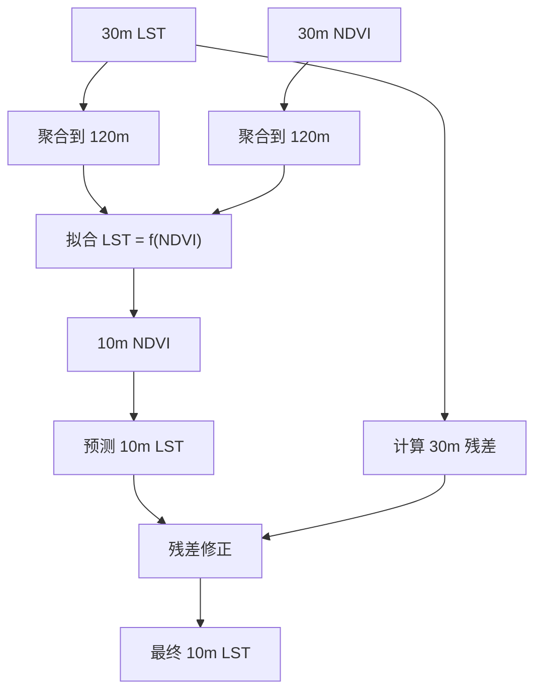
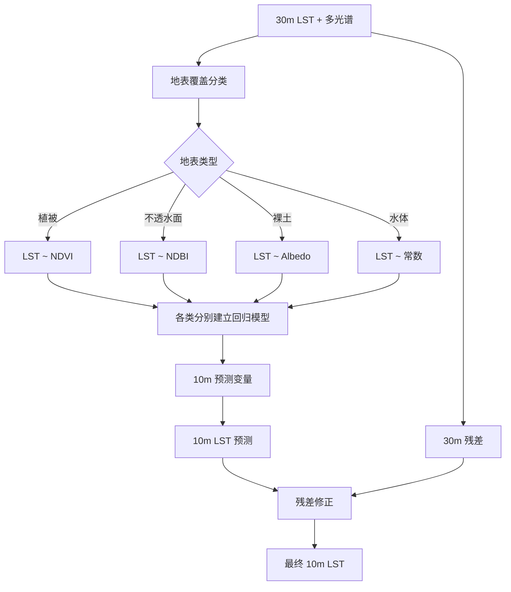
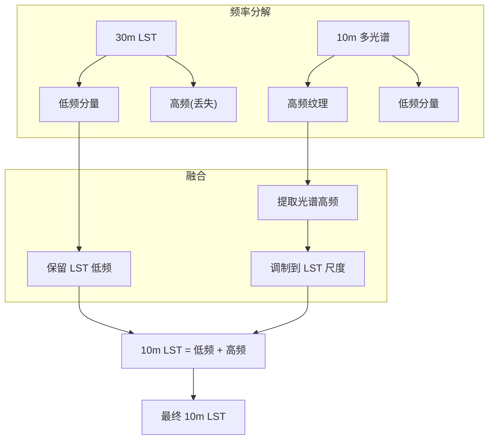
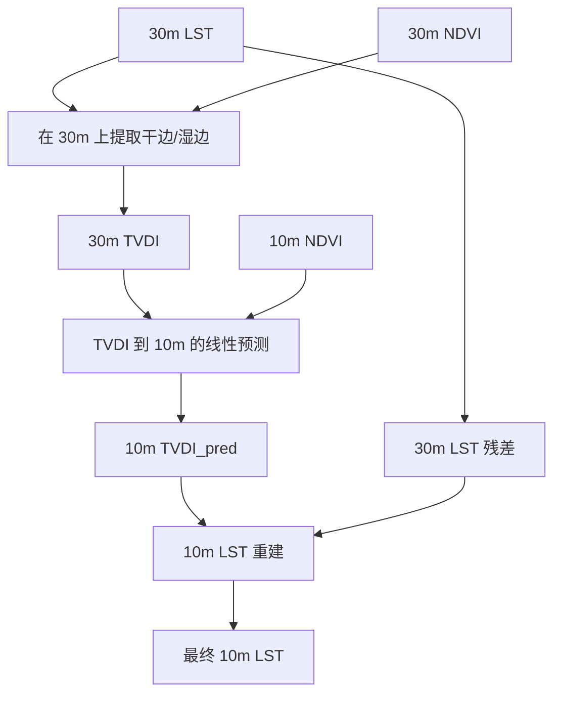

# 地表温度降尺度算法详细解析

> **文档定位**: 面向遥感技术人员的系统性算法参考手册。
> **范围**: 覆盖 GeoThermoAI 已实现的 TTRI+TCR 方法，以及可扩展的 TsHARP、DisTrad、SFS、MTVDI、深度学习降尺度等主流算法。
> **内容结构**: 算法原理 → 核心公式 → 实现流程 → 优缺点 → 适用场景 → 与现有系统的集成方式。

***

## 一、概述

### 1.1 什么是地表温度降尺度？

地表温度（Land Surface Temperature, LST）是地球系统科学研究中的关键参数，广泛应用于城市热环境、农业干旱监测、森林火灾预警、水文循环模拟等领域。

**空间分辨率矛盾**：

- 热红外波段（TIR）的空间分辨率通常较低：Landsat 8 TIRS 为 100m（重采样至 30m）
- 可见光/近红外（VNIR / SWIR）分辨率较高：Sentinel-2 MSI 可达 10m

**降尺度（Downscaling）** 的目标：利用高分辨率多光谱信息与 LST 之间的物理/统计关系，将 LST 从粗分辨率（30m\~100m）提升至细分辨率（10m）。

### 1.2 GeoThermoAI 已有的算法框架

```text
┌──────────────────────────────────────────────────────┐
│               GeoThermoAI 降尺度流程                   │
├──────────────────────────────────────────────────────┤
│                                                        │
│  30m 数据                   10m 数据                    │
│  ┌──────────┐              ┌──────────┐               │
│  │ Landsat  │              │Sentinel-2│               │
│  │ LST+B10  │              │ B2/B3/B4 │               │
│  │ QA_PIXEL │              │ B8/B11   │               │
│  └────┬─────┘              │ SCL      │               │
│       │                    └────┬─────┘               │
│       ▼                         ▼                      │
│  ┌─────────────────────────────────────┐              │
│  │  数据预处理 + 光谱指数计算            │              │
│  │  NDVI, NDWI, NDBI, DEM, Slope...   │              │
│  └──────────────┬──────────────────────┘              │
│                 │                                      │
│                 ▼                                      │
│  ┌─────────────────────────────────────┐              │
│  │  TTRI 计算（30m训练集）               │              │
│  │  TTRI = a·DEM + b·Slope + c·cos(A) │              │
│  └──────────────┬──────────────────────┘              │
│                 │                                      │
│                 ▼                                      │
│  ┌─────────────────────────────────────┐              │
│  │  RF 回归训练和预测                    │              │
│  │  输入 [R,G,B,NIR,SWIR1,NDVI,...]    │              │
│  │  输出 LST_pred                      │              │
│  └──────────────┬──────────────────────┘              │
│                 │                                      │
│                 ▼                                      │
│  ┌─────────────────────────────────────┐              │
│  │  TCR 计算（热约束残差修正）            │              │
│  │  TCR = LST_true - mean(LST_pred)    │              │
│  │  LST_final = LST_pred + TCR_interp  │              │
│  └──────────────┬──────────────────────┘              │
│                 │                                      │
│                 ▼                                      │
│          最终 10m LST 产品                             │
└──────────────────────────────────────────────────────┘
```

TTRI 和 TCR 是 GeoThermoAI 的核心创新。本章后续将介绍的算法均可作为独立 Skill 集成到现有系统中，提升平台的多方法对比能力。

***

## 二、TTRI（地形热响应指数）——已实现

### 2.1 算法原理

地形（高程、坡度、坡向）显著影响地表温度的空间分布。TTRI 通过多元线性回归捕捉 LST 与地形因子之间的统计关系。

```text
核心假设:
  不同下垫面的 LST 差异主要由地形因素（DEM、坡度、坡向）造成。
  去除地形影响后，LST 残差反映了地表覆盖/土壤水分等因素的贡献。
```

### 2.2 核心公式

```
TTRI = a × DEM + b × Slope + c × cos(Aspect)

其中系数 a, b, c 由最小二乘法拟合得到:

[LST] = intercept + a × [DEM] + b × [Slope] + c × [cos(Aspect)]
                                     ↓
TTRI = [DEM, Slope, cos(Aspect)] · [a, b, c]ᵀ
```

### 2.3 数学推导

给定 n 个训练样本，设计矩阵为：

```
A = [1, DEM, Slope, cos(Aspect)]     (n × 4)
y = [LST]                            (n × 1)
```

通过最小二乘法求解系数：

```
β = (AᵀA)⁻¹Aᵀy

β = [intercept, a, b, c]ᵀ
```

### 2.4 实现要点

参考 [core/ttri.py](file:///d:/Files/研究和项目/10.GeoThermoAI/GeoThermoAI/core/ttri.py)：

```python
# 训练集: 逐数据集独立拟合
for dataset in [train_csv, val_csv, test_csv]:
    df = pd.read_csv(dataset)
    X = df[["DEM", "Slope", "cos(Aspect)"]].values
    y = df["LST"].values
    A = np.column_stack([np.ones(len(X)), X])
    coeff = np.linalg.lstsq(A, y, rcond=None)[0]  # [intercept, a, b, c]
    ttri = X @ coeff[1:]  # 不含截距项

# 预测集: 使用训练集系数 + 30m→10m 双线性插值
grid_ttri_30m = ...  # 30m 规则网格上的 TTRI 值
interp = RegularGridInterpolator((rows, cols), grid_ttri_30m, method="linear")
ttri_10m = interp(points_10m)  # 10m 位置的双线性插值
```

### 2.5 优势与局限

| 维度     | 说明                            |
| ------ | ----------------------------- |
| **优势** | ① 物理可解释性强（LST 与地形的关系有明确物理基础）  |
| <br /> | ② 计算高效（线性回归，O(n) 级）           |
| <br /> | ③ 对平坦区域效果好（LST 主要由地表覆盖决定）     |
| **局限** | ① 假设 LST 与地形因子呈线性关系，真实情况往往更复杂 |
| <br /> | ② 无法处理非线性热环境效应（如城市峡谷热岛）       |
| <br /> | ③ 在地形复杂但地表覆盖单一的区域可能过拟合        |

### 2.6 适用的地形条件

| 地形类型  | DEM 标准差  | TTRI 表现                |
| ----- | -------- | ---------------------- |
| 平原/盆地 | <50m     | 良好（地形不是 LST 主控因子）      |
| 丘陵    | 50\~200m | 优秀（LST 与地形相关性最显著）      |
| 山地    | >200m    | 中等（非线性效应增强，需配合 TCR 修正） |

***

## 三、TCR（热约束残差修正）——已实现

### 3.1 算法原理

机器学习模型（RF）在 30m 上预测 LST 后，由于缺少热红外信息，预测结果与真实 LST 存在偏差。TCR 在 30m 块尺度捕捉这种偏差，通过空间插值修正到 10m。

```text
TCR 的物理含义:
  TCR_30m = LST_true_30m - mean(LST_pred_in_30m_block)

  正值 → RF 预测偏低，需要加 "热"
  负值 → RF 预测偏高，需要减 "热"
```

### 3.2 核心公式

**Phase 1: 计算 30m TCR**

```math
TCR_{30m}(r,c) = LST_{true,30m}(r,c) - \frac{1}{N}\sum_{j=1}^{N} LST_{pred,10m}(r_j,c_j)

其中 (r_j,c_j) 是落在 30m 块 (r,c) 内的所有 10m 像元
```

**Phase 2: 双线性插值到 10m 并修正**

```math
TCR_{10m}(r_i,c_i) = BilinearInterp(TCR_{30m}, r_i/3, c_i/3)

LST_{final,10m}(r_i,c_i) = LST_{pred,10m}(r_i,c_i) + TCR_{10m}(r_i,c_i)
```

### 3.3 实现流程

参考 [core/tcr.py](file:///d:/Files/研究和项目/10.GeoThermoAI/GeoThermoAI/core/tcr.py)：

```text
Phase 1 ────────────────┐
  ① 加载 RF 模型         │
  ② 逐批预测 10m LST     ├── 内存缓存 LST_pred
  ③ 30m 块聚合           │
  ④ 计算 TCR_30m         │
  ⑤ 构建规则网格 + 插值器 ┘
  
Phase 2 ────────────────┐
  ⑥ 逐批读取 10m 数据    │
  ⑦ 双线性插值 TCR       ├── 一次写入最终 CSV
  ⑧ LST_final = LST_pred ├── 无中间文件
       + TCR_interp      ┘
```

### 3.4 关键技术细节

**30m 块聚合**：

```python
# 用 cKDTree 做 10m → 30m 最近邻映射
tree_30m = cKDTree(utm_30m_coords)    # 30m 像元中心 UTM
_, indices = tree_30m.query(utm_10m)  # 每个 10m 像元归属的 30m 块
np.add.at(sum_pred, indices, lst_pred)
np.add.at(count_pred, indices, 1)
# TCR = lst_true - sum_pred / count_pred
```

**双线性插值**：

```python
interp = RegularGridInterpolator(
    (grid_rows_30m, grid_cols_30m),
    tcr_grid_30m,
    method="linear",
    bounds_error=False,
    fill_value=np.nan,
)
tcr_10m = interp(np.column_stack([row_10m / 3.0, col_10m / 3.0]))
```

### 3.5 优势与局限

| 维度     | 说明                                  |
| ------ | ----------------------------------- |
| **优势** | ① 物理约束性强——强制保证降尺度结果在 30m 块尺度上无偏     |
| <br /> | ② 无需额外数据输入，完全基于已有 RF 预测结果           |
| <br /> | ③ 可以有效恢复 RF 在像元尺度上的系统性偏差            |
| **局限** | ① 假设 30m 块内的 TCR 空间连续（线性插值合理）       |
| <br /> | ② 在 TCR 变化剧烈区域（如水体与陆地交界），线性插值可能过度平滑 |
| <br /> | ③ 依赖 RF 模型的空间泛化能力                   |

### 3.6 TTRI + TCR 的结合效果

```text
LST_final = LST_pred(RF) + TCR(interp)

  = f(R,G,B,NIR,SWIR1,NDVI,NDWI,NDBI,TTRI) + (LST_true - mean(f))

物理意义:
  RF 部分利用 10m 多光谱信息提供空间细节
  TCR 部分利用 30m 热红外信息校正系统偏差
  → "光谱信息提供纹理，热红外信息提供色调"
```

***

## 四、TsHARP（基于 NDVI 的尺度转换）

### 4.1 算法背景

TsHARP（*Thermal Sharpening*）由 Kustas 等人（2003）提出，是最经典的 LST 降尺度方法之一。其核心思想是利用 **LST 与 NDVI 之间的负相关关系** 进行尺度转换。

> Kustas, W. P., et al. (2003). Estimating subpixel surface temperatures and energy fluxes from the vegetation index–radiometric temperature relationship. *Remote Sensing of Environment*.

### 4.2 算法原理

```text
基本原理:
  在同一区域内，NDVI 越高 → 蒸散越强 → LST 越低。
  这个负相关在粗分辨率（30m）上建立模型，
  然后利用高分辨率 NDVI（10m）预测细分辨率 LST。
```



### 4.3 核心公式

**原始 TsHARP 模型**：

```math
LST_{coarse} = a + b × NDVI_{coarse}

预测:
LST_{fine,pred} = a + b × NDVI_{fine}
```

**残差修正（关键环节）**：

```math
ΔLST_{30m} = LST_{true,30m} - LST_{pred,30m}

LST_{fine,final} = LST_{fine,pred} + BilinearInterp(ΔLST_{30m})
```

**更高阶形式**（TsHARP v2）：

```math
LST = a + b × NDVI + c × NDVI²
```

### 4.4 与 TTRIR 的对比

| 对比维度  | TsHARP       | TTRI          |
| ----- | ------------ | ------------- |
| 预测变量  | 单一 NDVI      | 多光谱指数 + DEM   |
| 拟合模型  | 线性/二次回归      | 多元线性回归        |
| 残差修正  | 30m 残差插值     | TCR（块聚合 + 插值） |
| 核心假设  | LST-NDVI 负相关 | 地形驱动温度空间分布    |
| 计算复杂度 | O(n)         | O(n)          |

### 4.5 优势与局限

| 维度     | 说明                         |
| ------ | -------------------------- |
| **优势** | ① 经典方法，大量文献验证，可解释性强        |
| <br /> | ② 计算极快，适合大面积快速处理           |
| <br /> | ③ 在植被覆盖度中等区域效果优秀           |
| **局限** | ① 在 NDVI 饱和区（NDVI > 0.8）失效 |
| <br /> | ② 水体/裸土等无植被区域表现差           |
| <br /> | ③ 只能用一个 NDVI 特征，无法利用多光谱信息  |

### 4.6 适用场景

| 场景                  | 效果      | 说明                   |
| ------------------- | ------- | -------------------- |
| 农业区（植被覆盖度 0.2\~0.8） | **优秀**  | LST-NDVI 相关性强        |
| 森林（NDVI > 0.8）      | 中等      | NDVI 饱和，需要其他途径       |
| 城市                  | 差       | 不透水面使 NDVI-LST 关系复杂化 |
| 研究区以植被为主            | 可作为基准方法 | 与 RF+TTRI+TCR 的对比    |

***

## 五、DisTrad（热红外锐化算法）

### 5.1 算法背景

DisTrad（*Disaggregation of Thermal Radiance*）由 Zhan 等人（2013）提出，是 TsHARP 的扩展版本。它的核心创新在于：**不同地表覆盖类型（LULC）下，选择不同的预测变量**。

> Zhan, W., et al. (2013). Disaggregation of remotely sensed land surface temperature: A new approach based on the spatial and temporal information. *Remote Sensing of Environment*.

### 5.2 算法原理

```text
与传统 TsHARP 的区别:
  TsHARP 对全区使用同一个 LST-NDVI 关系
  DisTrad 根据不同地表类型选择不同的预测变量

例如:
  植被覆盖区: LST ~ NDVI
  城市不透水面: LST ~ NDBI + albedo
  裸土区域: LST ~ albedo
```



### 5.3 核心公式

**分类型回归**：

```math
\text{如果 } LULC = \text{植被:}
  LST = a₁ + b₁ × NDVI

\text{如果 } LULC = \text{不透水面:}
  LST = a₂ + b₂ × NDBI + b₃ × Albedo

\text{如果 } LULC = \text{裸土:}
  LST = a₃ + b₃ × Albedo + b₄ × NDVI
```

**综合预测**：

```math
LST_{fine} = \sum_{k=1}^{K} \mathbb{I}(LULC = k) × f_k(Features_{fine})
```

### 5.4 在 GeoThermoAI 中的实现思路

现有的 SCL（Scene Classification Layer）数据可以直接作为地表覆盖分类输入：

| SCL 值  | 类型        | DisTrad 预测变量 |
| ------ | --------- | ------------ |
| 4 / 5  | 植被        | NDVI         |
| 6      | 裸土        | Albedo, NDVI |
| 3      | 不透水面 / 城市 | NDBI, Albedo |
| 6 (暗色) | 水体        | 常数（近似）       |

```python
# 实现框架
class DisTradSkill(BaseSkill):
    def execute(self, params, ...):
        # 1. 从 SCL 获取地表分类
        scl = self._load_scl(params["scl_path"])
        
        # 2. 各类分别拟合 30m 模型
        models = {}
        for lulc_class in [3, 4, 5, 6]:
            mask = (scl_30m == lulc_class)
            if mask.sum() > 100:
                models[lulc_class] = self._fit_class_model(
                    lst_30m[mask], features_30m[mask], lulc_class
                )
        
        # 3. 按类应用 10m 预测
        lst_10m_pred = np.zeros(predict_shape)
        for lulc_class, model in models.items():
            mask = (scl_10m == lulc_class)
            lst_10m_pred[mask] = model.predict(features_10m[mask])
        
        # 4. 残差修正（同 TCR 机制）
        return self._correct_residual(lst_10m_pred, lst_30m)
```

### 5.5 优势与局限

| 维度     | 说明                          |
| ------ | --------------------------- |
| **优势** | ① 比 TsHARP 更精细——考虑地表覆盖异质性   |
| <br /> | ② 在城市区域表现优于 TsHARP          |
| <br /> | ③ 充分利用 Sentinel-2 SCL 分类数据  |
| **局限** | ① 分类精度直接影响降尺度效果             |
| <br /> | ② 每类需要足够的 30m 训练样本（>100 像素） |
| <br /> | ③ 分类边界处可能出现跳跃（非连续）          |

### 5.6 适用场景

| 场景                 | 效果     | 说明             |
| ------------------ | ------ | -------------- |
| 城市（不透水面 + 绿地 + 水体） | **优秀** | 分类型处理有效解决异质性   |
| 城乡过渡带              | 中等     | 混合像元分类困难       |
| 大面积均质区域（农田/沙漠）     | 不必要    | TsHARP 或 RF 即可 |

***

## 六、SFS（空间频率融合）

### 6.1 算法背景

SFS（*Spatial Frequency-based Sharpening*）基于一个简单的观察：**LST 在空间上是渐进变化的**，空间频率分析可以将粗分辨率的热信息与高分辨率的结构信息融合。

> 参考: Dominguez, A., et al. (2011). High-resolution urban thermal sharpener (HUTS). *Remote Sensing of Environment*.

### 6.2 算法原理

```text
核心思想:
  30m LST 包含低频信息（温度的空间格局）
  10m 光谱影像包含高频信息（地物的空间细节）
  将两者在频率域融合 → 10m LST

数学上:
  LST_10m = low_freq(LST_30m) + high_freq_guided(S2_10m_features)
```



### 6.3 核心公式

**方案 1: 小波变换**

```math
LST_{30m} \xrightarrow{DWT} \{A_1, H_1, V_1, D_1\}

S2_{10m} \xrightarrow{DWT} \{A_2, H_2, V_2, D_2\}

融合: 
  A_{fine} = A_1                             # 保留 LST 的低频
  H_{fine} = H_2 × (|H_1| / |H_2|)_norm     # 用光谱的纹理调制
  V_{fine} = V_2 × (|V_1| / |V_2|)_norm
  D_{fine} = D_2 × (|D_1| / |D_2|)_norm

LST_{10m} = IDWT(\{A_{fine}, H_{fine}, V_{fine}, D_{fine}\})
```

**方案 2: 高通滤波调制**

```math
HP_{S2} = S2_{10m} - Smooth(S2_{10m}, kernel=30m)

LST_{10m} = LST_{30m}^{upsampled} + HP_{S2} × \frac{LST_{30m}}{S2_{30m}}
```

### 6.4 优势与局限

| 维度     | 说明                        |
| ------ | ------------------------- |
| **优势** | ① 不依赖 LST 与光谱的统计关系，无需训练   |
| <br /> | ② 能保留 LST 的空间纹理连续性        |
| <br /> | ③ 在小波版本中，多尺度分解可以保留不同尺度的细节 |
| **局限** | ① 可能引入伪纹理（光谱细节不适于温度场）     |
| <br /> | ② 小波基函数选择影响结果             |
| <br /> | ③ 在高频噪声区域效果差              |

### 6.5 适用场景

| 场景            | 效果     | 说明                  |
| ------------- | ------ | ------------------- |
| 结构清晰的城区（道路网格） | **优秀** | 路网特征在光谱和 LST 中均显著   |
| 边界清晰的农田       | 中等     | 地块边界处可能有 ringing 效应 |
| 纹理复杂的自然区域     | 有限     | 光谱纹理与温度纹理不一一对应      |

***

## 七、MTVDI（温度-植被干燥度指数法）

### 7.1 算法背景

MTVDI（*Modified Temperature-Vegetation Dryness Index*）基于 TsHARP 框架的变体。与 TsHARP 直接拟合 LST-NDVI 关系不同，MTVDI 利用 **LST-NDVI 特征空间的三角形/梯形分布** 建立更精细的降尺度模型。

> 参考: Sandholt, I., et al. (2002). A simple interpretation of the surface temperature/vegetation index space for assessment of surface moisture status. *Remote Sensing of Environment*.

### 7.2 算法原理

```text
LST-NDVI 特征空间理论:
  在同一个区域内，LST 和 NDVI 的散点图呈现三角形分布:
  
  LST ↑
      │  *  *  *         ← 干边（土壤水分最低）
      │    *  *  *
      │      *  *  *     ← 中间状态
      │        *  *  *
      │          *  *  *  ← 湿边（土壤水分最高）
      └──────────────────→ NDVI
```

```math
TVDI = \frac{LST - LST_{min}(NDVI)}{LST_{max}(NDVI) - LST_{min}(NDVI)}

其中:
  LST_{min}(NDVI) = a₁ + b₁ × NDVI    # 湿边
  LST_{max}(NDVI) = a₂ + b₂ × NDVI    # 干边
  且 LST_{min}(NDVI) < LST < LST_{max}(NDVI)
```

### 7.3 MTVDI 降尺度的实现



### 7.4 与 TTRI 的对比

TTRI 已经实现了**多元线性回归**（DEM + Slope + Aspect → LST），而 MTVDI 可以理解为 **LST-NDVI 二维特征空间的线性回归**。两者可以互补：

```text
TTRI:    LST = f(DEM, Slope, cos(Aspect))       ← 地形因素
MTVDI:   LST = g(NDVI, TVDI)                     ← 植被+水分因素
结合:    LST = w₁ × TTRI + w₂ × MTVDI + offset  ← 加权融合
```

### 7.5 算法对比

| 维度    | TTRI               | MTVDI             |
| ----- | ------------------ | ----------------- |
| 预测变量  | DEM, Slope, Aspect | NDVI, TVDI        |
| 关系模型  | 多元线性回归             | LST-NDVI 三角形/梯形空间 |
| 侧重点   | 地形驱动的温度空间分布        | 植被-水分驱动的温度空间分布    |
| 对平坦区域 | 效果有限               | 更好（无地形因素因）        |
| 对干湿梯度 | 无反映                | 直接建模              |

***

## 八、深度学习降尺度

### 8.1 总体思路

传统方法（TsHARP, DisTrad, SFS, TTRI）都在使用**预定义的数学模型**来建模 LST 与光谱/地形的关系。深度学习则通过学习大量数据，自动发现从 30m 多光谱 + LST 到 10m LST 的非线性映射。

### 8.2 网络架构设计

#### 方案 A: UNet（推荐作为首选）

```text
输入: 10m 多光谱 + DEM (C=9, H×W)
      ┌──────────────────────────┐
      │  Conv3×3, BN, ReLU × 2   │
      │     ↓ MaxPool 2×2        │  Encoder 1: H/2 × W/2, 64ch
      │  Conv3×3, BN, ReLU × 2   │
      │     ↓ MaxPool 2×2        │  Encoder 2: H/4 × W/4, 128ch
      │  Conv3×3, BN, ReLU × 2   │
      │     ↓ MaxPool 2×2        │  Encoder 3: H/8 × W/8, 256ch
      │  Conv3×3, BN, ReLU × 2   │  Bottleneck
      │     ↓ UpConv 2×2         │  Decoder 3: H/4 × W/4
      │  Skip + Conv3×3 × 2      │
      │     ↓ UpConv 2×2         │  Decoder 2: H/2 × W/2
      │  Skip + Conv3×3 × 2      │
      │     ↓ UpConv 2×2         │  Decoder 1: H × W
      │  Skip + Conv3×3 × 2      │
      │     ↓ Conv 1×1           │  输出: 1ch (LST)
      └──────────────────────────┘
输出: 10m LST_pred (H×W, 1 channel)
```

**为什么 UNet 适合 LST 降尺度**：

- 监督训练：直接学习 9 通道输入 → 1 通道 LST 的映射
- 跳跃连接：保留空间细节（与 DisTrad 的"纹理保持"对应）
- 多尺度特征：Encoder 捕捉不同尺度的温度模式（类似小波变换的 SFS）

#### 方案 B: SRCNN（超分辨率卷积网络）

```python
class SRCNN_LST(nn.Module):
    """超分辨率风格: 30m LST upscaled → 10m 细节增强"""
    def __init__(self):
        super().__init__()
        self.conv1 = nn.Conv2d(1, 64, 9, padding=4)
        self.conv2 = nn.Conv2d(64, 32, 5, padding=2)
        self.conv3 = nn.Conv2d(32, 1, 5, padding=2)
    
    def forward(self, lst_30m_upsampled, s2_10m):
        # 将 S2 信息作为辅助输入
        x = torch.cat([lst_30m_upsampled, s2_10m], dim=1)
        x = F.relu(self.conv1(x))
        x = F.relu(self.conv2(x))
        return self.conv3(x)
```

#### 方案 C: GAN（对抗生成降尺度）

```text
Generator (UNet): S2_10m + DEM → 10m LST
Discriminator (PatchGAN): 判断生成的 LST 是否"真实"

损失函数:
  L_total = L1_loss(G(x), y_true) + λ × GAN_loss(G, D, x, y_true)

优势:
  - GAN 的对抗训练会生成更锐利的温度边界（对比度更好）
  - Discriminator 隐式约束了温度场的空间分布合理性
```

### 8.3 训练策略

**监督信号**：

```text
损失函数: L1Loss + SSIMLoss
  
  L1Loss: 像素级精度（与 RF 相同）
  SSIMLoss: 空间结构损失（保持温度场的纹理）

为什么不用 L2(MSE):
  MSE 倾向于生成平滑结果 (mean-value contraction)，
  这与 RF 观察到的现象一致——L1 + SSIM 能保留更多极值。
```

**训练数据构造**：

```
假设你有 30m LST + 10m 多光谱训练数据:
  (a) 将 30m LST 视为 Ground Truth
  (b) 将 30m 多光谱和 LST 聚合到 120m 作为"粗分辨率"输入
  (c) 训练: 120m 输入 → 30m 输出（降尺度系数 4×）
  (d) 推理时: 30m LST + 10m 多光谱 → 10m 输出（降尺度
```

